# MODUL 1: PENGANTAR CLOUD COMPUTING & SETUP ENVIRONMENT

---

**Mata Kuliah:** Komputasi Awan  
**Program Studi:** Sistem Informasi - Institut Teknologi Kalimantan  
**SKS:** 3 (1 Kuliah + 2 Project)  
**Metode:** Project-Based Learning (PjBL)  
**Pertemuan:** 1 dari 16  

---

## Estimasi Waktu Pembelajaran

Berdasarkan **Permendikbud No. 3 Tahun 2020** tentang SN-Dikti:

| Komponen | Kegiatan | Durasi |
|----------|----------|--------|
| **KULIAH (1 SKS)** | | |
| Tatap Muka | Pembekalan teori di kelas | 50 menit |
| Tugas Terstruktur | Pengembangan dari workshop | 60 menit |
| Belajar Mandiri | Belajar sendiri | 60 menit |
| **PROJECT (2 SKS)** | | |
| Workshop di Lab | Hands-on guided project di lab | 170 menit |
| Kerja Project Mandiri | Melanjutkan project secara mandiri | 170 menit |
| **TOTAL** | | **510 menit (~8.5 jam)** |

---

## Capaian Pembelajaran

### Sub-CPMK
Setelah menyelesaikan pertemuan ini, mahasiswa mampu:
1. Menjelaskan definisi, karakteristik, dan manfaat cloud computing
2. Mengidentifikasi model layanan cloud (IaaS, PaaS, SaaS) dan model deployment
3. Membedakan arsitektur cloud-native dengan arsitektur tradisional
4. Memahami gambaran besar proyek yang akan dibangun selama 1 semester
5. Menyiapkan environment pengembangan dan repository tim via GitHub Classroom

### Indikator Pencapaian
- Mahasiswa dapat menjelaskan minimal 3 karakteristik cloud computing (NIST)
- Mahasiswa dapat mengklasifikasikan layanan ke dalam IaaS/PaaS/SaaS dengan tepat
- Mahasiswa memiliki environment yang berjalan: Python, Node.js, Git, VS Code
- Tim terbentuk di GitHub Classroom dan semua anggota berhasil push kode pertama

---

## Pembagian Kelompok & Peran

### Ketentuan Kelompok

Proyek dikerjakan secara **berkelompok** sepanjang semester. Setiap kelompok terdiri dari **4 orang (standar)** atau **5 orang (jika jumlah mahasiswa tidak habis dibagi 4)**.

### Pembagian Peran (4 Orang)

| Peran | Tanggung Jawab Utama | Fokus Minggu |
|-------|----------------------|--------------|
| **Lead Backend** | REST API, database, authentication, business logic | 2, 4, 12-13 |
| **Lead Frontend** | React UI, state management, routing, UX | 3, 4, 14 |
| **Lead DevOps** | Docker, Docker Compose, CI/CD pipeline, deployment | 5-7, 9-11 |
| **Lead QA & Docs** | Testing, monitoring, logging, dokumentasi, README | 10, 14-15 |

> 💡 **Penting:** "Lead" bukan berarti hanya dia yang mengerjakan. Semua anggota berkontribusi ke semua bagian. Lead artinya **penanggung jawab utama & decision maker** untuk area tersebut. Setiap anggota harus punya commit di seluruh area.

### Pembagian Peran (5 Orang)

Jika kelompok terdiri dari 5 orang, peran DevOps dipecah menjadi dua:

| Peran | Tanggung Jawab Utama | Fokus Minggu |
|-------|----------------------|--------------|
| **Lead Backend** | REST API, database, authentication, business logic | 2, 4, 12-13 |
| **Lead Frontend** | React UI, state management, routing, UX | 3, 4, 14 |
| **Lead Container** | Docker, Dockerfile, Docker Compose, image optimization | 5-7 |
| **Lead CI/CD & Deploy** | GitHub Actions, automated testing, cloud deployment | 9-11 |
| **Lead QA & Docs** | Testing, monitoring, logging, dokumentasi, README | 10, 14-15 |

### Flowchart Kolaborasi Tim

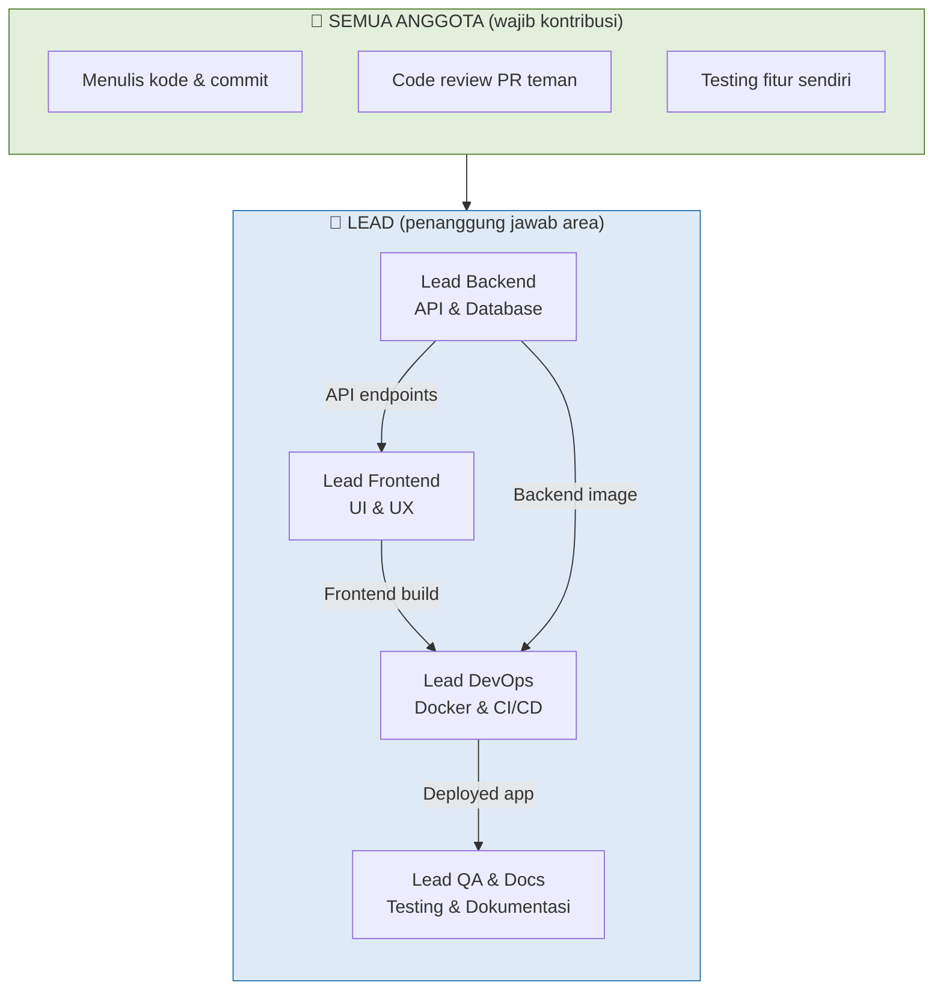

---

# BAGIAN A: PEMBEKALAN TEORI (50 Menit)

## 1. Apa itu Cloud Computing? (10 menit)

### 1.1 Definisi

**Cloud Computing** adalah model penyediaan layanan komputasi (server, penyimpanan, database, jaringan, software) melalui internet ("the cloud") dengan prinsip **on-demand**, **pay-as-you-go**, dan **scalable**.

> 💡 **Analogi Sederhana:**
> Bayangkan listrik di rumah Anda. Anda tidak perlu membangun pembangkit listrik sendiri — cukup colokkan ke PLN dan bayar sesuai pemakaian. Cloud computing bekerja dengan prinsip yang sama: Anda tidak perlu beli & kelola server sendiri, cukup "colokkan" aplikasi Anda ke cloud provider dan bayar sesuai pemakaian.

### 1.2 Lima Karakteristik Cloud Computing (NIST)

National Institute of Standards and Technology (NIST) mendefinisikan 5 karakteristik essential:

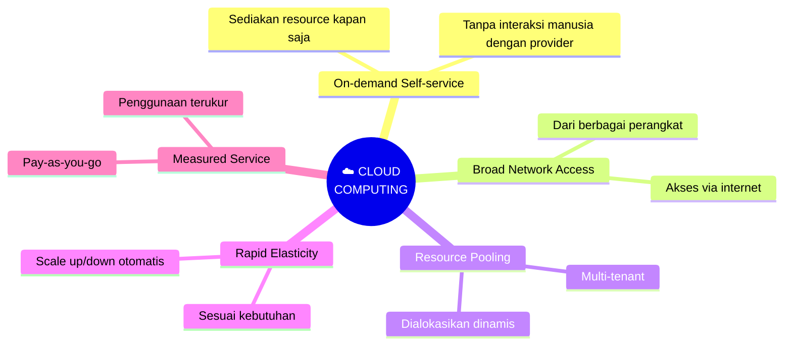

1. **On-demand self-service** — Pengguna bisa menyediakan resource (server, storage) kapan saja tanpa perlu interaksi manusia dengan provider
2. **Broad network access** — Layanan diakses melalui internet dari berbagai perangkat (laptop, smartphone, tablet)
3. **Resource pooling** — Resource provider digunakan bersama oleh banyak pengguna (multi-tenant), dialokasikan secara dinamis
4. **Rapid elasticity** — Resource bisa ditambah/dikurangi secara cepat dan otomatis sesuai kebutuhan
5. **Measured service** — Penggunaan resource diukur dan dilaporkan secara transparan (pay-as-you-go)

### 1.3 Mengapa Cloud Computing Penting?

1. **Efisiensi biaya** — Tidak perlu investasi hardware mahal di awal (CapEx → OpEx)
2. **Skalabilitas** — Bisa scale up/down sesuai demand (misal: traffic naik saat promo)
3. **Kecepatan** — Deploy server baru dalam hitungan menit, bukan minggu
4. **Reliabilitas** — Data di-backup dan di-replicate di beberapa lokasi
5. **Fokus pada produk** — Tim developer fokus membangun fitur, bukan mengelola server

---

## 2. Model Layanan Cloud (15 menit)

### 2.1 Tiga Model Layanan

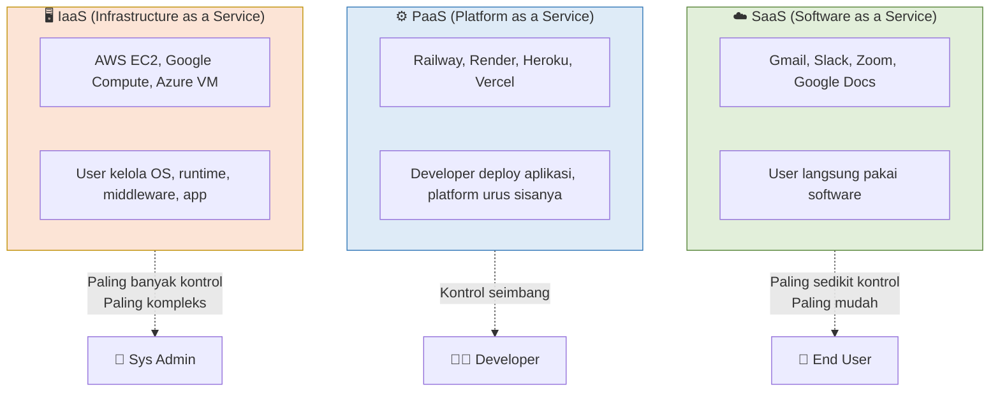

| Model | Deskripsi | Contoh | Analogi |
|-------|-----------|--------|---------|
| **IaaS** | Menyediakan infrastruktur virtual (server, storage, network) | AWS EC2, Google Compute Engine, DigitalOcean | Sewa tanah kosong, bangun rumah sendiri |
| **PaaS** | Menyediakan platform untuk develop & deploy tanpa kelola infrastruktur | Railway, Render, Heroku, Vercel | Sewa apartemen, tinggal bawa furniture |
| **SaaS** | Software siap pakai via browser/API | Gmail, Slack, Zoom, Google Docs | Menginap di hotel, semua sudah tersedia |

### 2.2 Apa yang Anda Kelola?

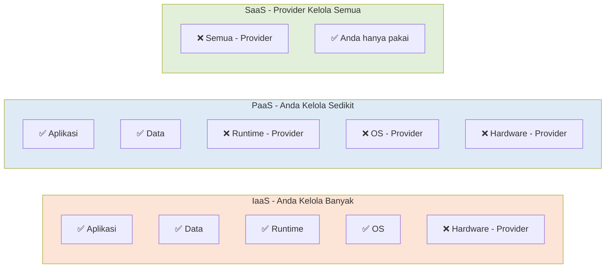

> 📝 **Dalam mata kuliah ini**, kita akan menggunakan **PaaS** (Railway/Render) untuk deployment. Kenapa? Karena PaaS memungkinkan kita fokus pada pengembangan aplikasi tanpa pusing mengelola server — cocok untuk belajar cloud computing secara praktis.

### 2.3 Model Deployment Cloud

| Model | Deskripsi | Use Case |
|-------|-----------|----------|
| **Public** | Infrastruktur dimiliki provider, diakses publik via internet | Startup, aplikasi consumer, SaaS products |
| **Private** | Infrastruktur eksklusif untuk satu organisasi | Perbankan, pemerintahan, data sensitif |
| **Hybrid** | Kombinasi public & private, workload bisa berpindah | Enterprise yang butuh fleksibilitas + compliance |

---

## 3. Cloud-Native vs Tradisional (10 menit)

### 3.1 Apa itu Cloud-Native?

**Cloud-Native** adalah pendekatan membangun aplikasi yang dirancang khusus untuk memanfaatkan keunggulan cloud computing: **scalable**, **resilient**, dan **manageable**.

### 3.2 Perbandingan

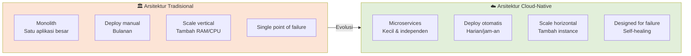

| Aspek | Tradisional | Cloud-Native |
|-------|-------------|--------------|
| **Arsitektur** | Monolith (satu aplikasi besar) | Microservices (kecil, independen) |
| **Deployment** | Manual, jarang (bulanan) | Otomatis, sering (harian/jam) |
| **Scaling** | Vertical (tambah RAM/CPU) | Horizontal (tambah instance) |
| **Infrastruktur** | Server fisik tetap | Container, orchestrated |
| **Failure** | Single point of failure | Designed for failure, self-healing |
| **Update** | Downtime saat update | Rolling update, zero downtime |

---

## 4. Overview Proyek Semester Ini (10 menit)

### 4.1 Konsep Proyek

Selama 16 pertemuan, Anda akan membangun **SATU proyek secara incremental** — setiap minggu menambahkan komponen baru di atas yang sudah ada.

> ⚠️ **Penting: Progressive Project**
> Anda TIDAK membuat proyek baru setiap minggu. Minggu 1 setup environment, minggu 2 buat backend, minggu 3 buat frontend, minggu 5 bungkus semuanya dalam Docker, dan seterusnya. Setiap minggu membangun di atas hasil minggu sebelumnya.

### 4.2 Arsitektur Akhir yang Akan Dibangun

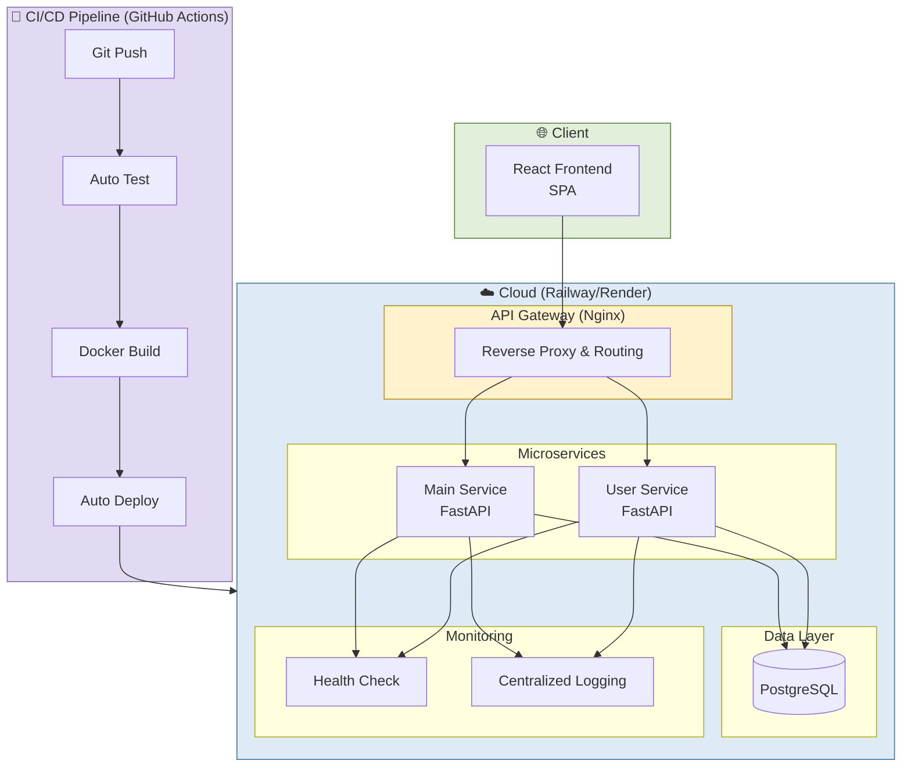

> 📝 Diagram di atas adalah **arsitektur akhir** di minggu 16. Anda tidak perlu memahami semuanya sekarang — kita akan membangunnya langkah demi langkah.

### 4.3 Technology Stack

| Kategori | Teknologi | Fungsi | Mulai Minggu |
|----------|-----------|--------|--------------|
| Backend | Python + FastAPI | REST API server | 2 |
| Frontend | React + Vite | User interface (SPA) | 3 |
| Database | PostgreSQL | Penyimpanan data | 2 |
| Container | Docker | Packaging aplikasi | 5 |
| Orkestrasi | Docker Compose | Multi-container management | 7 |
| CI/CD | GitHub Actions | Automated test & deploy | 10 |
| Cloud | Railway / Render | Hosting & deployment | 11 |
| API Gateway | Nginx | Reverse proxy & routing | 13 |

### 4.4 Roadmap 16 Minggu

| Fase | Minggu | Fokus | Milestone |
|------|--------|-------|-----------|
| 🟢 **Foundation** | 1-4 | Full-stack development | Aplikasi berjalan lokal |
| 🔵 **Container** | 5-7 | Docker & Docker Compose | Berjalan via `docker compose up` |
| 🟡 **UTS** | 8 | Demo & Viva Milestone 1 | Full-stack + Docker (dinilai) |
| 🟣 **CI/CD** | 9-11 | Git workflow, GitHub Actions, Deploy | Auto test + auto deploy |
| 🟠 **Architecture** | 12-14 | Microservices, Gateway, Monitoring | Microservices running |
| 🟡 **Final** | 15-16 | Polish, Security, Docs + UAS | Production-ready (dinilai) |

---

## 5. Rangkuman Teori

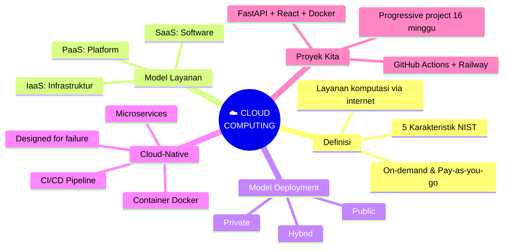

---

# BAGIAN B: WORKSHOP DI LAB (170 Menit)


## Tujuan Workshop
Menyiapkan seluruh environment pengembangan, membentuk tim di GitHub Classroom, dan memverifikasi bahwa semuanya berjalan.

> ⚠️ **Simpan Semua Hasil Workshop!** Seluruh kode dan konfigurasi yang dibuat di workshop ini akan menjadi fondasi proyek Anda selama 1 semester.

---

## Workshop 1.1: Instalasi Tools (40 menit)

### Flowchart Proses Instalasi

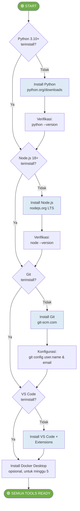

### A. Python (versi 3.10+)

Download dari https://www.python.org/downloads/

Verifikasi di terminal:
```bash
python --version    # atau python3 --version
pip --version       # atau pip3 --version
```

> 💡 **Tip untuk Windows:** Saat install Python, PASTIKAN centang **"Add Python to PATH"**. Jika lupa, Anda harus uninstall dan install ulang.

### B. Node.js (versi 18+) & npm

Download dari https://nodejs.org/ (pilih **LTS version**)

Verifikasi di terminal:
```bash
node --version
npm --version
```

### C. Git

Download dari https://git-scm.com/downloads

Verifikasi dan konfigurasi:
```bash
git --version

# Konfigurasi identitas (WAJIB, gunakan data asli Anda)
git config --global user.name "Nama Lengkap Anda"
git config --global user.email "email@student.itk.ac.id"
```

### D. Visual Studio Code

Download dari https://code.visualstudio.com/

Install extensions yang direkomendasikan:
- **Python** (Microsoft)
- **ES7+ React/Redux/React-Native snippets**
- **Docker** (Microsoft)
- **GitLens**
- **Thunder Client** (untuk testing API)

### E. Docker Desktop (Preview, untuk minggu 5)

Download dari https://www.docker.com/products/docker-desktop/

Belum wajib di minggu ini, tapi **disarankan install sekarang** agar tidak ada masalah nanti.

```bash
docker --version
docker compose version
```

---

## Workshop 1.2: Join GitHub Classroom & Setup Tim (40 menit)

### Alur GitHub Classroom

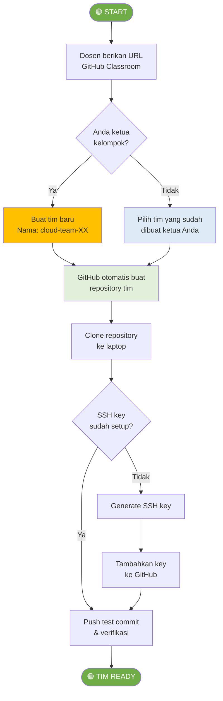

### Langkah 1: Ketua Kelompok — Buat Tim

1. Buka URL GitHub Classroom yang diberikan dosen
2. Klik **"Create a new team"**
3. Beri nama tim: `cloud-team-XX` (XX = nomor kelompok, misal `cloud-team-01`)
4. Klik **"Create team"** → GitHub otomatis membuat repository untuk tim Anda
5. **Bagikan URL GitHub Classroom ke anggota tim** agar mereka bisa join

### Langkah 2: Anggota — Join Tim

1. Buka URL GitHub Classroom yang sama
2. Cari dan klik nama tim yang sudah dibuat ketua Anda (misal `cloud-team-01`)
3. Klik **"Join"** → Anda otomatis ditambahkan ke repository tim

### Langkah 3: Semua Anggota — Setup SSH Key

```bash
# Generate SSH key
ssh-keygen -t ed25519 -C "email@student.itk.ac.id"

# Tekan Enter untuk semua pertanyaan (default location, no passphrase)

# Tampilkan public key
cat ~/.ssh/id_ed25519.pub
```

Tambahkan ke GitHub:
1. Copy seluruh output dari perintah `cat` di atas
2. Buka **GitHub → Settings → SSH and GPG keys → New SSH key**
3. Paste public key, beri nama (misal: "Laptop Kuliah"), klik **Add SSH key**
4. Verifikasi koneksi:

```bash
ssh -T git@github.com
# Expected: Hi username! You've successfully authenticated...
```

### Langkah 4: Clone Repository Tim

```bash
# Clone repository (URL dari GitHub Classroom)
git clone git@github.com:ORGANIZATION/cloud-team-XX.git

# Masuk ke folder
cd cloud-team-XX
```

### Langkah 5: Setup Struktur Proyek Awal

**Ketua kelompok** membuat struktur folder awal:

```bash
# Buat struktur folder
mkdir -p backend frontend docs

# Buat .gitignore
cat > .gitignore << 'EOF'
# Python
__pycache__/
*.pyc
venv/
.env

# Node
node_modules/
dist/

# Docker
*.log

# IDE
.vscode/
.idea/
EOF

# Commit & push
git add .
git commit -m "chore: initial project structure"
git push origin main
```

**Semua anggota** pull perubahan:

```bash
git pull origin main
```

### Langkah 6: Verifikasi — Setiap Anggota Push Test Commit

Setiap anggota buat file dengan nama masing-masing untuk verifikasi:

```bash
# Setiap anggota membuat file sendiri
echo "Nama: [NAMA LENGKAP] | NIM: [NIM] | Peran: [PERAN]" > docs/member-[NAMA].md

git add .
git commit -m "docs: add member info - [NAMA]"
git push origin main
```

> ⚠️ **Jika terjadi conflict saat push:** jalankan `git pull --rebase origin main` terlebih dahulu, lalu `git push` lagi.

> ✅ **Checkpoint:** Semua anggota berhasil push → repository berisi file dari setiap anggota.

---

## Workshop 1.3: Hello World — FastAPI & React (60 menit)

### Flowchart Full-Stack Hello World

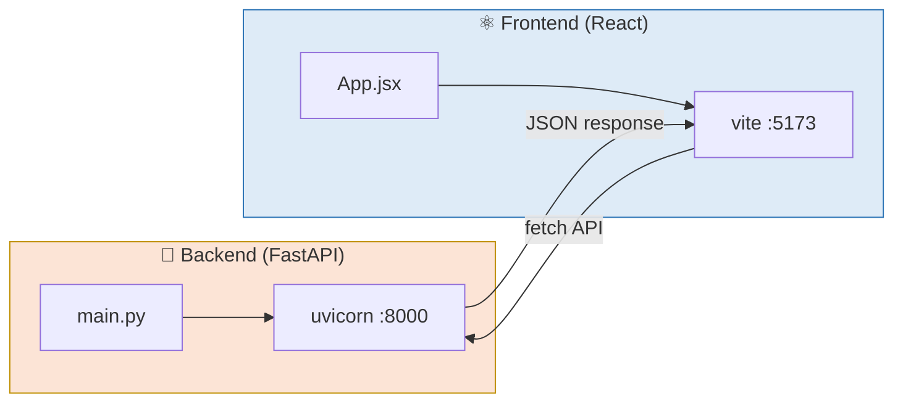

### A. Hello World Backend (FastAPI)

**Dikerjakan oleh: Lead Backend** (anggota lain observasi & bantu debug)

File: `backend/requirements.txt`
```
fastapi==0.115.0
uvicorn==0.30.0
```

File: `backend/main.py`
```python
from fastapi import FastAPI
from fastapi.middleware.cors import CORSMiddleware

app = FastAPI(
    title="Cloud App API",
    description="API untuk mata kuliah Komputasi Awan",
    version="0.1.0"
)

# CORS - agar frontend bisa akses API ini
app.add_middleware(
    CORSMiddleware,
    allow_origins=["*"],  # Untuk development saja
    allow_credentials=True,
    allow_methods=["*"],
    allow_headers=["*"],
)


@app.get("/")
def root():
    return {
        "message": "Hello from Cloud App API!",
        "status": "running",
        "version": "0.1.0"
    }


@app.get("/health")
def health_check():
    return {"status": "healthy"}


@app.get("/team")
def team_info():
    return {
        "team": "cloud-team-XX",
        "members": [
            # TODO: Isi dengan data tim Anda
            {"name": "Nama 1", "nim": "NIM1", "role": "Lead Backend"},
            {"name": "Nama 2", "nim": "NIM2", "role": "Lead Frontend"},
            {"name": "Nama 3", "nim": "NIM3", "role": "Lead DevOps"},
            {"name": "Nama 4", "nim": "NIM4", "role": "Lead QA & Docs"},
        ]
    }
```

Jalankan backend:
```bash
cd backend
pip install -r requirements.txt
uvicorn main:app --reload --port 8000

# Buka browser: http://localhost:8000
# Buka Swagger: http://localhost:8000/docs
```

> ✅ **Checkpoint:** Jika Anda melihat JSON response `{"message": "Hello from Cloud App API!"}` di browser, backend berhasil! Swagger UI di `/docs` juga harus menampilkan dokumentasi API otomatis.

### B. Hello World Frontend (React)

**Dikerjakan oleh: Lead Frontend** (anggota lain observasi & bantu debug)

Buka terminal **BARU** (biarkan backend tetap berjalan):

```bash
cd cloud-team-XX
npm create vite@latest frontend -- --template react
cd frontend
npm install
```

Edit file: `frontend/src/App.jsx` (ganti seluruh isinya)
```jsx
import { useState, useEffect } from "react"

function App() {
  const [data, setData] = useState(null)
  const [team, setTeam] = useState(null)
  const [loading, setLoading] = useState(true)

  useEffect(() => {
    // Fetch API root
    fetch("http://localhost:8000/")
      .then(res => res.json())
      .then(json => {
        setData(json)
        setLoading(false)
      })
      .catch(err => {
        console.error("Error:", err)
        setLoading(false)
      })

    // Fetch team info
    fetch("http://localhost:8000/team")
      .then(res => res.json())
      .then(json => setTeam(json))
      .catch(err => console.error("Error:", err))
  }, [])

  return (
    <div style={{ padding: "2rem", fontFamily: "Arial" }}>
      <h1>☁️ Cloud App</h1>
      <h2>Mata Kuliah Komputasi Awan - SI ITK</h2>

      {loading ? (
        <p>Loading...</p>
      ) : data ? (
        <div>
          <h3>API Response:</h3>
          <p>Message: {data.message}</p>
          <p>Status: {data.status}</p>
          <p>Version: {data.version}</p>
        </div>
      ) : (
        <p style={{ color: "red" }}>Error connecting to backend</p>
      )}

      {team && (
        <div>
          <h3>Tim: {team.team}</h3>
          <ul>
            {team.members.map((m, i) => (
              <li key={i}>{m.name} ({m.nim}) - {m.role}</li>
            ))}
          </ul>
        </div>
      )}
    </div>
  )
}

export default App
```

Jalankan frontend:
```bash
npm run dev

# Buka browser: http://localhost:5173
```

> ✅ **Checkpoint:** Frontend menampilkan data dari backend API → koneksi full-stack berhasil!

---

## Workshop 1.4: Commit, Push & Verifikasi (30 menit)

### Flowchart Git Workflow Dasar

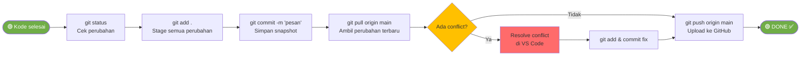

### Commit oleh Lead Backend:
```bash
git add backend/
git commit -m "feat: add FastAPI backend with health check and team endpoint"
git push origin main
```

### Commit oleh Lead Frontend:
```bash
git pull origin main
git add frontend/
git commit -m "feat: add React frontend with API integration"
git push origin main
```

### Semua anggota — Verifikasi:
```bash
git pull origin main
git log --oneline
# Pastikan semua commit terlihat
```

> ✅ **Checkpoint Akhir Workshop:** Buka repository di GitHub → semua file (backend + frontend) terupload, ada commit dari minimal 2 anggota tim.

---

# BAGIAN C: TUGAS TERSTRUKTUR (60 Menit)

> 📝 **Pengembangan dari workshop — kumpulkan sebelum pertemuan 2**
> Push ke repository tim di GitHub Classroom.

---

## Tugas: Buat README.md yang Lengkap & Endpoint /team

### Deskripsi

Setiap tim membuat file `README.md` yang menjelaskan proyek. Ini akan menjadi "wajah" proyek Anda di GitHub dan terus di-update sepanjang semester.

**Pembagian pengerjaan tugas:**

| Bagian README | Dikerjakan oleh | Juga mengerjakan |
|---------------|-----------------|------------------|
| Deskripsi proyek & Architecture Overview | Lead Backend | Update endpoint `/team` dengan data asli |
| Tech Stack & Getting Started | Lead Frontend | Pastikan instruksi running benar |
| Roadmap Milestone & Project Structure | Lead DevOps | Setup branch protection rules |
| Identitas Tim & Peer Review README | Lead QA & Docs | Review & finalisasi seluruh README |
| *(Jika 5 orang)* Getting Started dipecah: Backend + Frontend terpisah | Lead CI/CD & Deploy | Tambahkan section "Deployment" (placeholder) |

### Isi Wajib README.md

# ☁️ Cloud App - [Nama Proyek Tim Anda]

Deskripsi singkat aplikasi (1-2 paragraf): apa yang dilakukan, 
untuk siapa, masalah apa yang diselesaikan.

## 👥 Tim

| Nama | NIM | Peran |
|------|-----|-------|
| ...  | ... | Lead Backend |
| ...  | ... | Lead Frontend |
| ...  | ... | Lead DevOps |
| ...  | ... | Lead QA & Docs |

## 🛠️ Tech Stack

| Teknologi | Fungsi |
|-----------|--------|
| FastAPI   | Backend REST API |
| React     | Frontend SPA |
| PostgreSQL | Database |
| Docker    | Containerization |
| GitHub Actions | CI/CD |
| Railway/Render | Cloud Deployment |

## 🏗️ Architecture

```
[React Frontend] <--HTTP--> [FastAPI Backend] <--SQL--> [PostgreSQL]
```

*(Diagram ini akan berkembang setiap minggu)*

## 🚀 Getting Started

### Prasyarat
- Python 3.10+
- Node.js 18+
- Git

### Backend
```bash
cd backend
pip install -r requirements.txt
uvicorn main:app --reload --port 8000
```

### Frontend
```bash
cd frontend
npm install
npm run dev
```

## 📅 Roadmap

| Minggu | Target | Status |
|--------|--------|--------|
| 1 | Setup & Hello World | ✅ |
| 2 | REST API + Database | ⬜ |
| 3 | React Frontend | ⬜ |
| 4 | Full-Stack Integration | ⬜ |
| 5-7 | Docker & Compose | ⬜ |
| 8 | UTS Demo | ⬜ |
| 9-11 | CI/CD Pipeline | ⬜ |
| 12-14 | Microservices | ⬜ |
| 15-16 | Final & UAS | ⬜ |


### Informasi Pengumpulan

| Item | Keterangan |
|------|------------|
| **Deadline** | Sebelum pertemuan 2 dimulai |
| **Format** | Push ke repository tim di GitHub Classroom |
| **Yang dikumpulkan** | README.md + endpoint `/team` dengan data asli + commit dari semua anggota |
| **Penilaian** | Kelengkapan isi, kejelasan penjelasan, setiap anggota punya minimal 1 commit |

---

# BAGIAN D: BELAJAR MANDIRI (230 Menit)

> 📚 **Dikerjakan secara mandiri di luar kelas**
> Tidak dikumpulkan, tetapi penting untuk pemahaman materi.

---

## D1. Membaca Referensi (60 menit)

### Bacaan Wajib
1. **NIST Definition of Cloud Computing (SP 800-145)** — dokumen resmi 7 halaman yang mendefinisikan cloud computing
2. **12-Factor App Methodology** (https://12factor.net/) — baca minimal faktor I (Codebase), III (Config), dan V (Build, release, run)

### Bacaan Tambahan
- Google Cloud: What is Cloud Computing? — https://cloud.google.com/learn/what-is-cloud-computing
- AWS: Types of Cloud Computing — https://aws.amazon.com/types-of-cloud-computing/
- FastAPI Tutorial — https://fastapi.tiangolo.com/tutorial/first-steps/

---

## D2. Video Tutorial (60 menit)

Tonton dan buat catatan singkat:

1. **"Cloud Computing In 6 Minutes"** — Simplilearn (YouTube, ~6 min)
   - Overview cloud computing yang ringkas dan visual

2. **"IaaS vs PaaS vs SaaS"** — IBM Technology (YouTube, ~10 min)
   - Penjelasan mendalam 3 model layanan

3. **"FastAPI Course for Beginners"** — freeCodeCamp (YouTube, ~20 min pertama saja)
   - Hands-on tutorial FastAPI dasar

4. **"React in 100 Seconds" + "React for Beginners"** — Fireship (YouTube, ~15 min total)
   - Overview React yang cepat dan padat

---

## D3. Latihan Mandiri (60 menit)

### Soal Pilihan Ganda

**1.** Layanan cloud yang menyediakan platform untuk develop & deploy aplikasi tanpa mengelola infrastruktur disebut:
- [ ] a. IaaS
- [ ] b. SaaS
- [ ] c. PaaS
- [ ] d. DaaS

**2.** Manakah yang merupakan contoh SaaS?
- [ ] a. AWS EC2
- [ ] b. Gmail
- [ ] c. Heroku
- [ ] d. Docker

**3.** Aplikasi cloud-native dirancang untuk scaling secara:
- [ ] a. Vertical (upgrade hardware)
- [ ] b. Diagonal
- [ ] c. Horizontal (tambah instance)
- [ ] d. Tidak bisa di-scale

**4.** Salah satu keunggulan CI/CD dalam cloud-native adalah:
- [ ] a. Deployment manual yang lebih aman
- [ ] b. Deployment otomatis dan sering (daily/hourly)
- [ ] c. Tidak perlu testing
- [ ] d. Hanya bisa deploy bulanan

**5.** Apa kelemahan utama arsitektur monolith dibanding microservices?
- [ ] a. Lebih mahal
- [ ] b. Single point of failure
- [ ] c. Tidak bisa menggunakan database
- [ ] d. Harus menggunakan Docker

---

## D4. Persiapan Pertemuan Berikutnya (50 menit)

Baca dan pelajari materi tentang **REST API & FastAPI**:
- Apa itu REST API? (HTTP Methods: GET, POST, PUT, DELETE)
- Apa itu CRUD? (Create, Read, Update, Delete)
- FastAPI official tutorial: https://fastapi.tiangolo.com/tutorial/
- Apa itu ORM dan SQLAlchemy?
- Cara koneksi Python ke PostgreSQL

> 💡 **Tip:** Install PostgreSQL di laptop Anda **sebelum pertemuan 2**. Download dari https://www.postgresql.org/download/. Ini akan menghemat waktu di workshop minggu depan.

---

---

*Modul ini disusun oleh Aidil Saputra Kirsan, Institut Teknologi Kalimantan.*
