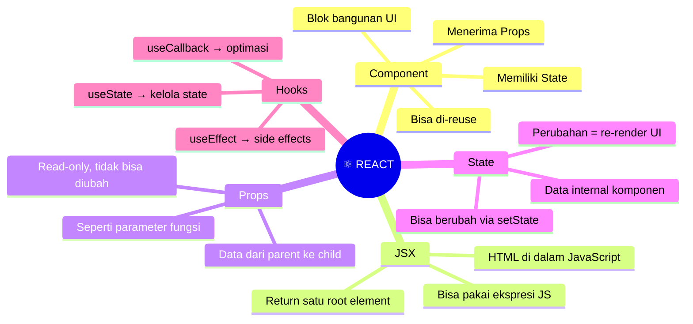
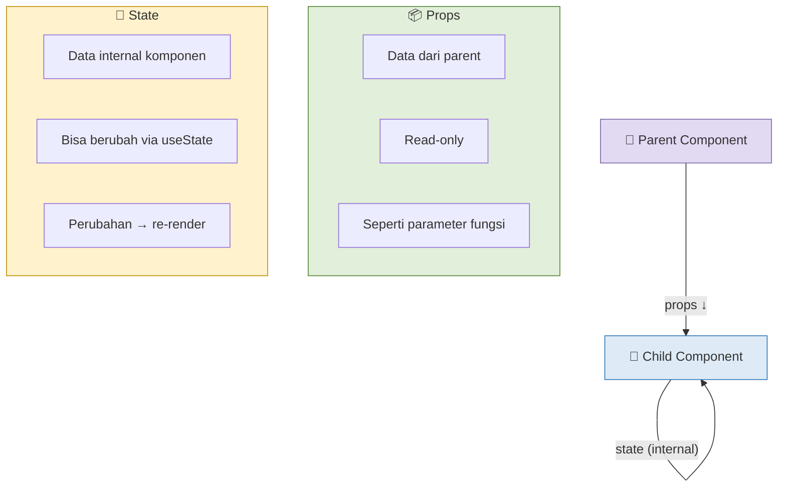
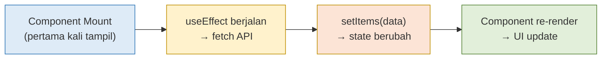
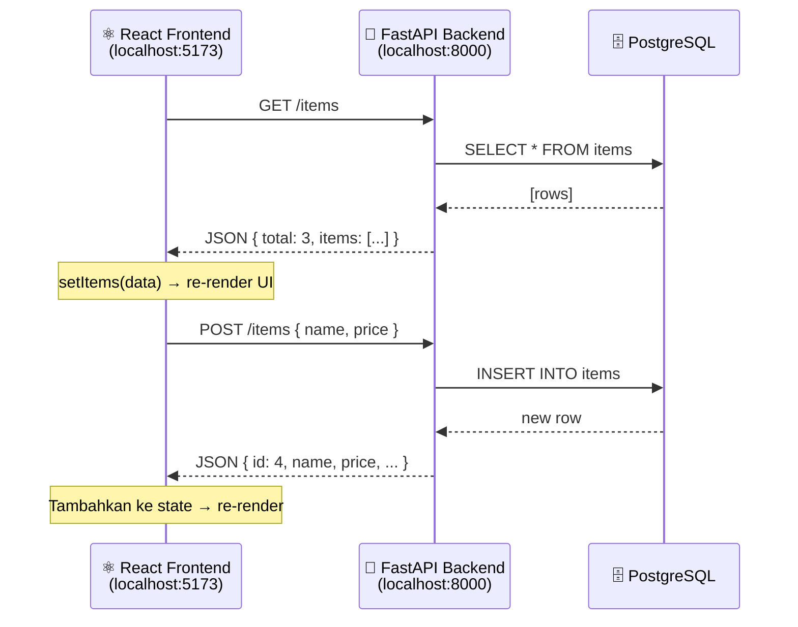
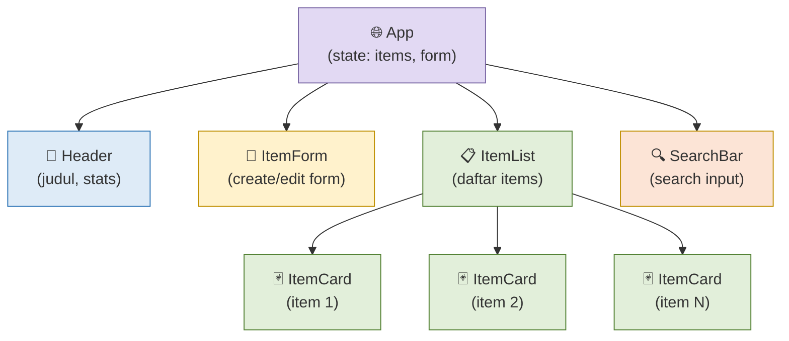
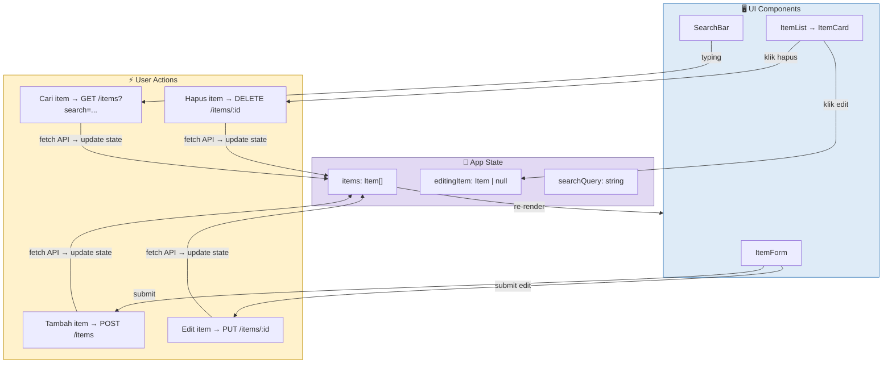
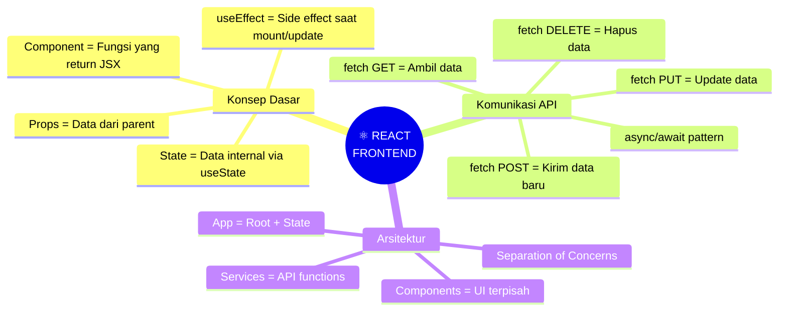
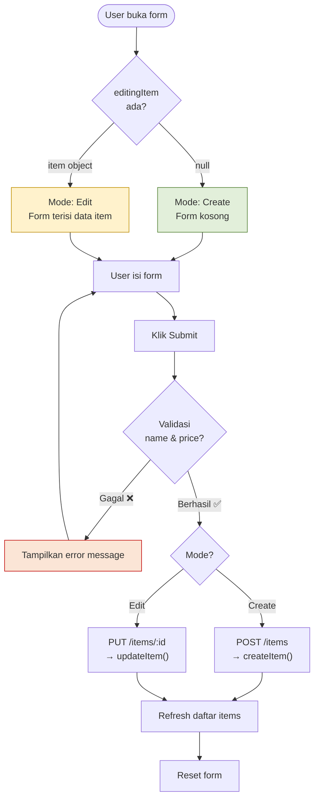
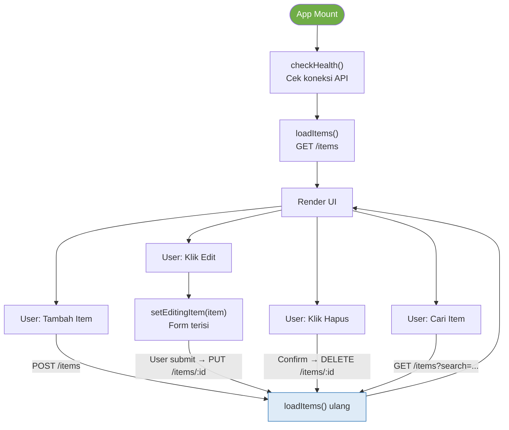
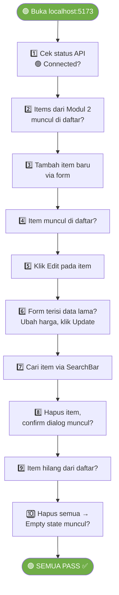

# MODUL 3: FRONTEND REACT — UI & API INTEGRATION

---

**Mata Kuliah:** Komputasi Awan  
**Program Studi:** Sistem Informasi - Institut Teknologi Kalimantan  
**SKS:** 3 (1 Kuliah + 2 Project)  
**Pertemuan:** 3 dari 16  
**Fase:** 🟢 Foundation (Minggu 1-4)  

---

## Prasyarat

Sebelum memulai pertemuan ini, pastikan:
- [x] Backend FastAPI + PostgreSQL dari Modul 2 berjalan (`uvicorn main:app --reload`)
- [x] Minimal 3 item sudah ada di database (dari testing Modul 2)
- [x] Frontend React hello world dari Modul 1 masih bisa dijalankan (`npm run dev`)
- [x] Sudah membaca materi React Hooks & fetch API (Modul 2 Bagian D4)

> ⚠️ **Penting:** Selama workshop, Anda perlu **2 terminal berjalan bersamaan**: satu untuk backend (port 8000) dan satu untuk frontend (port 5173).

---

## Capaian Pembelajaran

### Sub-CPMK
Setelah menyelesaikan pertemuan ini, mahasiswa mampu:
1. Memahami konsep React: component, props, state, dan hooks
2. Mengimplementasikan komunikasi frontend-backend via fetch API
3. Membangun antarmuka CRUD (Create, Read, Update, Delete) yang fungsional
4. Menerapkan conditional rendering dan form handling di React
5. Mengorganisasi kode React ke dalam komponen yang reusable

### Indikator Pencapaian
- Frontend menampilkan daftar items dari backend API
- User bisa menambah, mengedit, dan menghapus item via UI
- Form memiliki validasi dasar (field wajib, harga > 0)
- Komponen terstruktur rapi (minimal 3 komponen terpisah)

---

## Pembagian Fokus Tim Pertemuan Ini

| Peran | Fokus Utama | Juga Membantu |
|-------|-------------|---------------|
| **Lead Frontend** | Menulis semua komponen React & styling | — |
| **Lead Backend** | Pastikan API berjalan, bantu debug response format | Tambah endpoint jika perlu |
| **Lead DevOps** | Setup environment frontend (env vars, proxy config) | Testing cross-browser |
| **Lead QA & Docs** | Testing semua fitur CRUD via UI, catat bug | Update README |
| **Lead CI/CD** *(5 orang)* | Buat file `docs/ui-test-results.md` | Screenshot setiap fitur |

---

# BAGIAN A: PEMBEKALAN TEORI (50 Menit)

## 1. React Fundamentals (20 menit)

### 1.1 Apa itu React?

**React** adalah library JavaScript untuk membangun user interface (UI). React memecah UI menjadi **komponen-komponen kecil** yang bisa di-reuse dan dikelola secara independen.

> 💡 **Analogi:**  
> Bayangkan Anda membangun rumah dari **LEGO**. Setiap blok LEGO adalah sebuah **komponen** — ada blok untuk pintu, jendela, atap. Anda bisa menggunakan blok yang sama berulang kali (reusable), dan jika satu blok rusak, Anda hanya perlu ganti blok itu saja tanpa membongkar seluruh rumah.

### 1.2 Konsep Utama React



### 1.3 Component — Blok Bangunan UI

Komponen React adalah **fungsi JavaScript** yang mengembalikan **JSX** (HTML-like syntax):

```jsx
// Komponen sederhana
function Greeting({ name }) {
  return <h1>Halo, {name}!</h1>
}

// Penggunaan
<Greeting name="Aidil" />
// Output: <h1>Halo, Aidil!</h1>
```

### 1.4 Props vs State



| Aspek | Props | State |
|-------|-------|-------|
| **Sumber** | Dari parent component | Internal komponen sendiri |
| **Bisa diubah?** | ❌ Read-only | ✅ Via `useState` setter |
| **Perubahan** | Parent berubah → child re-render | State berubah → komponen re-render |
| **Analogi** | Instruksi dari atasan | Catatan pribadi karyawan |

### 1.5 React Hooks

**Hooks** adalah fungsi spesial React yang memungkinkan kita menggunakan fitur React di dalam function component.

#### useState — Mengelola Data yang Berubah

```jsx
import { useState } from "react"

function Counter() {
  // [nilaiSaatIni, fungsiUntukMengubah] = useState(nilaiAwal)
  const [count, setCount] = useState(0)

  return (
    <div>
      <p>Count: {count}</p>
      <button onClick={() => setCount(count + 1)}>Tambah</button>
    </div>
  )
}
```

#### useEffect — Menjalankan Kode Saat Komponen Mount/Update

```jsx
import { useState, useEffect } from "react"

function ItemList() {
  const [items, setItems] = useState([])

  // useEffect berjalan SETELAH komponen di-render
  useEffect(() => {
    // Fetch data dari API
    fetch("http://localhost:8000/items")
      .then(res => res.json())
      .then(data => setItems(data.items))
  }, []) // [] = hanya jalankan sekali saat mount

  return (
    <ul>
      {items.map(item => (
        <li key={item.id}>{item.name} - Rp{item.price}</li>
      ))}
    </ul>
  )
}
```



---

## 2. Komunikasi Frontend ↔ Backend (15 menit)

### 2.1 Fetch API

**Fetch API** adalah cara bawaan JavaScript untuk melakukan HTTP request ke server.



### 2.2 Pola Umum Fetch

```jsx
// GET — Ambil data
const fetchItems = async () => {
  const response = await fetch("http://localhost:8000/items")
  const data = await response.json()
  return data
}

// POST — Kirim data baru
const createItem = async (newItem) => {
  const response = await fetch("http://localhost:8000/items", {
    method: "POST",
    headers: { "Content-Type": "application/json" },
    body: JSON.stringify(newItem),
  })
  const data = await response.json()
  return data
}

// PUT — Update data
const updateItem = async (id, updatedData) => {
  const response = await fetch(`http://localhost:8000/items/${id}`, {
    method: "PUT",
    headers: { "Content-Type": "application/json" },
    body: JSON.stringify(updatedData),
  })
  const data = await response.json()
  return data
}

// DELETE — Hapus data
const deleteItem = async (id) => {
  await fetch(`http://localhost:8000/items/${id}`, {
    method: "DELETE",
  })
}
```

---

## 3. Arsitektur Komponen yang Akan Dibangun (15 menit)

### 3.1 Component Tree



### 3.2 Data Flow



### 3.3 Struktur File Frontend

```
frontend/src/
├── App.jsx              # Root component, state management
├── App.css              # Global styles
├── components/
│   ├── Header.jsx       # Judul & statistik
│   ├── SearchBar.jsx    # Input pencarian
│   ├── ItemForm.jsx     # Form create/edit item
│   ├── ItemList.jsx     # Container daftar items
│   └── ItemCard.jsx     # Card untuk setiap item
├── services/
│   └── api.js           # Semua fungsi fetch API
└── main.jsx             # Entry point (tidak diubah)
```

> 📝 **Kenapa dipisah?**  
> Sama seperti backend (Modul 2) — **Separation of Concerns**. Setiap file punya tugas jelas. `api.js` hanya berisi fungsi komunikasi ke backend, komponen hanya berisi UI logic. Ini memudahkan debugging dan maintenance.

---

## 4. Rangkuman Teori



---

# BAGIAN B: WORKSHOP DI LAB (170 Menit)

> ⚠️ **Pastikan backend berjalan!** Buka terminal pertama:
> ```bash
> cd cloud-team-XX/backend
> uvicorn main:app --reload --port 8000
> ```
> Lalu buka terminal **kedua** untuk frontend.

---

## Workshop 3.1: Setup API Service Layer (20 menit)

> ⚠️Fokus dalam tahap pengerjaan, periksa kembali apa yang sudah di copy dari modul

### Langkah 1: Buat Folder Struktur

```bash
cd cloud-team-XX/frontend/src
mkdir -p components services
```

### Langkah 2: Buat API Service

File: `frontend/src/services/api.js`
```javascript
const API_URL = "http://localhost:8000"

// ==================== GET ====================

export async function fetchItems(search = "", skip = 0, limit = 20) {
  const params = new URLSearchParams()
  if (search) params.append("search", search)
  params.append("skip", skip)
  params.append("limit", limit)

  const response = await fetch(`${API_URL}/items?${params}`)
  if (!response.ok) throw new Error("Gagal mengambil data items")
  return response.json()
}

export async function fetchItem(id) {
  const response = await fetch(`${API_URL}/items/${id}`)
  if (!response.ok) throw new Error(`Item ${id} tidak ditemukan`)
  return response.json()
}

// ==================== POST ====================

export async function createItem(itemData) {
  const response = await fetch(`${API_URL}/items`, {
    method: "POST",
    headers: { "Content-Type": "application/json" },
    body: JSON.stringify(itemData),
  })
  if (!response.ok) {
    const error = await response.json()
    throw new Error(error.detail || "Gagal membuat item")
  }
  return response.json()
}

// ==================== PUT ====================

export async function updateItem(id, itemData) {
  const response = await fetch(`${API_URL}/items/${id}`, {
    method: "PUT",
    headers: { "Content-Type": "application/json" },
    body: JSON.stringify(itemData),
  })
  if (!response.ok) {
    const error = await response.json()
    throw new Error(error.detail || "Gagal mengupdate item")
  }
  return response.json()
}

// ==================== DELETE ====================

export async function deleteItem(id) {
  const response = await fetch(`${API_URL}/items/${id}`, {
    method: "POST",
  })
  if (!response.ok) throw new Error(`Gagal menghapus item ${id}`)
  return true
}

// ==================== HEALTH ====================

export async function checkHealth() {
  try {
    const response = await fetch(`${API_URL}/health`)
    const data = await response.json()
    return data.status === "healthy"
  } catch {
    return false
  }
}
```

> 💡 **Kenapa API_URL di sini hardcoded?**  
> Untuk sekarang tidak apa-apa. Di Modul 4 kita akan memindahkannya ke environment variable agar lebih fleksibel (bisa beda antara development dan production).

---

## Workshop 3.2: Komponen Header & SearchBar (20 menit)

### Header Component

File: `frontend/src/components/Header.jsx`
```jsx
function Header({ totalItems, isConnected }) {
  return (
    <header style={styles.header}>
      <div>
        <h1 style={styles.title}>☁️ Cloud App</h1>
        <p style={styles.subtitle}>Komputasi Awan — SI ITK</p>
      </div>
      <div style={styles.stats}>
        <span style={styles.badge}>
          {totalItems} items
        </span>
        <span style={{
          ...styles.status,
          backgroundColor: isConnected ? "#E2EFDA" : "#FBE5D6",
          color: isConnected ? "#548235" : "#C00000",
        }}>
          {isConnected ? "🟢 API Connected" : "🔴 API Disconnected"}
        </span>
      </div>
    </header>
  )
}

const styles = {
  header: {
    display: "flex",
    justifyContent: "space-between",
    alignItems: "center",
    padding: "1.5rem 2rem",
    backgroundColor: "#1F4E79",
    color: "white",
    borderRadius: "12px",
    marginBottom: "1.5rem",
  },
  title: {
    margin: 0,
    fontSize: "1.8rem",
  },
  subtitle: {
    margin: "0.25rem 0 0 0",
    fontSize: "0.9rem",
    opacity: 0.8,
  },
  stats: {
    display: "flex",
    gap: "0.75rem",
    alignItems: "center",
  },
  badge: {
    backgroundColor: "rgba(255,255,255,0.2)",
    padding: "0.4rem 0.8rem",
    borderRadius: "20px",
    fontSize: "0.85rem",
  },
  status: {
    padding: "0.4rem 0.8rem",
    borderRadius: "20px",
    fontSize: "0.8rem",
    fontWeight: "bold",
  },
}

export default Header
```

### SearchBar Component

File: `frontend/src/components/SearchBar.jsx`
```jsx
import { useState } from "react"

function SearchBar({ onSearch }) {
  const [query, setQuery] = useState("")

  const handleSubmit = (e) => {
    e.preventDefault()
    onSearch(query)
  }

  const handleClear = () => {
    setQuery("")
    onSearch("")
  }

  return (
    <form onSubmit={handleSubmit} style={styles.form}>
      <input
        type="text"
        placeholder="Cari item berdasarkan nama atau deskripsi..."
        value={query}
        onChange={(e) => setQuery(e.target.value)}
        style={styles.input}
      />
      <button type="submit" style={styles.btnSearch}>
        🔍 Cari
      </button>
      {query && (
        <button type="button" onClick={handleClear} style={styles.btnClear}>
          ✕ Clear
        </button>
      )}
    </form>
  )
}

const styles = {
  form: {
    display: "flex",
    gap: "0.5rem",
    marginBottom: "1.5rem",
  },
  input: {
    flex: 1,
    padding: "0.75rem 1rem",
    fontSize: "1rem",
    border: "2px solid #ddd",
    borderRadius: "8px",
    outline: "none",
  },
  btnSearch: {
    padding: "0.75rem 1.25rem",
    backgroundColor: "#2E75B6",
    color: "white",
    border: "none",
    borderRadius: "8px",
    cursor: "pointer",
    fontSize: "0.9rem",
  },
  btnClear: {
    padding: "0.75rem 1rem",
    backgroundColor: "#f0f0f0",
    border: "none",
    borderRadius: "8px",
    cursor: "pointer",
    fontSize: "0.9rem",
  },
}

export default SearchBar
```

---

## Workshop 3.3: Komponen ItemForm (30 menit)

### Flowchart Form Behavior



File: `frontend/src/components/ItemForm.jsx`
```jsx
import { useState, useEffect } from "react"

function ItemForm({ onSubmit, editingItem, onCancelEdit }) {
  const [formData, setFormData] = useState({
    name: "",
    description: "",
    price: "",
    quantity: "0",
  })
  const [error, setError] = useState("")

  // Jika editingItem berubah, isi form dengan datanya
  useEffect(() => {
    if (editingItem) {
      setFormData({
        name: editingItem.name,
        description: editingItem.description || "",
        price: String(editingItem.price),
        quantity: String(editingItem.quantity),
      })
    } else {
      setFormData({ name: "", description: "", price: "", quantity: "0" })
    }
    setError("")
  }, [editingItem])

  const handleChange = (e) => {
    const { name, value } = e.target
    setFormData((prev) => ({ ...prev, [name]: value }))
  }

  const handleSubmit = async (e) => {
    e.preventDefault()
    setError("")

    // Validasi
    if (!formData.name.trim()) {
      setError("Nama item wajib diisi")
      return
    }
    if (!formData.price || parseFloat(formData.price) <= 0) {
      setError("Harga harus lebih dari 0")
      return
    }

    const itemData = {
      name: formData.name.trim(),
      description: formData.description.trim() || null,
      price: parseFloat(formData.price),
      quantity: parseInt(formData.quantity) || 0,
    }

    try {
      await onSubmit(itemData, editingItem?.id)
      // Reset form setelah berhasil
      setFormData({ name: "", description: "", price: "", quantity: "0" })
    } catch (err) {
      setError(err.message)
    }
  }

  return (
    <div style={styles.container}>
      <h2 style={styles.title}>
        {editingItem ? "✏️ Edit Item" : "➕ Tambah Item Baru"}
      </h2>

      {error && <div style={styles.error}>{error}</div>}

      <form onSubmit={handleSubmit} style={styles.form}>
        <div style={styles.row}>
          <div style={styles.field}>
            <label style={styles.label}>Nama Item *</label>
            <input
              type="text"
              name="name"
              value={formData.name}
              onChange={handleChange}
              placeholder="Contoh: Laptop"
              style={styles.input}
            />
          </div>
          <div style={styles.field}>
            <label style={styles.label}>Harga (Rp) *</label>
            <input
              type="number"
              name="price"
              value={formData.price}
              onChange={handleChange}
              placeholder="Contoh: 15000000"
              min="0"
              step="any"
              style={styles.input}
            />
          </div>
        </div>

        <div style={styles.row}>
          <div style={styles.field}>
            <label style={styles.label}>Deskripsi</label>
            <input
              type="text"
              name="description"
              value={formData.description}
              onChange={handleChange}
              placeholder="Opsional"
              style={styles.input}
            />
          </div>
          <div style={{ ...styles.field, maxWidth: "150px" }}>
            <label style={styles.label}>Jumlah Stok</label>
            <input
              type="number"
              name="quantity"
              value={formData.quantity}
              onChange={handleChange}
              min="0"
              style={styles.input}
            />
          </div>
        </div>

        <div style={styles.actions}>
          <button type="submit" style={styles.btnSubmit}>
            {editingItem ? "💾 Update Item" : "➕ Tambah Item"}
          </button>
          {editingItem && (
            <button type="button" onClick={onCancelEdit} style={styles.btnCancel}>
              ✕ Batal Edit
            </button>
          )}
        </div>
      </form>
    </div>
  )
}

const styles = {
  container: {
    backgroundColor: "#f8f9fa",
    padding: "1.5rem",
    borderRadius: "12px",
    border: "2px solid #e0e0e0",
    marginBottom: "1.5rem",
  },
  title: {
    margin: "0 0 1rem 0",
    color: "#1F4E79",
    fontSize: "1.2rem",
  },
  form: {
    display: "flex",
    flexDirection: "column",
    gap: "0.75rem",
  },
  row: {
    display: "flex",
    gap: "1rem",
  },
  field: {
    flex: 1,
    display: "flex",
    flexDirection: "column",
    gap: "0.25rem",
  },
  label: {
    fontSize: "0.85rem",
    fontWeight: "bold",
    color: "#555",
  },
  input: {
    padding: "0.6rem 0.8rem",
    border: "2px solid #ddd",
    borderRadius: "6px",
    fontSize: "0.95rem",
    outline: "none",
  },
  actions: {
    display: "flex",
    gap: "0.75rem",
    marginTop: "0.5rem",
  },
  btnSubmit: {
    padding: "0.7rem 1.5rem",
    backgroundColor: "#548235",
    color: "white",
    border: "none",
    borderRadius: "8px",
    cursor: "pointer",
    fontSize: "0.95rem",
    fontWeight: "bold",
  },
  btnCancel: {
    padding: "0.7rem 1.5rem",
    backgroundColor: "#e0e0e0",
    color: "#333",
    border: "none",
    borderRadius: "8px",
    cursor: "pointer",
    fontSize: "0.95rem",
  },
  error: {
    backgroundColor: "#FBE5D6",
    color: "#C00000",
    padding: "0.6rem 1rem",
    borderRadius: "6px",
    marginBottom: "0.75rem",
    fontSize: "0.9rem",
  },
}

export default ItemForm
```

---

## Workshop 3.4: Komponen ItemCard & ItemList (30 menit)

### ItemCard — Menampilkan Satu Item

File: `frontend/src/components/ItemCard.jsx`
```jsx
function ItemCard({ item, onEdit, onDelete }) {
  const formatRupiah = (num) => {
    return new Intl.NumberFormat("id-ID", {
      style: "currency",
      currency: "IDR",
      minimumFractionDigits: 0,
    }).format(num)
  }

  const formatDate = (dateStr) => {
    if (!dateStr) return "-"
    return new Date(dateStr).toLocaleDateString("id-ID", {
      day: "numeric",
      month: "short",
      year: "numeric",
      hour: "2-digit",
      minute: "2-digit",
    })
  }

  return (
    <div style={styles.card}>
      <div style={styles.cardHeader}>
        <h3 style={styles.name}>{item.name}</h3>
        <span style={styles.price}>{formatRupiah(item.price)}</span>
      </div>

      {item.description && (
        <p style={styles.description}>{item.description}</p>
      )}

      <div style={styles.meta}>
        <span style={styles.quantity}>📦 Stok: {item.quantity}</span>
        <span style={styles.date}>🕐 {formatDate(item.created_at)}</span>
      </div>

      <div style={styles.actions}>
        <button onClick={() => onEdit(item)} style={styles.btnEdit}>
          ✏️ Edit
        </button>
        <button onClick={() => onDelete(item.id)} style={styles.btnDelete}>
          🗑️ Hapus
        </button>
      </div>
    </div>
  )
}

const styles = {
  card: {
    backgroundColor: "white",
    padding: "1.25rem",
    borderRadius: "10px",
    border: "1px solid #e0e0e0",
    boxShadow: "0 2px 4px rgba(0,0,0,0.05)",
    transition: "box-shadow 0.2s",
  },
  cardHeader: {
    display: "flex",
    justifyContent: "space-between",
    alignItems: "flex-start",
    marginBottom: "0.5rem",
  },
  name: {
    margin: 0,
    fontSize: "1.1rem",
    color: "#1F4E79",
  },
  price: {
    fontWeight: "bold",
    color: "#548235",
    fontSize: "1rem",
    whiteSpace: "nowrap",
  },
  description: {
    color: "#666",
    fontSize: "0.9rem",
    margin: "0.25rem 0 0.75rem 0",
  },
  meta: {
    display: "flex",
    gap: "1rem",
    fontSize: "0.8rem",
    color: "#888",
    marginBottom: "0.75rem",
  },
  quantity: {},
  date: {},
  actions: {
    display: "flex",
    gap: "0.5rem",
    borderTop: "1px solid #f0f0f0",
    paddingTop: "0.75rem",
  },
  btnEdit: {
    flex: 1,
    padding: "0.5rem",
    backgroundColor: "#DEEBF7",
    color: "#1F4E79",
    border: "none",
    borderRadius: "6px",
    cursor: "pointer",
    fontSize: "0.85rem",
    fontWeight: "bold",
  },
  btnDelete: {
    flex: 1,
    padding: "0.5rem",
    backgroundColor: "#FBE5D6",
    color: "#C00000",
    border: "none",
    borderRadius: "6px",
    cursor: "pointer",
    fontSize: "0.85rem",
    fontWeight: "bold",
  },
}

export default ItemCard
```

### ItemList — Container untuk Semua Cards

File: `frontend/src/components/ItemList.jsx`
```jsx
import ItemCard from "./ItemCard"

function ItemList({ items, onEdit, onDelete, loading }) {
  if (loading) {
    return <p style={styles.message}>⏳ Memuat data...</p>
  }

  if (items.length === 0) {
    return (
      <div style={styles.empty}>
        <p style={styles.emptyIcon}>📭</p>
        <p style={styles.emptyText}>Belum ada item.</p>
        <p style={styles.emptyHint}>
          Gunakan form di atas untuk menambahkan item pertama.
        </p>
      </div>
    )
  }

  return (
    <div style={styles.grid}>
      {items.map((item) => (
        <ItemCard
          key={item.id}
          item={item}
          onEdit={onEdit}
          onDelete={onDelete}
        />
      ))}
    </div>
  )
}

const styles = {
  grid: {
    display: "grid",
    gridTemplateColumns: "repeat(auto-fill, minmax(320px, 1fr))",
    gap: "1rem",
  },
  message: {
    textAlign: "center",
    color: "#888",
    padding: "2rem",
    fontSize: "1.1rem",
  },
  empty: {
    textAlign: "center",
    padding: "3rem",
    backgroundColor: "#f8f9fa",
    borderRadius: "12px",
    border: "2px dashed #ddd",
  },
  emptyIcon: {
    fontSize: "3rem",
    margin: "0 0 0.5rem 0",
  },
  emptyText: {
    fontSize: "1.1rem",
    color: "#555",
    margin: "0 0 0.25rem 0",
  },
  emptyHint: {
    fontSize: "0.9rem",
    color: "#888",
    margin: 0,
  },
}

export default ItemList
```

---

## Workshop 3.5: Root Component — App.jsx (30 menit)

### Flowchart Alur Lengkap di App.jsx



Update file: `frontend/src/App.jsx` (ganti seluruh isinya)
```jsx
import { useState, useEffect, useCallback } from "react"
import Header from "./components/Header"
import SearchBar from "./components/SearchBar"
import ItemForm from "./components/ItemForm"
import ItemList from "./components/ItemList"
import { fetchItems, createItem, updateItem, deleteItem, checkHealth } from "./services/api"

function App() {
  // ==================== STATE ====================
  const [items, setItems] = useState([])
  const [totalItems, setTotalItems] = useState(0)
  const [loading, setLoading] = useState(true)
  const [isConnected, setIsConnected] = useState(false)
  const [editingItem, setEditingItem] = useState(null)
  const [searchQuery, setSearchQuery] = useState("")

  // ==================== LOAD DATA ====================
  const loadItems = useCallback(async (search = "") => {
    setLoading(true)
    try {
      const data = await fetchItems(search)
      setItems(data.items)
      setTotalItems(data.total)
    } catch (err) {
      console.error("Error loading items:", err)
    } finally {
      setLoading(false)
    }
  }, [])

  // ==================== ON MOUNT ====================
  useEffect(() => {
    // Cek koneksi API
    checkHealth().then(setIsConnected)
    // Load items
    loadItems()
  }, [loadItems])

  // ==================== HANDLERS ====================

  const handleSubmit = async (itemData, editId) => {
    if (editId) {
      // Mode edit
      await updateItem(editId, itemData)
      setEditingItem(null)
    } else {
      // Mode create
      await createItem(itemData)
    }
    // Reload daftar items
    loadItems(searchQuery)
  }

  const handleEdit = (item) => {
    setEditingItem(item)
    // Scroll ke atas ke form
    window.scrollTo({ top: 0, behavior: "smooth" })
  }

  const handleDelete = async (id) => {
    const item = items.find((i) => i.id === id)
    if (!window.confirm(`Yakin ingin menghapus "${item?.name}"?`)) return

    try {
      await deleteItem(id)
      loadItems(searchQuery)
    } catch (err) {
      alert("Gagal menghapus: " + err.message)
    }
  }

  const handleSearch = (query) => {
    setSearchQuery(query)
    loadItems(query)
  }

  const handleCancelEdit = () => {
    setEditingItem(null)
  }

  // ==================== RENDER ====================
  return (
    <div style={styles.app}>
      <div style={styles.container}>
        <Header totalItems={totalItems} isConnected={isConnected} />
        <ItemForm
          onSubmit={handleSubmit}
          editingItem={editingItem}
          onCancelEdit={handleCancelEdit}
        />
        <SearchBar onSearch={handleSearch} />
        <ItemList
          items={items}
          onEdit={handleEdit}
          onDelete={handleDelete}
          loading={loading}
        />
      </div>
    </div>
  )
}

const styles = {
  app: {
    minHeight: "100vh",
    backgroundColor: "#f0f2f5",
    padding: "2rem",
    fontFamily: "'Segoe UI', Arial, sans-serif",
  },
  container: {
    maxWidth: "900px",
    margin: "0 auto",
  },
}

export default App
```

### Reset CSS Default

Update file: `frontend/src/App.css` (ganti seluruh isinya)
```css
/* Reset default Vite styles */
* {
  box-sizing: border-box;
}

body {
  margin: 0;
  padding: 0;
}

input:focus {
  border-color: #2E75B6 !important;
}

button:hover {
  opacity: 0.9;
  transform: translateY(-1px);
  transition: all 0.15s;
}
```

Pastikan `main.jsx` meng-import CSS:

File: `frontend/src/main.jsx` (pastikan ada import App.css)
```jsx
import React from 'react'
import ReactDOM from 'react-dom/client'
import App from './App.jsx'
import './App.css'

ReactDOM.createRoot(document.getElementById('root')).render(
  <React.StrictMode>
    <App />
  </React.StrictMode>,
)
```

### Jalankan & Test

```bash
cd frontend
npm run dev
```

Buka http://localhost:5173

> ✅ **Checkpoint:** UI menampilkan daftar items dari database. Anda bisa menambah, mengedit, mencari, dan menghapus item langsung dari browser.

---

## Workshop 3.6: Testing Alur Lengkap (20 menit)

### Checklist Testing



Jalankan semua 10 langkah testing. Setiap langkah yang berhasil, centang di catatan.

---

## Workshop 3.7: Commit & Push (20 menit)

### Struktur File Baru

```
frontend/src/
├── App.jsx                  ← Diupdate total
├── App.css                  ← Diupdate
├── main.jsx                 ← Tidak berubah
├── components/
│   ├── Header.jsx           ← Baru
│   ├── SearchBar.jsx        ← Baru
│   ├── ItemForm.jsx         ← Baru
│   ├── ItemList.jsx         ← Baru
│   └── ItemCard.jsx         ← Baru
└── services/
    └── api.js               ← Baru
```

### Commit

```bash
# Lead Frontend commit kode utama
cd cloud-team-XX
git add frontend/
git commit -m "feat: add React CRUD frontend with component architecture

- Add api.js: centralized API service layer
- Add Header component: title, stats, API status
- Add SearchBar component: search with clear
- Add ItemForm component: create/edit with validation
- Add ItemCard component: display item with edit/delete
- Add ItemList component: grid layout with empty state
- Update App.jsx: state management, CRUD handlers"

git push origin main
```

---

# BAGIAN C: TUGAS TERSTRUKTUR (60 Menit)

> 📝 **Kumpulkan sebelum pertemuan 4** via push ke repository tim.

---

## Tugas 3: Perbaikan UI & Fitur Tambahan

### Pembagian Tugas

| Anggota | Tugas | Detail |
|---------|-------|--------|
| **Lead Frontend** | Tambah fitur **sorting** | Dropdown di atas daftar: "Urutkan berdasarkan: Nama / Harga / Terbaru". Implementasi sorting di frontend (filter state) |
| **Lead Backend** | Tambah endpoint `GET /items/stats` jika belum, dan pastikan pagination berfungsi | Test: `GET /items?skip=0&limit=2` harus mengembalikan 2 item saja |
| **Lead DevOps** | Buat file `frontend/.env` dan pindahkan `API_URL` ke environment variable | Gunakan `import.meta.env.VITE_API_URL` di React (Vite env vars harus prefix `VITE_`) |
| **Lead QA & Docs** | Buat file `docs/ui-test-results.md` | Dokumentasikan 10 test case di atas + screenshot hasil (gunakan screenshot tool) |
| **Lead CI/CD** *(5 orang)* | Tambah komponen **Notification/Toast** | Tampilkan pesan sukses/gagal setelah create/update/delete (hilang otomatis setelah 3 detik) |

### Contoh: Environment Variable di Vite

File: `frontend/.env`
```
VITE_API_URL=http://localhost:8000
```

File: `frontend/.env.example`
```
VITE_API_URL=http://localhost:8000
```

Update `frontend/src/services/api.js` baris pertama:
```javascript
const API_URL = import.meta.env.VITE_API_URL || "http://localhost:8000"
```

> ⚠️ Pastikan `.env` ada di `.gitignore` dan `.env.example` yang di-commit!

### Informasi Pengumpulan

| Item | Keterangan |
|------|------------|
| **Deadline** | Sebelum pertemuan 4 dimulai |
| **Format** | Push ke repository tim |
| **Penilaian** | Fitur berfungsi, kode bersih, setiap anggota punya ≥1 commit |

---

# BAGIAN D: BELAJAR MANDIRI (230 Menit)

> 📚 **Tidak dikumpulkan**, tetapi sangat penting untuk pemahaman.

---

## D1. Membaca Referensi (60 menit)

### Bacaan Wajib
1. **React Official Docs — Thinking in React**  
   https://react.dev/learn/thinking-in-react  
   (Cara berpikir dalam memecah UI menjadi komponen)

2. **React Official Docs — State Management**  
   https://react.dev/learn/managing-state  
   (Prinsip mengelola state di aplikasi React)

### Bacaan Tambahan
- Vite Environment Variables — https://vitejs.dev/guide/env-and-mode.html
- JavaScript Fetch API — https://developer.mozilla.org/en-US/docs/Web/API/Fetch_API/Using_Fetch
- React Hooks Reference — https://react.dev/reference/react

---

## D2. Video Tutorial (60 menit)

1. **"React in 100 Seconds" + "React Hooks Explained"** — Fireship (YouTube, ~15 min total)
2. **"Full Stack React + FastAPI"** — cari di YouTube (tonton bagian frontend: ~30 min)
3. **"Fetch API in JavaScript"** — Web Dev Simplified (YouTube, ~15 min)

---

## D3. Latihan Mandiri (60 menit)

### Soal Pilihan Ganda

**1.** Hook React yang digunakan untuk menyimpan data yang bisa berubah dalam komponen adalah:
- [ ] a. useEffect
- [ ] b. useCallback
- [ ] c. useState
- [ ] d. useRef

**2.** Apa yang terjadi saat `setState` dipanggil di React?
- [ ] a. Halaman di-refresh total
- [ ] b. Komponen di-render ulang dengan state baru
- [ ] c. Database di-update
- [ ] d. Tidak terjadi apa-apa

**3.** Data yang dikirim dari parent component ke child component disebut:
- [ ] a. State
- [ ] b. Props
- [ ] c. Hooks
- [ ] d. Context

**4.** `useEffect(() => { ... }, [])` dengan array kosong berarti:
- [ ] a. Berjalan setiap kali komponen re-render
- [ ] b. Tidak pernah berjalan
- [ ] c. Hanya berjalan sekali saat komponen pertama kali mount
- [ ] d. Berjalan saat komponen unmount

**5.** Method HTTP yang digunakan untuk mengirim data baru ke server adalah:
- [ ] a. GET
- [ ] b. POST
- [ ] c. PUT
- [ ] d. PATCH

---

## D4. Persiapan Pertemuan Berikutnya (50 menit)

Pertemuan 4 akan fokus pada **Integrasi Full-Stack: CORS, Environment Variables, dan JWT Auth**. Persiapkan:

- Apa itu **CORS** (Cross-Origin Resource Sharing) dan mengapa penting?
- Apa itu **JWT** (JSON Web Token) dan bagaimana cara kerjanya?
- Apa itu **environment variables** dan kenapa tidak boleh hardcode credentials?
- Baca: https://jwt.io/introduction
- Baca: https://developer.mozilla.org/en-US/docs/Web/HTTP/CORS

> 💡 **Tip:** Pertemuan 4 adalah pertemuan terakhir fase Foundation. Manfaatkan waktu itu untuk menyelesaikan masalah teknis yang menumpuk dari minggu 1-3.

---

---

*Modul ini disusun oleh Aidil Saputra Kirsan, Institut Teknologi Kalimantan.*
