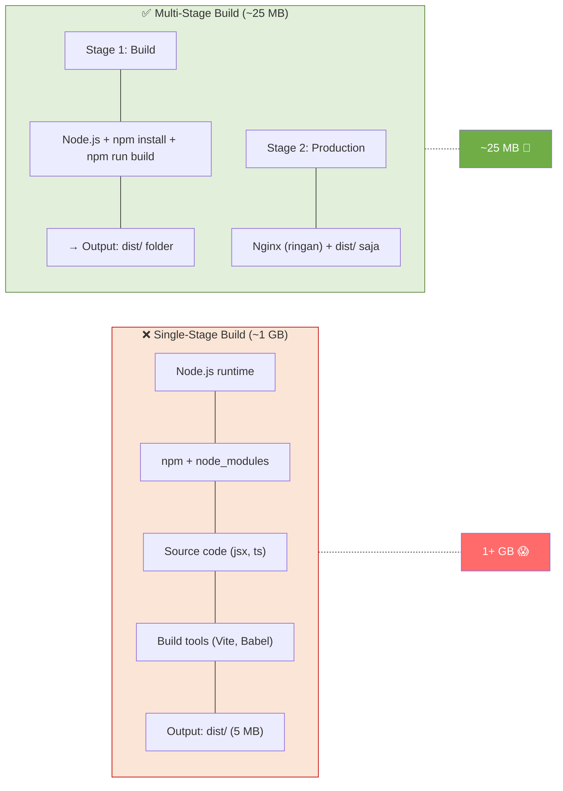
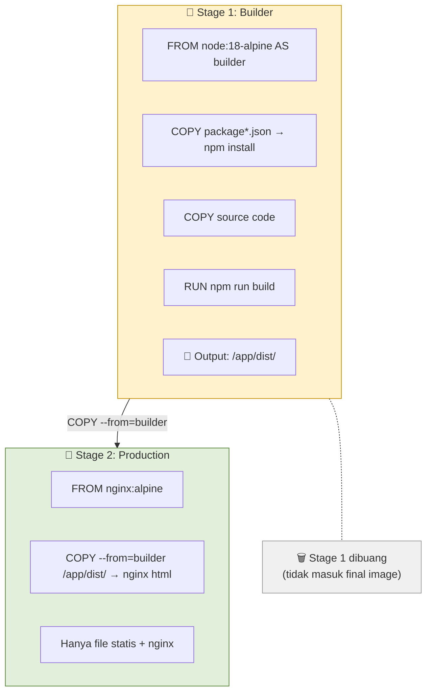
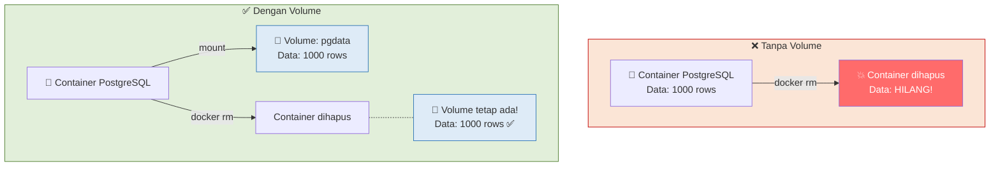
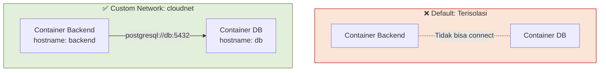
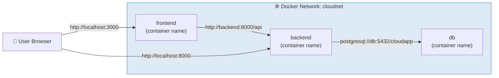
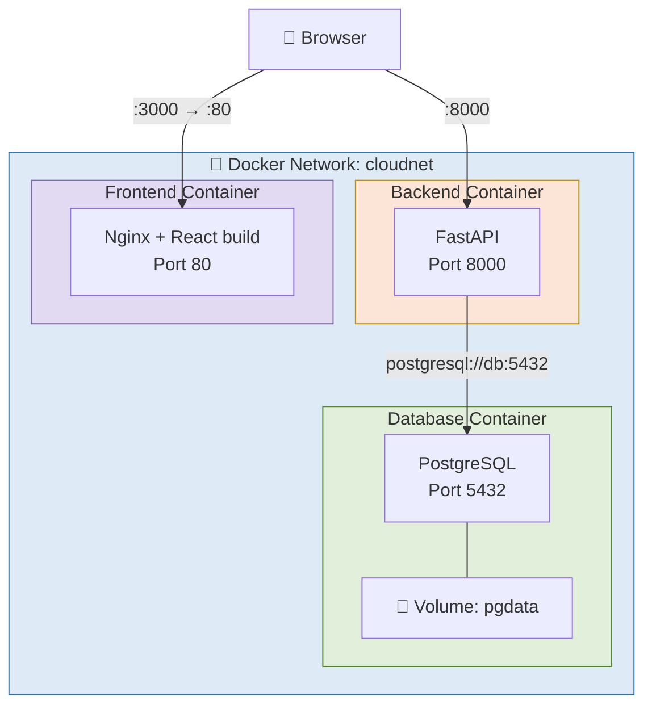
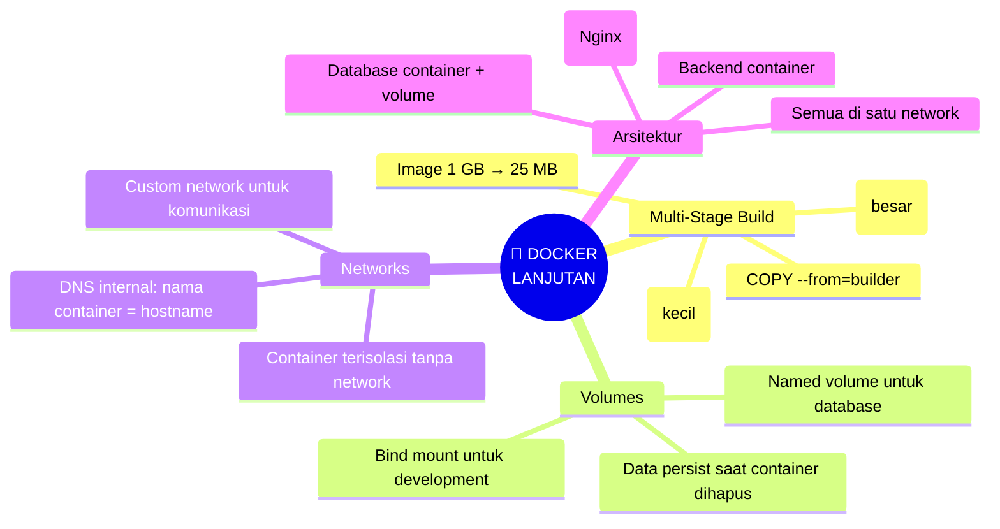
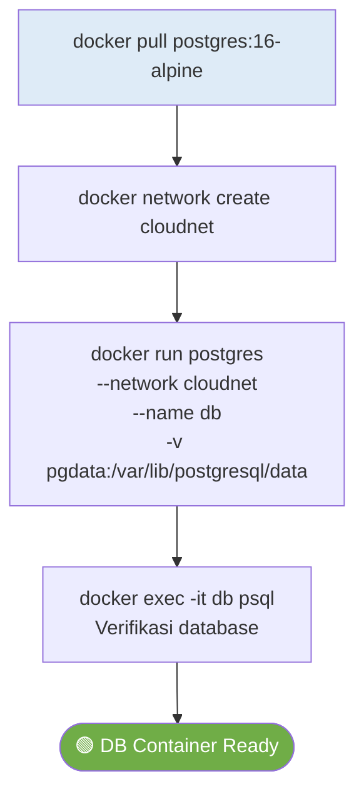
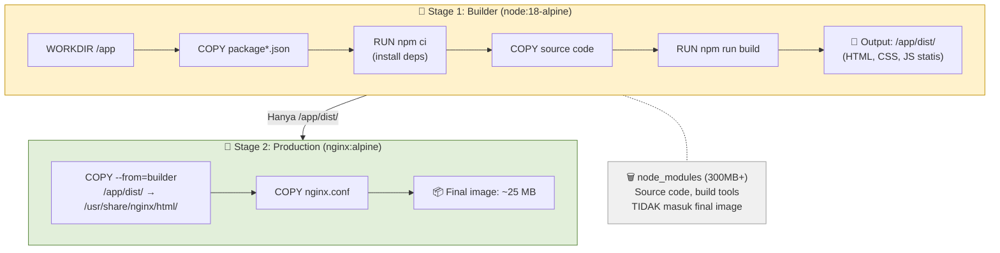
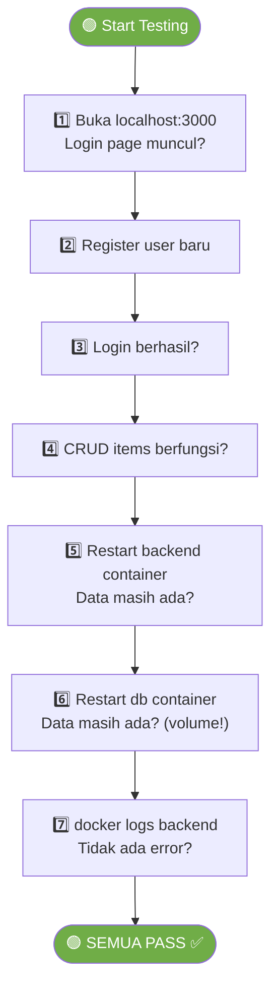

# MODUL 6: DOCKER LANJUTAN — MULTI-STAGE BUILD, VOLUMES & NETWORKS

---

**Mata Kuliah:** Komputasi Awan  
**Program Studi:** Sistem Informasi - Institut Teknologi Kalimantan  
**SKS:** 3 (1 Kuliah + 2 Project)  
**Pertemuan:** 6 dari 16  
**Fase:** 🔵 Containerization (Minggu 5-7)  

---

## Prasyarat

Sebelum memulai pertemuan ini, pastikan:
- [x] Backend Dockerfile dari Modul 5 berjalan di container
- [x] Image backend sudah di-push ke Docker Hub
- [x] Sudah membaca materi multi-stage build & volumes (Modul 5 Bagian D4)
- [x] Docker Desktop running

> ⚠️ **Quick check sebelum mulai:**
> ```bash
> docker --version
> docker images | grep cloudapp    # Image backend harus ada
> ```

---

## Capaian Pembelajaran

### Sub-CPMK
Setelah menyelesaikan pertemuan ini, mahasiswa mampu:
1. Menerapkan multi-stage build untuk menghasilkan image yang efisien
2. Menulis Dockerfile untuk frontend React (build + serve dengan Nginx)
3. Memahami dan menggunakan Docker volumes untuk data persistence
4. Mengkonfigurasi Docker networks untuk komunikasi antar container
5. Menjalankan backend, frontend, dan database sebagai container terpisah yang saling terhubung

### Indikator Pencapaian
- Frontend React berjalan di container Nginx via multi-stage build
- Image frontend berukuran < 50 MB (dibanding ~1 GB tanpa multi-stage)
- Data PostgreSQL persist meskipun container di-restart
- Backend container bisa berkomunikasi dengan PostgreSQL container via Docker network

---

## Pembagian Fokus Tim Pertemuan Ini

| Peran | Fokus Utama | Juga Membantu |
|-------|-------------|---------------|
| **Lead DevOps** | Docker network setup, PostgreSQL container | — |
| **Lead Frontend** | Menulis Dockerfile frontend (multi-stage + Nginx) | — |
| **Lead Backend** | Update backend untuk connect ke DB container, fix env | Debug connection |
| **Lead QA & Docs** | Testing semua container, dokumentasi | Update README |
| **Lead CI/CD** *(5 orang)* | Push frontend image ke Docker Hub, dokumentasi size | Bantu network debug |

---

# BAGIAN A: PEMBEKALAN TEORI (50 Menit)

## 1. Multi-Stage Build (15 menit)

### 1.1 Masalah: Image Terlalu Besar

Saat build frontend React, kita butuh Node.js, npm, dan semua dev dependencies — tapi untuk **menjalankan** hasilnya, kita hanya butuh file statis HTML/CSS/JS. Jika semua tool build ikut masuk ke image final, ukurannya bisa >1 GB.



### 1.2 Konsep Multi-Stage Build

Multi-stage build menggunakan **beberapa `FROM`** dalam satu Dockerfile. Setiap `FROM` memulai **stage baru**. Hanya stage terakhir yang menjadi image final — stage sebelumnya dibuang setelah build selesai.



> 💡 **Analogi:**  
> Multi-stage build seperti **pabrik roti**. Stage 1 adalah dapur (oven, mixer, bahan mentah) — dibutuhkan untuk **membuat** roti. Stage 2 adalah toko (etalase, roti jadi) — hanya berisi **hasil akhir**. Pembeli tidak perlu bawa oven ke rumah, cukup rotinya saja.

---

## 2. Docker Volumes (15 menit)

### 2.1 Masalah: Data Hilang Saat Container Dihapus

Container bersifat **ephemeral** (sementara). Semua data yang ditulis di dalam container akan **hilang** saat container dihapus.



### 2.2 Jenis Volume

| Jenis | Syntax | Kapan Digunakan |
|-------|--------|-----------------|
| **Named Volume** | `-v pgdata:/var/lib/postgresql/data` | Database, persistent data |
| **Bind Mount** | `-v ./backend:/app` | Development (live reload) |
| **tmpfs** | `--tmpfs /tmp` | Data sementara di memory |

> 📝 **Untuk mata kuliah ini:** kita gunakan **named volume** untuk PostgreSQL dan **bind mount** tidak digunakan di production (nanti di Docker Compose minggu 7 akan lebih terstruktur).

---

## 3. Docker Networks (15 menit)

### 3.1 Bagaimana Container Berkomunikasi?

Secara default, setiap container terisolasi. Agar container bisa berkomunikasi, mereka harus berada di **network yang sama**.



### 3.2 DNS di Docker Network

Di dalam Docker network, container bisa saling mengakses menggunakan **nama container** sebagai hostname. Docker menyediakan DNS internal.



| Dari | Ke | URL |
|------|-----|-----|
| Host machine | Backend container | `http://localhost:8000` |
| Host machine | Frontend container | `http://localhost:3000` |
| Backend container | DB container | `postgresql://db:5432/cloudapp` |
| Frontend container (runtime) | Backend container | Tidak langsung — browser user yang request |

> 📝 **Penting untuk frontend:** React berjalan di **browser user**, bukan di container. Jadi frontend tidak bisa akses `http://backend:8000` — itu hanya bisa dari dalam Docker network. Browser user tetap mengakses `http://localhost:8000`. Ini akan kita solve lebih elegan di Docker Compose (minggu 7) dan Nginx reverse proxy (minggu 13).

### 3.3 Network Commands

| Command | Fungsi |
|---------|--------|
| `docker network create cloudnet` | Buat custom network |
| `docker network ls` | Lihat semua networks |
| `docker network inspect cloudnet` | Detail network |
| `docker run --network cloudnet ...` | Jalankan container di network |

---

## 4. Arsitektur Target Minggu Ini



---

## 5. Rangkuman Teori



---

# BAGIAN B: WORKSHOP DI LAB (170 Menit)


---

## Workshop 6.1: PostgreSQL di Docker (30 menit)

### Flowchart Database Container



### Langkah 1: Buat Docker Network

```bash
# Buat custom network
docker network create cloudnet

# Verifikasi
docker network ls
```

### Langkah 2: Jalankan PostgreSQL Container

```bash
docker run -d \
  --name db \
  --network cloudnet \
  -e POSTGRES_USER=postgres \
  -e POSTGRES_PASSWORD=postgres123 \
  -e POSTGRES_DB=cloudapp \
  -p 5433:5432 \
  -v pgdata:/var/lib/postgresql/data \
  postgres:16-alpine
```

> 📝 **Penjelasan flags:**
> - `--name db`: Nama container (jadi hostname di network)
> - `--network cloudnet`: Gabung ke network
> - `-e POSTGRES_*`: Environment variables untuk setup awal
> - `-p 5433:5432`: Map ke port **5433** di host (agar tidak bentrok dengan PostgreSQL lokal di 5432)
> - `-v pgdata:/var/lib/postgresql/data`: Named volume untuk data persistence

### Langkah 3: Verifikasi Database

```bash
# Cek container running
docker ps

# Masuk ke PostgreSQL
docker exec -it db psql -U postgres -d cloudapp

# Di dalam psql:
\dt          # Lihat tabel (masih kosong — nanti dibuat oleh backend)
\q           # Keluar
```

### Langkah 4: Test Volume Persistence

```bash
# Stop & remove container
docker stop db
docker rm db

# Volume masih ada!
docker volume ls | grep pgdata

# Jalankan ulang — data tetap ada
docker run -d \
  --name db \
  --network cloudnet \
  -e POSTGRES_USER=postgres \
  -e POSTGRES_PASSWORD=postgres123 \
  -e POSTGRES_DB=cloudapp \
  -p 5433:5432 \
  -v pgdata:/var/lib/postgresql/data \
  postgres:16-alpine
```

> ✅ **Checkpoint:** PostgreSQL berjalan di container, data persist setelah restart.

---

## Workshop 6.2: Backend Container di Network (25 menit)

### Langkah 1: Update .env untuk Docker Network

Buat file khusus untuk Docker: `backend/.env.docker`

```bash
# Database — menggunakan nama container 'db' sebagai hostname
DATABASE_URL=postgresql://postgres:postgres123@db:5432/cloudapp

# JWT
SECRET_KEY=ganti-dengan-random-string-panjang-minimal-32-karakter
ALGORITHM=HS256
ACCESS_TOKEN_EXPIRE_MINUTES=60

# CORS
ALLOWED_ORIGINS=http://localhost:3000,http://localhost:5173
```

> 📝 **Perhatikan:** `DATABASE_URL` sekarang menggunakan `db` (nama container) sebagai hostname, bukan `localhost` atau `host.docker.internal`.

### Langkah 2: Build & Run Backend di Network

```bash
cd backend

# Build image (jika ada perubahan)
docker build -t cloudapp-backend:v2 .

# Jalankan di network yang sama dengan database
docker run -d \
  --name backend \
  --network cloudnet \
  --env-file .env.docker \
  -p 8000:8000 \
  cloudapp-backend:v2
```

### Langkah 3: Verifikasi Koneksi

```bash
# Cek logs backend
docker logs backend

# Harus muncul: "Uvicorn running on http://0.0.0.0:8000"
# TIDAK boleh ada error database connection
```

Test di browser: http://localhost:8000/docs
- `POST /auth/register` → Buat user baru
- `POST /auth/login` → Login
- Data tersimpan di PostgreSQL container

### Langkah 4: Verifikasi Data di Database Container

```bash
docker exec -it db psql -U postgres -d cloudapp

# Di dalam psql:
\dt                    # Tabel users & items harus ada (dibuat oleh SQLAlchemy)
SELECT * FROM users;   # User yang baru register harus muncul
\q
```

> ✅ **Checkpoint:** Backend container terhubung ke database container via Docker network.

---

## Workshop 6.3: Frontend Multi-Stage Build (40 menit)

### Flowchart Multi-Stage Build Frontend



### Langkah 1: Buat Nginx Config

File: `frontend/nginx.conf`
```nginx
server {
    listen 80;
    server_name localhost;
    root /usr/share/nginx/html;
    index index.html;

    # SPA: semua route diarahkan ke index.html
    # React Router butuh ini agar refresh di /login tidak 404
    location / {
        try_files $uri $uri/ /index.html;
    }

    # Cache static assets
    location ~* \.(js|css|png|jpg|jpeg|gif|ico|svg|woff|woff2)$ {
        expires 1y;
        add_header Cache-Control "public, immutable";
    }

    # Disable caching untuk index.html
    location = /index.html {
        add_header Cache-Control "no-cache";
    }
}
```

### Langkah 2: Buat .dockerignore Frontend

File: `frontend/.dockerignore`
```
node_modules/
dist/
.env
.git/
.gitignore
*.md
.vscode/
.idea/
```

### Langkah 3: Buat Dockerfile Frontend (Multi-Stage)

File: `frontend/Dockerfile`
```dockerfile
# ============================================================
# Stage 1: Build — Install deps & build React app
# ============================================================
FROM node:18-alpine AS builder

WORKDIR /app

# Copy dependency files dulu (cache optimization)
COPY package.json package-lock.json* ./

# Install dependencies
# npm ci = clean install (lebih cepat & reproducible dari npm install)
RUN npm ci

# Copy source code
COPY . .

# Set API URL untuk production build
# Ini akan di-embed ke dalam bundle JavaScript
ARG VITE_API_URL=http://localhost:8000
ENV VITE_API_URL=$VITE_API_URL

# Build React app → output di /app/dist/
RUN npm run build

# ============================================================
# Stage 2: Production — Serve dengan Nginx
# ============================================================
FROM nginx:alpine

# Copy build output dari stage 1
COPY --from=builder /app/dist/ /usr/share/nginx/html/

# Copy custom nginx config
COPY nginx.conf /etc/nginx/conf.d/default.conf

# Nginx default port
EXPOSE 80

# Nginx berjalan di foreground
CMD ["nginx", "-g", "daemon off;"]
```

### Langkah 4: Build Frontend Image

```bash
cd frontend

# Build dengan default API URL
docker build -t cloudapp-frontend:v1 .

# ATAU: Build dengan custom API URL
docker build -t cloudapp-frontend:v1 \
  --build-arg VITE_API_URL=http://localhost:8000 .

# Cek ukuran image
docker images | grep cloudapp
```

**Bandingkan ukuran:**
```
cloudapp-frontend:v1    ~25 MB   ← Multi-stage (Nginx + static files)
cloudapp-backend:v2     ~200 MB  ← Python + dependencies
```

> 💡 Frontend image **jauh lebih kecil** karena hanya berisi Nginx + file statis HTML/CSS/JS. Semua build tools (Node.js, npm, node_modules) sudah dibuang.

### Langkah 5: Jalankan Frontend Container

```bash
docker run -d \
  --name frontend \
  --network cloudnet \
  -p 3000:80 \
  cloudapp-frontend:v1
```

### Langkah 6: Test

Buka browser:
- http://localhost:3000 → Frontend (React di Nginx)
- http://localhost:8000 → Backend (FastAPI)
- Login page harus muncul, register & login harus berfungsi

> ✅ **Checkpoint:** Frontend berjalan di Nginx container via multi-stage build, image < 50 MB.

---

## Workshop 6.4: Verifikasi Semua Container (20 menit)

### Status Check

```bash
# Lihat semua container yang berjalan
docker ps

# Output harus menunjukkan 3 container:
# NAMES       IMAGE                     PORTS
# frontend    cloudapp-frontend:v1      0.0.0.0:3000->80/tcp
# backend     cloudapp-backend:v2       0.0.0.0:8000->8000/tcp
# db          postgres:16-alpine        0.0.0.0:5433->5432/tcp
```

### Network Check

```bash
# Inspect network — semua 3 container harus terdaftar
docker network inspect cloudnet
```

### Full Integration Test



```bash
# Test restart persistence
docker restart backend
# Buka localhost:3000 → data harus masih ada

docker stop db
docker rm db
# Jalankan ulang db DENGAN VOLUME YANG SAMA
docker run -d \
  --name db \
  --network cloudnet \
  -e POSTGRES_USER=postgres \
  -e POSTGRES_PASSWORD=postgres123 \
  -e POSTGRES_DB=cloudapp \
  -p 5433:5432 \
  -v pgdata:/var/lib/postgresql/data \
  postgres:16-alpine

docker restart backend
# Data harus tetap ada!
```

> ✅ **Checkpoint:** 3 container berjalan, saling terhubung, data persist setelah restart.

---

## Workshop 6.5: Push Frontend Image (15 menit)

```bash
# Tag frontend image
docker tag cloudapp-frontend:v1 USERNAME/cloudapp-frontend:v1

# Push ke Docker Hub
docker push USERNAME/cloudapp-frontend:v1

# Verifikasi di https://hub.docker.com/
```

Sekarang Anda punya 2 image di Docker Hub:
- `USERNAME/cloudapp-backend:v2`
- `USERNAME/cloudapp-frontend:v1`

---

## Workshop 6.6: Cleanup Script & Commit (20 menit)

### Helper Script

Buat script untuk mempermudah start/stop semua container:

File: `scripts/docker-run.sh`
```bash
#!/bin/bash

# ============================================================
# Script untuk menjalankan semua container secara manual
# CATATAN: Minggu 7 kita akan pakai Docker Compose yang lebih elegan
# ============================================================

ACTION=${1:-start}

case $ACTION in
  start)
    echo "🚀 Starting all containers..."
    
    # Create network
    docker network create cloudnet 2>/dev/null || true
    
    # Database
    echo "📦 Starting database..."
    docker run -d \
      --name db \
      --network cloudnet \
      -e POSTGRES_USER=postgres \
      -e POSTGRES_PASSWORD=postgres123 \
      -e POSTGRES_DB=cloudapp \
      -p 5433:5432 \
      -v pgdata:/var/lib/postgresql/data \
      postgres:16-alpine
    
    # Wait for database to be ready
    echo "⏳ Waiting for database..."
    sleep 5
    
    # Backend
    echo "🐍 Starting backend..."
    docker run -d \
      --name backend \
      --network cloudnet \
      --env-file backend/.env.docker \
      -p 8000:8000 \
      cloudapp-backend:v2
    
    # Frontend
    echo "⚛️ Starting frontend..."
    docker run -d \
      --name frontend \
      --network cloudnet \
      -p 3000:80 \
      cloudapp-frontend:v1
    
    echo ""
    echo "✅ All containers started!"
    echo "   Frontend: http://localhost:3000"
    echo "   Backend:  http://localhost:8000"
    echo "   Database: localhost:5433"
    ;;
    
  stop)
    echo "🛑 Stopping all containers..."
    docker stop frontend backend db 2>/dev/null
    docker rm frontend backend db 2>/dev/null
    echo "✅ All containers stopped and removed."
    ;;
    
  status)
    echo "📊 Container Status:"
    docker ps --format "table {{.Names}}\t{{.Image}}\t{{.Status}}\t{{.Ports}}"
    ;;
    
  logs)
    CONTAINER=${2:-backend}
    echo "📋 Logs for $CONTAINER:"
    docker logs -f $CONTAINER
    ;;
    
  *)
    echo "Usage: ./scripts/docker-run.sh [start|stop|status|logs [container]]"
    ;;
esac
```

```bash
chmod +x scripts/docker-run.sh
```

### Commit

```bash
cd cloud-team-XX

# Lead Frontend commit Dockerfile
git add frontend/Dockerfile frontend/.dockerignore frontend/nginx.conf
git commit -m "feat: add multi-stage Docker build for frontend

- Stage 1: Node.js build (npm ci + npm run build)
- Stage 2: Nginx alpine serve static files
- Add nginx.conf: SPA routing, static asset caching
- Image size: ~25 MB (vs ~1 GB single-stage)"

git push origin main

# Lead DevOps commit scripts & env
git pull origin main
git add scripts/ backend/.env.docker backend/.env.example
git commit -m "feat: add Docker network setup and run scripts

- Add docker-run.sh: start/stop/status/logs for all containers
- Add .env.docker: env vars for Docker network (db hostname)
- PostgreSQL runs in container with named volume pgdata"

git push origin main
```

---

# BAGIAN C: TUGAS TERSTRUKTUR (60 Menit)

> 📝 **Kumpulkan sebelum pertemuan 7** via push ke repository tim.
>
> ⚠️ **Minggu depan: Docker Compose!** Kita akan meng-otomasi semua yang dikerjakan manual hari ini.

---

## Tugas 6: Optimasi & Dokumentasi Multi-Container

### Pembagian Tugas

| Anggota | Tugas | Detail |
|---------|-------|--------|
| **Lead DevOps** | Optimasi backend Dockerfile: **multi-stage build** | Buat 2-stage: Stage 1 install deps di venv, Stage 2 copy venv + kode saja. Target: image < 150 MB. |
| **Lead Frontend** | Buat **production-ready nginx.conf** | Tambahkan: gzip compression, security headers (`X-Frame-Options`, `X-Content-Type-Options`), custom error pages. |
| **Lead Backend** | Buat **startup script** yang cek database ready | Buat `scripts/wait-for-db.sh` yang ping PostgreSQL sebelum start uvicorn. Ini mencegah error saat DB belum siap. |
| **Lead QA & Docs** | Buat `docs/docker-architecture.md` | Gambarkan arsitektur 3-container lengkap: ports, networks, volumes, env vars. Gunakan diagram Mermaid. |
| **Lead CI/CD** *(5 orang)* | Bandingkan image sizes & push semua images | Dokumentasikan: ukuran sebelum vs sesudah optimasi. Push backend:v2 & frontend:v1 ke Docker Hub. |

### Contoh: Backend Multi-Stage Build

```dockerfile
# Stage 1: Install dependencies
FROM python:3.12-slim AS builder
WORKDIR /app
COPY requirements.txt .
RUN python -m venv /opt/venv
ENV PATH="/opt/venv/bin:$PATH"
RUN pip install --no-cache-dir -r requirements.txt

# Stage 2: Production
FROM python:3.12-slim
WORKDIR /app
COPY --from=builder /opt/venv /opt/venv
ENV PATH="/opt/venv/bin:$PATH"
COPY . .
RUN useradd -m appuser && chown -R appuser /app
USER appuser
EXPOSE 8000
CMD ["uvicorn", "main:app", "--host", "0.0.0.0", "--port", "8000"]
```

### Contoh: wait-for-db.sh

```bash
#!/bin/bash
echo "Waiting for PostgreSQL..."
while ! pg_isready -h db -p 5432 -U postgres -q; do
  sleep 1
done
echo "PostgreSQL is ready!"
exec "$@"
```

### Informasi Pengumpulan

| Item | Keterangan |
|------|------------|
| **Deadline** | Sebelum pertemuan 7 dimulai |
| **Format** | Push ke repository tim |
| **Penilaian** | Optimasi berjalan, docs lengkap, semua anggota ≥1 commit |

---

# BAGIAN D: BELAJAR MANDIRI (230 Menit)

---

## D1. Membaca Referensi (60 menit)

### Bacaan Wajib
1. **Docker Compose Overview**  
   https://docs.docker.com/compose/  
   (Persiapan utama minggu 7 — baca keseluruhan)

2. **Docker Compose File Reference**  
   https://docs.docker.com/reference/compose-file/  
   (Referensi syntax `docker-compose.yml`)

3. **Docker Multi-stage Builds Best Practices**  
   https://docs.docker.com/build/building/multi-stage/

### Bacaan Tambahan
- Docker Volumes Deep Dive — https://docs.docker.com/engine/storage/volumes/
- Docker Networking — https://docs.docker.com/engine/network/
- Nginx Docker Official Image — https://hub.docker.com/_/nginx

---

## D2. Video Tutorial (60 menit)

1. **"Docker Compose Tutorial"** — TechWorld with Nana (YouTube, ~30 min)
2. **"Multi-stage Docker Builds"** — cari di YouTube (~10 min)
3. **"Docker Networking Explained"** — cari di YouTube (~15 min)
4. **"Docker Volumes Explained"** — cari di YouTube (~10 min)

> ⚠️ **Docker Compose video SANGAT penting!** Minggu 7 kita akan menggantikan semua docker run manual hari ini dengan satu file `docker-compose.yml`.

---

## D3. Latihan Mandiri (60 menit)

### Soal Pilihan Ganda

**1.** Multi-stage build berguna untuk:
- [ ] a. Menjalankan multiple aplikasi dalam satu container
- [ ] b. Memisahkan proses build dari production image agar image lebih kecil
- [ ] c. Membuat multiple container sekaligus
- [ ] d. Mengupdate image secara otomatis

**2.** Docker volume digunakan untuk:
- [ ] a. Memperbesar ukuran container
- [ ] b. Mempercepat build image
- [ ] c. Menyimpan data yang persist meskipun container dihapus
- [ ] d. Menghubungkan container ke internet

**3.** Di dalam Docker custom network, container bisa mengakses container lain menggunakan:
- [ ] a. IP address saja
- [ ] b. Nama container sebagai hostname
- [ ] c. Port forwarding saja
- [ ] d. Tidak bisa saling akses

**4.** `COPY --from=builder /app/dist/ .` artinya:
- [ ] a. Copy file dari host machine
- [ ] b. Copy file dari stage sebelumnya yang bernama "builder"
- [ ] c. Copy file dari Docker Hub
- [ ] d. Copy file dari volume

**5.** `npm ci` berbeda dari `npm install` karena:
- [ ] a. `npm ci` lebih lambat
- [ ] b. `npm ci` menghasilkan output berbeda setiap run
- [ ] c. `npm ci` clean install berdasarkan lock file — lebih cepat & reproducible
- [ ] d. `npm ci` tidak memerlukan package.json

---

## D4. Persiapan Pertemuan Berikutnya (50 menit)

Pertemuan 7 akan menggunakan **Docker Compose** untuk menggantikan semua docker run manual. Persiapkan:

- Apa itu **Docker Compose** dan apa bedanya dengan `docker run`?
- Bagaimana syntax file `docker-compose.yml`?
- Apa itu **services**, **networks**, dan **volumes** di Compose?
- Coba tulis draft `docker-compose.yml` untuk 3 service (db, backend, frontend)
- Baca: https://docs.docker.com/compose/gettingstarted/

> 💡 **Preview:** Semua perintah docker run yang panjang hari ini akan digantikan dengan satu perintah: `docker compose up`. Satu file YAML, satu perintah, semua container berjalan!

---

---

*Modul ini disusun oleh Aidil Saputra Kirsan, Institut Teknologi Kalimantan.*
