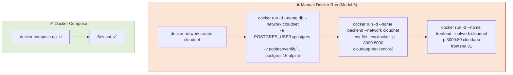
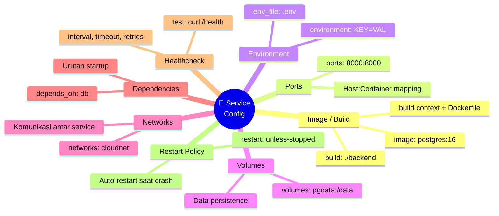
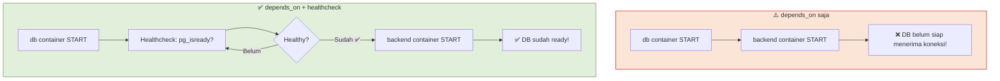
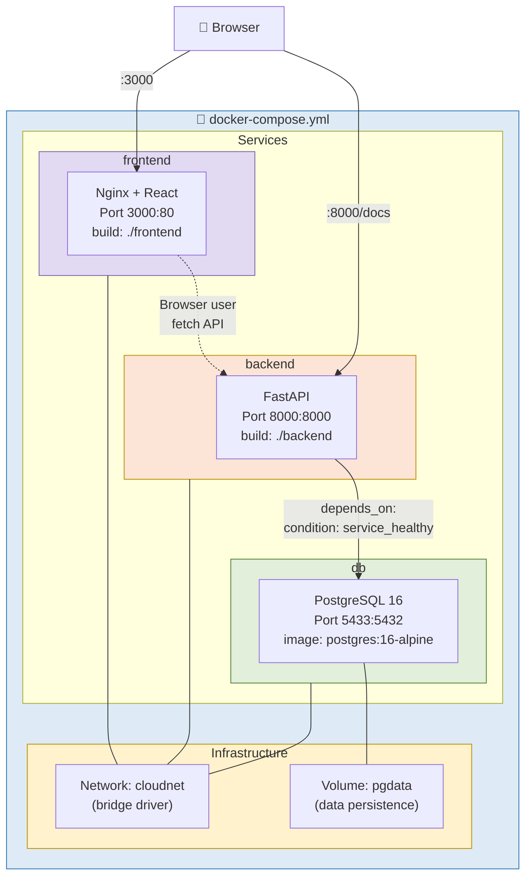
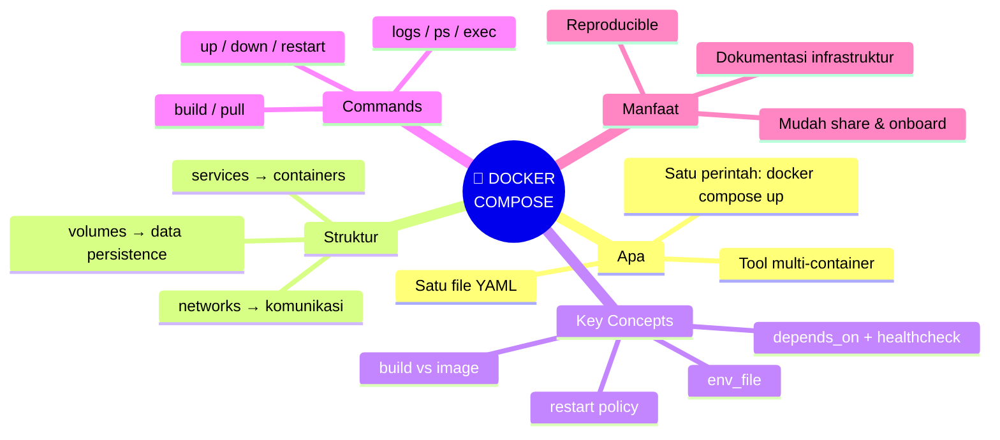
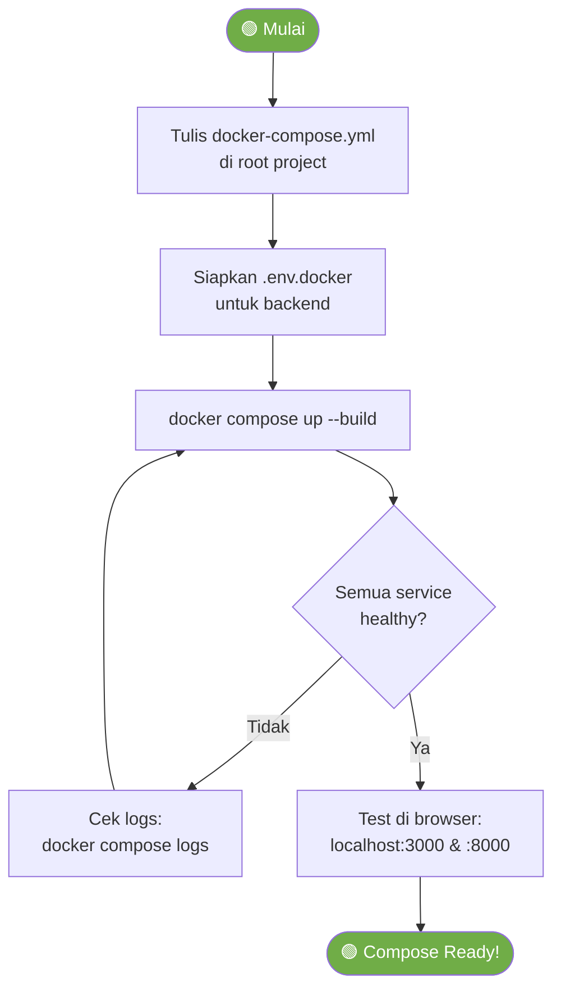
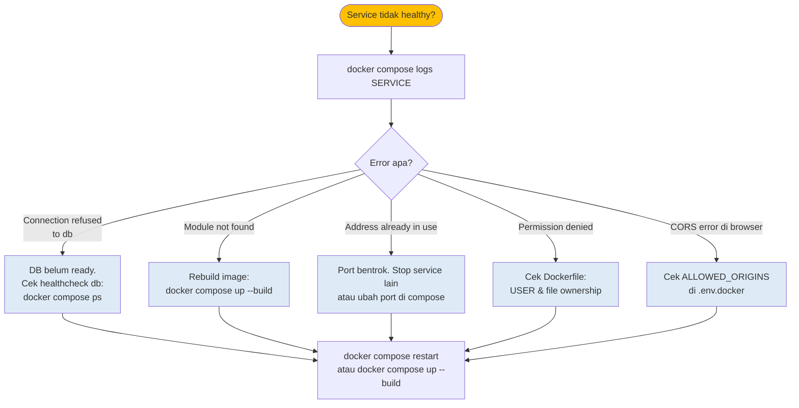
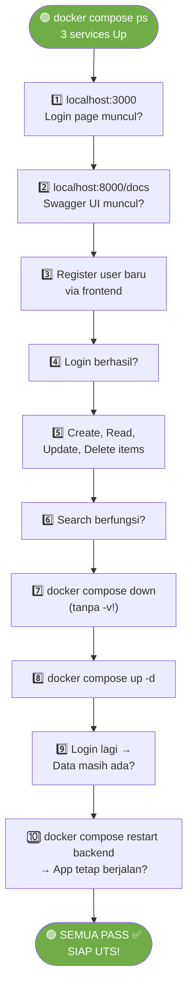
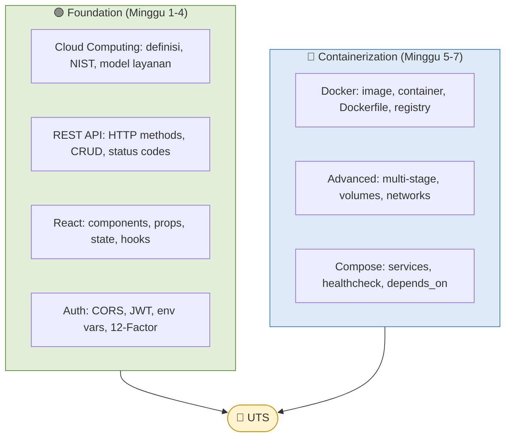

# MODUL 7: DOCKER COMPOSE — ORKESTRASI MULTI-CONTAINER

---

**Mata Kuliah:** Komputasi Awan  
**Program Studi:** Sistem Informasi - Institut Teknologi Kalimantan  
**SKS:** 3 (1 Kuliah + 2 Project)  
**Pertemuan:** 7 dari 16  
**Fase:** 🔵 Containerization (Minggu 5-7) — **Pertemuan Terakhir Fase Container**  

---

## Prasyarat

Sebelum memulai pertemuan ini, pastikan:
- [x] Modul 5 & 6 selesai: backend, frontend, database berjalan di container terpisah
- [x] Docker Desktop running
- [x] Sudah membaca materi Docker Compose (Modul 6 Bagian D4)

> ⚠️ **Clean up dulu!** Stop dan hapus semua container dari minggu lalu agar port tidak bentrok:
> ```bash
> docker stop frontend backend db 2>/dev/null
> docker rm frontend backend db 2>/dev/null
> ```

---

## Capaian Pembelajaran

### Sub-CPMK
Setelah menyelesaikan pertemuan ini, mahasiswa mampu:
1. Menulis file `docker-compose.yml` untuk mendefinisikan multi-container application
2. Mengkonfigurasi services, networks, volumes, dan dependencies di Compose
3. Menerapkan healthcheck dan restart policy untuk reliability
4. Mengelola environment variables secara terpusat di Compose
5. Menggunakan perintah `docker compose` untuk lifecycle management

### Indikator Pencapaian
- Seluruh aplikasi (3 services) berjalan dengan satu perintah: `docker compose up`
- Database healthcheck berfungsi — backend menunggu DB ready sebelum start
- Data persist saat `docker compose down` dan `docker compose up` kembali
- Aplikasi siap di-demo untuk UTS minggu depan

---

## Pembagian Fokus Tim Pertemuan Ini

| Peran | Fokus Utama | Juga Membantu |
|-------|-------------|---------------|
| **Lead DevOps** | Menulis `docker-compose.yml`, konfigurasi services | — |
| **Lead Backend** | Pastikan backend berjalan di Compose, fix env vars | Debug startup |
| **Lead Frontend** | Pastikan frontend build & serve benar di Compose | Test UI |
| **Lead QA & Docs** | Testing lifecycle (up, down, restart), dokumentasi | Update README |
| **Lead CI/CD** *(5 orang)* | Buat `Makefile` untuk Compose commands, push images | Bantu testing |

---

# BAGIAN A: PEMBEKALAN TEORI (50 Menit)

## 1. Mengapa Docker Compose? (10 menit)

### 1.1 Masalah: Terlalu Banyak Perintah

Di Modul 6, kita menjalankan 3 container secara manual — setiap container butuh perintah panjang:



### 1.2 Apa itu Docker Compose?

**Docker Compose** adalah tool untuk mendefinisikan dan menjalankan **multi-container Docker application** menggunakan satu file YAML (`docker-compose.yml`). Semua konfigurasi — services, networks, volumes, environment — ditulis di satu tempat.

> 💡 **Analogi:**  
> Jika Dockerfile adalah **resep untuk satu masakan**, maka Docker Compose adalah **menu restoran lengkap** — mendefinisikan semua masakan yang perlu disiapkan, urutan penyajiannya, dan bagaimana mereka saling melengkapi.

---

## 2. Anatomy docker-compose.yml (20 menit)

### 2.1 Struktur Dasar

```yaml
# Versi (opsional di Compose V2)
services:
  nama-service-1:
    # Konfigurasi service 1
  nama-service-2:
    # Konfigurasi service 2

volumes:
  # Definisi named volumes

networks:
  # Definisi custom networks
```

### 2.2 Konfigurasi Service



### 2.3 Key Directives Explained

| Directive | Fungsi | Contoh |
|-----------|--------|--------|
| `build` | Build image dari Dockerfile | `build: ./backend` |
| `image` | Gunakan image yang sudah ada | `image: postgres:16-alpine` |
| `ports` | Port mapping host:container | `ports: ["8000:8000"]` |
| `environment` | Set env vars inline | `environment: [DB_HOST=db]` |
| `env_file` | Load env vars dari file | `env_file: ./backend/.env.docker` |
| `volumes` | Mount volume | `volumes: [pgdata:/var/lib/...]` |
| `depends_on` | Startup dependency | `depends_on: [db]` |
| `healthcheck` | Cek apakah service sehat | `test: ["CMD", "curl", "-f", "..."]` |
| `restart` | Restart policy | `restart: unless-stopped` |
| `networks` | Assign ke network | `networks: [cloudnet]` |

### 2.4 depends_on vs healthcheck

`depends_on` saja **hanya menjamin urutan startup**, bukan bahwa service sudah **ready**. Kombinasikan dengan `healthcheck` dan `condition: service_healthy` untuk memastikan service benar-benar siap.



---

## 3. Docker Compose Commands (10 menit)

### Lifecycle Commands

| Command | Fungsi |
|---------|--------|
| `docker compose up` | Build (jika perlu) & start semua services |
| `docker compose up -d` | Start di background (detached) |
| `docker compose up --build` | Force rebuild images lalu start |
| `docker compose down` | Stop & remove containers, networks |
| `docker compose down -v` | Stop & remove + hapus volumes (⚠️ data hilang!) |
| `docker compose restart` | Restart semua services |
| `docker compose stop` | Stop tanpa remove |

### Monitoring Commands

| Command | Fungsi |
|---------|--------|
| `docker compose ps` | Status semua services |
| `docker compose logs` | Lihat log semua services |
| `docker compose logs -f backend` | Follow log service tertentu |
| `docker compose exec backend bash` | Masuk ke container service |
| `docker compose top` | Lihat proses di semua containers |

### Build Commands

| Command | Fungsi |
|---------|--------|
| `docker compose build` | Build semua images |
| `docker compose build backend` | Build image service tertentu |
| `docker compose pull` | Pull images dari registry |

---

## 4. Arsitektur Final Compose



---

## 5. Rangkuman Teori



---

# BAGIAN B: WORKSHOP DI LAB (170 Menit)


> ⚠️ **Pastikan tidak ada container dari minggu lalu yang berjalan:**
> ```bash
> docker stop $(docker ps -q) 2>/dev/null
> docker rm $(docker ps -aq) 2>/dev/null
> ```

---

## Workshop 7.1: Menulis docker-compose.yml (40 menit)

### Flowchart Compose Setup



### Langkah 1: Buat docker-compose.yml

File: `docker-compose.yml` (di **root** project, bukan di subfolder)

```yaml
# ============================================================
# Docker Compose — Cloud App
# Komputasi Awan — SI ITK
# ============================================================
# Usage:
#   docker compose up -d          # Start semua services
#   docker compose down            # Stop & remove
#   docker compose logs -f         # Lihat logs
#   docker compose ps              # Status services
# ============================================================

services:
  # ==================== DATABASE ====================
  db:
    image: postgres:16-alpine
    container_name: cloudapp-db
    restart: unless-stopped
    environment:
      POSTGRES_USER: postgres
      POSTGRES_PASSWORD: postgres123
      POSTGRES_DB: cloudapp
    ports:
      - "5433:5432"
    volumes:
      - pgdata:/var/lib/postgresql/data
    networks:
      - cloudnet
    healthcheck:
      test: ["CMD-SHELL", "pg_isready -U postgres -d cloudapp"]
      interval: 10s
      timeout: 5s
      retries: 5
      start_period: 10s

  # ==================== BACKEND ====================
  backend:
    build:
      context: ./backend
      dockerfile: Dockerfile
    container_name: cloudapp-backend
    restart: unless-stopped
    env_file:
      - ./backend/.env.docker
    ports:
      - "8000:8000"
    networks:
      - cloudnet
    depends_on:
      db:
        condition: service_healthy
    healthcheck:
      test: ["CMD", "python", "-c", "import urllib.request; urllib.request.urlopen('http://localhost:8000/health')"]
      interval: 30s
      timeout: 10s
      retries: 3
      start_period: 15s

  # ==================== FRONTEND ====================
  frontend:
    build:
      context: ./frontend
      dockerfile: Dockerfile
      args:
        VITE_API_URL: http://localhost:8000
    container_name: cloudapp-frontend
    restart: unless-stopped
    ports:
      - "3000:80"
    networks:
      - cloudnet
    depends_on:
      - backend

# ==================== VOLUMES ====================
volumes:
  pgdata:
    name: cloudapp-pgdata

# ==================== NETWORKS ====================
networks:
  cloudnet:
    name: cloudapp-network
    driver: bridge
```

> 📝 **Penjelasan penting:**
> - `depends_on.db.condition: service_healthy` — Backend MENUNGGU sampai PostgreSQL healthcheck pass
> - `restart: unless-stopped` — Container auto-restart jika crash, kecuali di-stop manual
> - `start_period` — Grace period sebelum healthcheck mulai (beri waktu service startup)
> - `build.args.VITE_API_URL` — Inject API URL saat build frontend

### Langkah 2: Verifikasi .env.docker

Pastikan file `backend/.env.docker` sudah benar:

```bash
# Database — hostname 'db' sesuai nama service di compose
DATABASE_URL=postgresql://postgres:postgres123@db:5432/cloudapp

# JWT
SECRET_KEY=ganti-dengan-random-string-panjang-minimal-32-karakter
ALGORITHM=HS256
ACCESS_TOKEN_EXPIRE_MINUTES=60

# CORS
ALLOWED_ORIGINS=http://localhost:3000,http://localhost:5173
```

### Langkah 3: Verifikasi Struktur File

```
cloud-team-XX/
├── docker-compose.yml       ← BARU (di root!)
├── backend/
│   ├── Dockerfile
│   ├── .dockerignore
│   ├── .env.docker
│   ├── main.py
│   └── ...
├── frontend/
│   ├── Dockerfile
│   ├── .dockerignore
│   ├── nginx.conf
│   └── ...
└── ...
```

> ✅ **Checkpoint:** File `docker-compose.yml` berada di root project, `.env.docker` siap.

---

## Workshop 7.2: docker compose up (30 menit)

### The Magic Command 🎉

```bash
cd cloud-team-XX

# Build & start semua services
docker compose up --build -d
```

**Perhatikan output:**
```
[+] Building 45.2s (23/23) FINISHED
 => [backend] ...
 => [frontend] ...
[+] Running 4/4
 ✔ Network cloudapp-network  Created
 ✔ Volume "cloudapp-pgdata"  Created
 ✔ Container cloudapp-db      Started
 ✔ Container cloudapp-backend  Started
 ✔ Container cloudapp-frontend Started
```

### Cek Status

```bash
# Lihat status semua services
docker compose ps

# Output yang diharapkan:
# NAME                 STATUS               PORTS
# cloudapp-db          Up (healthy)         0.0.0.0:5433->5432/tcp
# cloudapp-backend     Up (healthy)         0.0.0.0:8000->8000/tcp
# cloudapp-frontend    Up                   0.0.0.0:3000->80/tcp
```

### Cek Logs

```bash
# Semua logs
docker compose logs

# Log service tertentu (follow)
docker compose logs -f backend

# Log terakhir 50 baris
docker compose logs --tail 50 backend
```

### Troubleshooting



> ✅ **Checkpoint:** `docker compose ps` menunjukkan 3 services "Up", db dan backend "healthy".

---

## Workshop 7.3: Testing Lengkap (25 menit)

### Full Test Checklist



**Jalankan setiap langkah:**

```bash
# Step 7: Down (data harus persist karena volume tetap ada)
docker compose down

# Step 8: Up lagi
docker compose up -d

# Step 9: Buka localhost:3000 — login dengan akun tadi — data harus ada

# Step 10: Restart satu service
docker compose restart backend
# Frontend & DB tetap jalan, backend restart sebentar lalu ready lagi
```

### Test: Apa yang Terjadi Jika Service Crash?

```bash
# Simulasi crash: kill backend process
docker compose exec backend sh -c "kill 1"

# Tunggu beberapa detik...
docker compose ps
# Backend harus auto-restart karena restart: unless-stopped!
```

> ✅ **Checkpoint:** Semua test pass, data persist, auto-restart bekerja.

---

## Workshop 7.4: Useful Compose Workflows (20 menit)

### Rebuild Satu Service

```bash
# Hanya rebuild & restart backend (jika ada perubahan kode)
docker compose up --build -d backend

# Frontend saja
docker compose up --build -d frontend
```

### Masuk ke Container

```bash
# Backend shell
docker compose exec backend bash

# Database psql
docker compose exec db psql -U postgres -d cloudapp

# Frontend shell
docker compose exec frontend sh  # Nginx alpine pakai sh, bukan bash
```

### Scale (Preview — tidak untuk production kita)

```bash
# Jalankan 3 instance backend (demonstrasi horizontal scaling)
# ⚠️ Butuh load balancer — ini hanya demo konsep
docker compose up -d --scale backend=3 --no-recreate
```

### Resource Monitoring

```bash
# Lihat resource usage semua containers
docker stats

# Output:
# CONTAINER       CPU %   MEM USAGE
# cloudapp-db     0.5%    50 MB
# cloudapp-backend 1.2%   80 MB
# cloudapp-frontend 0.1%  5 MB
```

---

## Workshop 7.5: Persiapan UTS (15 menit)

### UTS Minggu Depan: Apa yang Di-demo?

```mermaid
flowchart TD
    subgraph UTS ["📋 UTS — Project Milestone 1"]
        DEMO["🖥️ Live Demo (30%)"]
        CODE["💻 Code Review (25%)"]
        VIVA["🎤 Individual Viva (25%)"]
        DOCS["📝 Dokumentasi (20%)"]
    end

    DEMO --> D1["docker compose up -d"]
    DEMO --> D2["Buka frontend → Register → Login"]
    DEMO --> D3["CRUD items via UI"]
    DEMO --> D4["docker compose down → up → data persist"]

    CODE --> C1["Dockerfile best practices"]
    CODE --> C2["docker-compose.yml lengkap"]
    CODE --> C3["Backend CRUD + Auth"]
    CODE --> C4["Frontend components"]

    VIVA --> V1["Setiap anggota ditanya<br/>tentang bagian mereka"]
    VIVA --> V2["Pertanyaan Docker:<br/>Jelaskan Dockerfile Anda"]
    VIVA --> V3["Pertanyaan konsep:<br/>Apa itu multi-stage build?"]

    DOCS --> DOC1["README lengkap"]
    DOCS --> DOC2["docker-compose.yml terdokumentasi"]
    DOCS --> DOC3["Commit history teratur"]

    style UTS fill:#FFF2CC,stroke:#BF8F00
```



### Checklist Kesiapan UTS

Pastikan sebelum minggu depan:

- [ ] `docker compose up -d` berjalan tanpa error
- [ ] Frontend accessible di localhost:3000
- [ ] Backend accessible di localhost:8000
- [ ] Register & login berfungsi
- [ ] CRUD items berfungsi (create, read, update, delete, search)
- [ ] Data persist setelah `docker compose down` dan `up`
- [ ] README.md lengkap dengan instruksi Docker
- [ ] Setiap anggota memahami bagian masing-masing (untuk viva)
- [ ] Setiap anggota punya commit yang signifikan di Git history

---

## Workshop 7.6: Commit & Push (20 menit)

### File Baru/Updated

```
cloud-team-XX/
├── docker-compose.yml       ← BARU
├── backend/
│   ├── Dockerfile           ← Verified
│   ├── .dockerignore
│   ├── .env.docker          ← Verified
│   └── ...
├── frontend/
│   ├── Dockerfile           ← Verified
│   ├── .dockerignore
│   ├── nginx.conf           ← Verified
│   └── ...
├── docs/
│   └── ...
├── .gitignore
└── README.md                ← Updated
```

### Commit

```bash
cd cloud-team-XX

# Lead DevOps commit docker-compose
git add docker-compose.yml
git commit -m "feat: add Docker Compose for multi-container orchestration

- Define 3 services: db (PostgreSQL), backend (FastAPI), frontend (Nginx)
- Add healthcheck for db (pg_isready) and backend (/health)
- Backend waits for db healthy before starting
- Named volume pgdata for database persistence
- Custom bridge network cloudnet for service communication
- Restart policy: unless-stopped for all services

Run with: docker compose up -d"

git push origin main

# Lead QA update README
git pull origin main

# Update README dengan section Docker Compose
git add README.md
git commit -m "docs: add Docker Compose instructions to README

- Add quick start with docker compose up
- Add available commands (up, down, logs, ps)
- Add UTS demo preparation checklist"

git push origin main
```

---

# BAGIAN C: TUGAS TERSTRUKTUR (60 Menit)

> 📝 **Kumpulkan sebelum UTS (pertemuan 8)** via push ke repository tim.
> 
> ⚠️ **Tugas ini adalah PERSIAPAN UTS!** Pastikan semua beres.

---

## Tugas 7: Final Polish untuk UTS

### Pembagian Tugas

| Anggota | Tugas | Detail |
|---------|-------|--------|
| **Lead DevOps** | Buat `Makefile` untuk shortcut commands | `make up`, `make down`, `make logs`, `make build`, `make clean`. Test semua commands berfungsi. |
| **Lead Backend** | Pastikan SEMUA endpoint berfungsi di Docker | Test dari Swagger: register, login, CRUD, stats, health. Fix bug jika ada. |
| **Lead Frontend** | Pastikan UI/UX clean untuk demo | Fix styling issues, pastikan loading states benar, error messages jelas. |
| **Lead QA & Docs** | **Final README review** + buat `docs/uts-demo-script.md` | Script demo UTS step-by-step: urutan apa yang di-tunjukkan ke dosen. |
| **Lead CI/CD** *(5 orang)* | Push semua images ke Docker Hub + tag `latest` | `docker compose build`, tag, push. Dokumentasikan image names & sizes. |

### Contoh Makefile

File: `Makefile`
```makefile
.PHONY: up down build logs ps clean restart

# Start semua services
up:
	docker compose up -d

# Start dengan rebuild
build:
	docker compose up --build -d

# Stop & remove containers
down:
	docker compose down

# Stop, remove, DAN hapus volumes (⚠️ data hilang!)
clean:
	docker compose down -v
	docker system prune -f

# Restart semua
restart:
	docker compose restart

# Lihat logs (semua services)
logs:
	docker compose logs -f

# Lihat logs backend saja
logs-backend:
	docker compose logs -f backend

# Lihat status
ps:
	docker compose ps

# Masuk ke backend shell
shell-backend:
	docker compose exec backend bash

# Masuk ke database
shell-db:
	docker compose exec db psql -U postgres -d cloudapp
```

### Contoh: UTS Demo Script

File: `docs/uts-demo-script.md`
```markdown
# UTS Demo Script — Cloud Team XX

## 1. Setup (2 menit)
- Buka terminal di root project
- `make up` atau `docker compose up -d`
- `docker compose ps` → tunjukkan 3 services healthy

## 2. Frontend Demo (5 menit)
- Buka http://localhost:3000
- Register user baru (tunjukkan form validation)
- Login → masuk ke main app
- Create 3 items (tunjukkan form, response)
- Edit 1 item (tunjukkan pre-filled form)
- Search item
- Delete 1 item (tunjukkan confirm dialog)

## 3. Backend Demo (3 menit)
- Buka http://localhost:8000/docs (Swagger UI)
- Tunjukkan semua endpoints terdokumentasi
- Test /health endpoint
- Tunjukkan auth flow di Swagger

## 4. Docker Demo (3 menit)
- `docker compose ps` → status
- `docker compose down` → semua stop
- `docker compose up -d` → semua start lagi
- Login → data masih ada (volume persistence)
- `docker compose logs backend` → tunjukkan logs

## 5. Code Walkthrough (2 menit)
- Tunjukkan docker-compose.yml (services, healthcheck)
- Tunjukkan backend/Dockerfile
- Tunjukkan frontend/Dockerfile (multi-stage)

## Total: ~15 menit
```

### Informasi Pengumpulan

| Item | Keterangan |
|------|------------|
| **Deadline** | Sebelum UTS (pertemuan 8) dimulai |
| **Format** | Push ke repository tim |
| **Penilaian** | Compose berjalan, docs lengkap, demo script ready, semua anggota ≥1 commit |

---

# BAGIAN D: BELAJAR MANDIRI (230 Menit)

---

## D1. Persiapan UTS (120 menit)

### Materi yang Diujikan

UTS mencakup **semua materi Minggu 1-7**:



### Contoh Pertanyaan Viva

**Cloud & REST API:**
- Apa perbedaan IaaS, PaaS, dan SaaS? Kita pakai yang mana?
- Sebutkan 5 karakteristik cloud computing menurut NIST
- Jelaskan HTTP method yang digunakan untuk update data
- Apa status code yang dikembalikan saat resource tidak ditemukan?

**React & Auth:**
- Apa perbedaan props dan state di React?
- Jelaskan alur JWT authentication di aplikasi kita
- Mengapa kita tidak boleh pakai `allow_origins=["*"]` di production?
- Apa fungsi `.env` file dan kenapa tidak boleh di-commit?

**Docker:**
- Apa perbedaan Docker image dan container?
- Jelaskan Dockerfile backend Anda baris per baris
- Mengapa kita COPY requirements.txt sebelum COPY kode?
- Apa itu multi-stage build dan apa manfaatnya?
- Jelaskan cara container berkomunikasi via Docker network
- Apa yang terjadi dengan data jika container dihapus? Bagaimana solusinya?
- Jelaskan docker-compose.yml: apa fungsi healthcheck dan depends_on?

> ⚠️ **Setiap anggota HARUS bisa menjelaskan bagian yang menjadi tanggung jawabnya.** Tapi juga harus paham gambaran besar keseluruhan sistem.

---

## D2. Latihan Mandiri (60 menit)

### Soal Pilihan Ganda

**1.** Docker Compose digunakan untuk:
- [ ] a. Membuat Dockerfile
- [ ] b. Mendefinisikan dan menjalankan multi-container application
- [ ] c. Membuat virtual machine
- [ ] d. Mengelola source code

**2.** Perintah untuk menjalankan semua services di background adalah:
- [ ] a. `docker compose run -d`
- [ ] b. `docker compose start -background`
- [ ] c. `docker compose up -d`
- [ ] d. `docker compose exec -d`

**3.** `depends_on` dengan `condition: service_healthy` memastikan:
- [ ] a. Service dibuat tapi tidak dijalankan
- [ ] b. Service dimulai setelah dependency benar-benar healthy
- [ ] c. Service di-restart setiap 10 detik
- [ ] d. Service selalu berjalan bersamaan

**4.** Apa yang terjadi saat `docker compose down` (tanpa flag `-v`)?
- [ ] a. Containers dihapus, volumes dihapus, networks dihapus
- [ ] b. Containers dihapus, networks dihapus, volumes TETAP ada
- [ ] c. Hanya containers yang di-stop
- [ ] d. Semua data hilang

**5.** `restart: unless-stopped` artinya:
- [ ] a. Container tidak pernah restart
- [ ] b. Container restart otomatis kecuali di-stop manual
- [ ] c. Container restart setiap 5 menit
- [ ] d. Container restart hanya saat error

---

## D3. Video Tutorial (50 menit)

1. **"Docker Compose Tutorial"** — TechWorld with Nana (YouTube, ~30 min)
2. **"Docker Compose in 12 Minutes"** — Jake Wright (YouTube, ~12 min)
3. **Review semua video Docker dari minggu 5-6** untuk persiapan UTS

---

---

*Modul ini disusun oleh Aidil Saputra Kirsan, Institut Teknologi Kalimantan.*
