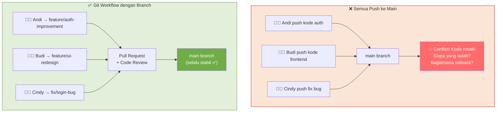
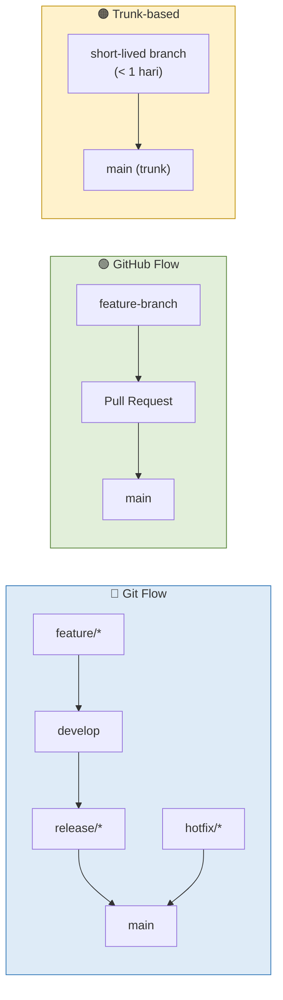
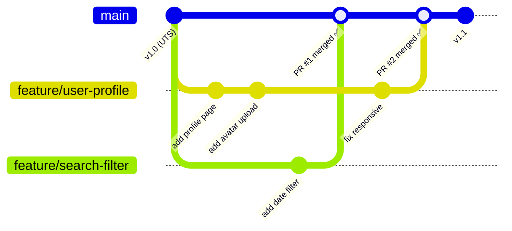
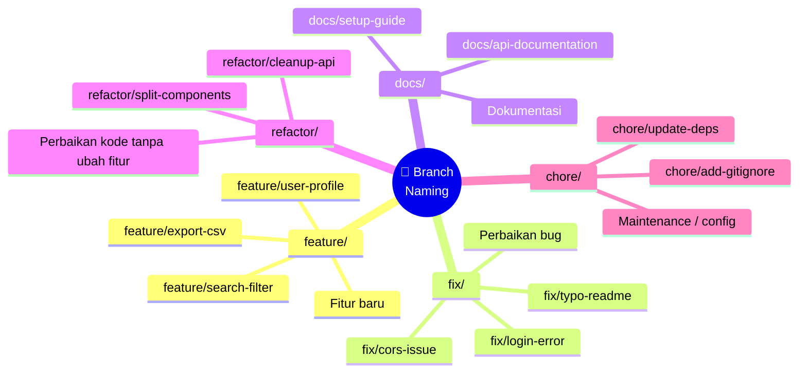
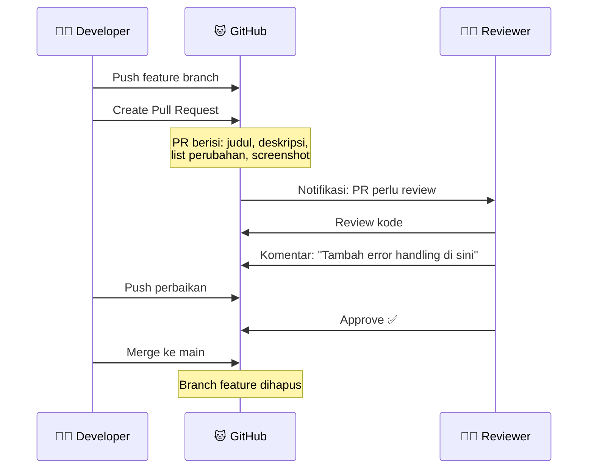
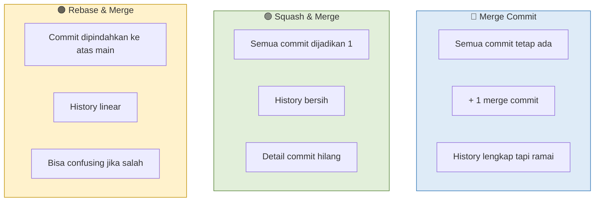
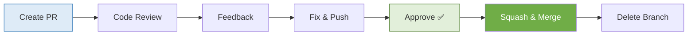
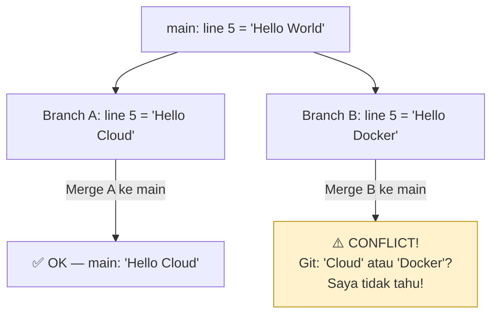

# MODUL 9: GIT WORKFLOW & BRANCHING STRATEGY

---

**Mata Kuliah:** Komputasi Awan  
**Program Studi:** Sistem Informasi - Institut Teknologi Kalimantan  
**SKS:** 3 (1 Kuliah + 2 Project)  
**Pertemuan:** 9 dari 16  
**Fase:** 🟠 CI/CD & Deployment (Minggu 9-11) — **Pertemuan Pertama Fase CI/CD**  

---

## Prasyarat

Sebelum memulai pertemuan ini, pastikan:
- [x] UTS (Modul 8) selesai — aplikasi full-stack berjalan via `docker compose up`
- [x] Repository tim sudah memiliki tag `v1.0` (Milestone 1)
- [x] Semua anggota memiliki akses push ke repository GitHub Classroom
- [x] Sudah familiar dengan perintah dasar Git: `add`, `commit`, `push`, `pull`

> ⚠️ **Fase baru!** Mulai minggu ini kita masuk ke Fase CI/CD & Deployment. Fokus bergeser dari *"membangun aplikasi"* ke *"mengelola dan men-deploy aplikasi secara profesional"*. Kode yang sudah jadi di Fase 1-2 akan kita kelola dengan Git workflow yang proper.

---

## Capaian Pembelajaran

### Sub-CPMK
Setelah menyelesaikan pertemuan ini, mahasiswa mampu:
1. Membandingkan berbagai Git workflow (Git Flow, GitHub Flow, Trunk-based) dan memilih yang sesuai
2. Menerapkan branching strategy dengan naming convention yang konsisten
3. Membuat Pull Request (PR) dan melakukan code review terhadap PR teman
4. Memahami merge strategies (merge, squash, rebase) dan kapan menggunakannya
5. Mengkonfigurasi branch protection rules di GitHub

### Indikator Pencapaian
- Repository memiliki branch protection pada `main` — tidak bisa push langsung
- Setiap anggota berhasil membuat feature branch, push, dan membuat PR
- Minimal 1 PR dari anggota lain berhasil di-review dan di-merge
- File `CODEOWNERS` terkonfigurasi sesuai pembagian peran tim

---

## Pembagian Fokus Tim Pertemuan Ini

| Peran | Fokus Utama | Juga Membantu |
|-------|-------------|---------------|
| **Lead DevOps** | Setup branch protection rules, CODEOWNERS file | — |
| **Lead Backend** | Buat feature branch untuk fitur backend baru | Review PR frontend |
| **Lead Frontend** | Buat feature branch untuk fitur frontend baru | Review PR backend |
| **Lead QA & Docs** | Buat PR untuk update dokumentasi, review semua PR | Update README |
| **Lead CI/CD** *(5 orang)* | Buat PR template, dokumentasi Git workflow tim | Bantu resolve conflict |

---

# BAGIAN A: PEMBEKALAN TEORI (50 Menit)

## 1. Mengapa Git Workflow? (10 menit)

### 1.1 Masalah: Push Langsung ke Main

Selama Minggu 1-8, kita semua push langsung ke branch `main`. Ini **oke untuk belajar**, tapi di dunia nyata bisa menyebabkan masalah serius:



> 💡 **Analogi:**  
> Bayangkan Anda menulis buku bersama tim. Jika semua orang langsung mengedit **dokumen asli** secara bersamaan, hasilnya chaos — paragraf hilang, kalimat bertabrakan. Git workflow seperti **setiap penulis mengerjakan draft di kertas terpisah**, lalu editor mereview sebelum dimasukkan ke naskah final.

### 1.2 Manfaat Git Workflow

1. **Isolasi** — Setiap fitur dikembangkan terpisah, tidak mengganggu `main`
2. **Code Review** — Kode direview sebelum masuk production, menangkap bug lebih awal
3. **Traceability** — Setiap perubahan terlacak: siapa, kapan, apa, kenapa
4. **Rollback** — Jika ada masalah, mudah revert satu PR tanpa mempengaruhi fitur lain
5. **Parallel Development** — Tim bisa bekerja bersamaan tanpa saling menunggu

---

## 2. Git Workflow Models (20 menit)

### 2.1 Tiga Model Populer



| Aspek | Git Flow | GitHub Flow | Trunk-based |
|-------|----------|-------------|-------------|
| **Kompleksitas** | Tinggi (5 jenis branch) | Rendah (main + feature) | Sangat rendah |
| **Release cycle** | Terjadwal (mingguan/bulanan) | Setiap PR merge | Setiap commit |
| **Cocok untuk** | Produk enterprise, banyak versi | Web app, SaaS, tim kecil-sedang | Tim senior, CI/CD mature |
| **Branch hidup** | Lama (minggu-bulan) | Sedang (hari-minggu) | Sangat pendek (jam-hari) |
| **Contoh pengguna** | Perusahaan banking, software desktop | GitHub, Spotify | Google, Meta |

### 2.2 Kita Pakai: GitHub Flow (Simplified)

Untuk mata kuliah ini, kita menggunakan **GitHub Flow** karena:
- Sederhana — hanya `main` + feature branch
- Cocok untuk tim 4-5 orang
- Bisa langsung dipakai dengan GitHub Pull Request & code review
- Sejalan dengan CI/CD yang akan kita bangun di minggu 10-11



### 2.3 Aturan GitHub Flow

1. **`main` selalu deployable** — kode di main harus selalu bisa dijalankan
2. **Buat branch dari main** — setiap fitur, fix, atau perubahan mulai dari main terbaru
3. **Commit secara reguler** — push ke branch fitur secara berkala
4. **Buat Pull Request** — saat fitur siap (atau butuh feedback awal)
5. **Review & diskusi** — anggota lain mereview kode sebelum approve
6. **Merge setelah approved** — setelah review selesai, merge ke main

---

## 3. Branch Naming & Commit Convention (10 menit)

### 3.1 Branch Naming Convention



**Format:** `tipe/deskripsi-singkat` (lowercase, kebab-case)

| Tipe | Kapan Digunakan | Contoh |
|------|-----------------|--------|
| `feature/` | Menambah fitur baru | `feature/user-profile` |
| `fix/` | Memperbaiki bug | `fix/login-token-expired` |
| `docs/` | Update dokumentasi | `docs/api-docs-update` |
| `refactor/` | Perbaikan kode tanpa ubah behavior | `refactor/split-crud-service` |
| `chore/` | Maintenance, config, dependencies | `chore/update-requirements` |

### 3.2 Commit Message Convention

Kita menggunakan **Conventional Commits** (yang sudah dipakai sejak Modul 1):

```
tipe: deskripsi singkat

Body opsional: penjelasan lebih detail

Footer opsional: referensi issue
```

| Tipe | Kapan | Contoh |
|------|-------|--------|
| `feat` | Fitur baru | `feat: add user profile page` |
| `fix` | Bug fix | `fix: resolve JWT token expiry issue` |
| `docs` | Dokumentasi | `docs: update API endpoint list in README` |
| `refactor` | Refactoring | `refactor: extract auth logic to separate module` |
| `chore` | Maintenance | `chore: update python dependencies` |
| `test` | Testing | `test: add unit tests for CRUD operations` |
| `style` | Formatting | `style: fix indentation in docker-compose.yml` |

---

## 4. Pull Request & Code Review (10 menit)

### 4.1 Apa itu Pull Request?

**Pull Request (PR)** adalah permintaan untuk menggabungkan (merge) kode dari satu branch ke branch lain. PR bukan sekadar "merge button" — PR adalah **tempat diskusi, review, dan quality gate**.



### 4.2 Merge Strategies



| Strategy | History | Kapan Digunakan |
|----------|---------|-----------------|
| **Merge commit** | Semua commit + merge commit | Default, cocok untuk fitur besar |
| **Squash & merge** | Satu commit bersih | Fitur kecil, banyak commit WIP |
| **Rebase & merge** | Linear, tanpa merge commit | Tim yang suka history rapi |

> 📝 **Untuk mata kuliah ini:** Kita akan pakai **Squash & Merge** sebagai default. Alasannya: history `main` tetap bersih (1 commit per fitur), mudah di-revert jika ada masalah.

### 4.3 Apa yang Di-review?

Saat code review, perhatikan:

| Aspek | Yang Dicek | Contoh Feedback |
|-------|-----------|-----------------|
| **Fungsionalitas** | Apakah kode bekerja sesuai tujuan? | "Endpoint ini return 200 tapi seharusnya 201 untuk POST" |
| **Readability** | Apakah kode mudah dibaca? | "Nama variabel `x` kurang deskriptif, ganti `item_count`?" |
| **Best Practices** | Apakah mengikuti konvensi tim? | "Password hashing seharusnya di auth.py, bukan di main.py" |
| **Edge Cases** | Apakah kasus batas ditangani? | "Apa yang terjadi kalau user submit form kosong?" |
| **Security** | Ada risiko keamanan? | "Jangan hardcode API key di sini, pakai env var" |

> 💡 **Tips Code Review:**
> - Berikan feedback yang **konstruktif**, bukan menghakimi
> - Jelaskan **mengapa**, bukan hanya "salah"
> - Puji kode yang bagus — review bukan hanya soal menemukan kesalahan
> - Gunakan "suggestion" fitur GitHub untuk menyarankan perubahan langsung

---

# BAGIAN B: WORKSHOP LAB (170 Menit)

## Workshop 9.1: Setup Branch Protection (20 menit)

### Langkah 1: Buka Repository Settings

1. Buka repository tim di GitHub
2. Klik **Settings** → **Branches** (di sidebar kiri)
3. Klik **Add branch ruleset** (atau Add rule)

### Langkah 2: Konfigurasi Protection Rules

Buat ruleset untuk branch `main`:

**Ruleset name:** `Protect main branch`

**Target branches:** `main`

**Rules yang diaktifkan:**

| Rule | Setting | Alasan |
|------|---------|--------|
| **Require a pull request before merging** | ✅ Enabled | Tidak bisa push langsung ke main |
| Required approvals | 1 | Minimal 1 orang harus approve |
| **Require status checks to pass** | ⬜ Skip dulu | Akan diaktifkan di Modul 10 (CI) |
| **Block force pushes** | ✅ Enabled | Mencegah rewrite history main |

> ⚠️ **Penting:** Pastikan **semua anggota tim** sudah push perubahan terakhir ke `main` SEBELUM mengaktifkan protection. Setelah diaktifkan, tidak bisa push langsung ke main lagi!

```bash
# Sebelum aktifkan protection, pastikan main up-to-date
git checkout main
git pull origin main
git push origin main  # Push terakhir langsung ke main
```

### Langkah 3: Verifikasi Protection

```bash
# Coba push langsung ke main (seharusnya GAGAL)
echo "test" >> test.txt
git add test.txt
git commit -m "test: direct push to main"
git push origin main
# ❌ Error: protected branch hook declined
```

Jika muncul error, **berarti protection berhasil!** Hapus commit test:
```bash
git reset HEAD~1
rm test.txt
```

> ✅ **Checkpoint:** Push langsung ke `main` ditolak oleh GitHub.

---

## Workshop 9.2: Buat CODEOWNERS (15 menit)

### Apa itu CODEOWNERS?

File `CODEOWNERS` mendefinisikan siapa yang otomatis menjadi reviewer untuk file/folder tertentu. Saat PR mengubah file yang ada di CODEOWNERS, GitHub otomatis menambahkan reviewer.

### Buat File CODEOWNERS

File: `.github/CODEOWNERS`

```
# =============================================
# CODEOWNERS — Cloud Team XX
# =============================================
# Setiap baris: pola file → username GitHub reviewer
# Reviewer otomatis ditambahkan saat PR mengubah file terkait

# Backend — Lead Backend
/backend/                @username-lead-backend

# Frontend — Lead Frontend
/frontend/               @username-lead-frontend

# Docker & Infrastructure — Lead DevOps
docker-compose.yml       @username-lead-devops
/backend/Dockerfile      @username-lead-devops
/frontend/Dockerfile     @username-lead-devops
Makefile                 @username-lead-devops

# Documentation — Lead QA & Docs
README.md                @username-lead-qa
/docs/                   @username-lead-qa

# CI/CD (jika 5 orang) — Lead CI/CD
# /.github/workflows/   @username-lead-cicd
```

> ⚠️ Ganti `@username-*` dengan username GitHub asli anggota tim!

### Commit & Push via Branch (Pertama Kali!)

Ini adalah commit pertama menggunakan workflow baru:

```bash
# 1. Pastikan main terbaru
git checkout main
git pull origin main

# 2. Buat branch baru
git checkout -b chore/add-codeowners

# 3. Buat folder & file
mkdir -p .github
# Buat file .github/CODEOWNERS (isi sesuai di atas)

# 4. Commit & push
git add .github/CODEOWNERS
git commit -m "chore: add CODEOWNERS for automatic reviewer assignment"
git push origin chore/add-codeowners
```

### Buat Pull Request

1. Buka GitHub → repository tim
2. Akan muncul banner: *"chore/add-codeowners had recent pushes — Compare & pull request"*
3. Klik **Compare & pull request**
4. Isi PR:
   - **Title:** `chore: add CODEOWNERS for automatic reviewer assignment`
   - **Description:**
     ```
     ## Perubahan
     - Menambahkan file `.github/CODEOWNERS`
     - Setiap area kode memiliki reviewer otomatis sesuai peran tim
     
     ## Checklist
     - [x] Username GitHub sudah benar
     - [x] Semua area tercakup (backend, frontend, docker, docs)
     ```
5. Klik **Create pull request**
6. Minta 1 anggota tim untuk **review & approve**
7. Setelah approved → **Squash and merge**
8. ✅ Hapus branch setelah merge (klik "Delete branch")

> ✅ **Checkpoint:** File `.github/CODEOWNERS` ada di main, PR pertama berhasil di-merge!

---

## Workshop 9.3: Feature Branch Workflow (60 menit)

### Skenario

Setiap anggota tim akan membuat **1 fitur baru** di branch terpisah, lalu membuat PR. Ini adalah latihan inti dari pertemuan ini.

### Pembagian Fitur

| Anggota | Branch Name | Fitur | File yang Diubah |
|---------|-------------|-------|------------------|
| **Lead Backend** | `feature/health-endpoint` | Tambah endpoint `GET /health` yang return status semua services | `backend/main.py` |
| **Lead Frontend** | `feature/about-page` | Tambah halaman About (informasi tim, tech stack) | `frontend/src/components/AboutPage.jsx`, `frontend/src/App.jsx` |
| **Lead DevOps** | `feature/compose-profiles` | Tambah profile `dev` dan `prod` di docker-compose | `docker-compose.yml`, `docker-compose.prod.yml` |
| **Lead QA & Docs** | `docs/milestone1-retrospective` | Tulis retrospective Milestone 1 (apa yang berjalan baik, apa yang perlu diperbaiki) | `docs/retrospective-m1.md` |
| **Lead CI/CD** *(5 orang)* | `chore/pr-template` | Buat PR template untuk standardisasi | `.github/pull_request_template.md` |

### Step-by-Step (Setiap Anggota)

**Step 1: Buat branch baru dari main terbaru**

```bash
git checkout main
git pull origin main
git checkout -b feature/health-endpoint    # Ganti sesuai branch Anda
```

**Step 2: Kerjakan fitur**

#### Contoh: Lead Backend — Health Endpoint

File: `backend/main.py` (tambahkan di atas endpoint CRUD)

```python
@app.get("/health")
def health_check(db: Session = Depends(get_db)):
    """Health check endpoint — cek status semua komponen."""
    health = {
        "status": "healthy",
        "service": "backend",
        "version": "1.0.0",
    }
    
    # Cek database connection
    try:
        db.execute(text("SELECT 1"))
        health["database"] = "connected"
    except Exception as e:
        health["status"] = "unhealthy"
        health["database"] = f"error: {str(e)}"
    
    status_code = 200 if health["status"] == "healthy" else 503
    return JSONResponse(content=health, status_code=status_code)
```

> Jangan lupa import: `from fastapi.responses import JSONResponse` dan `from sqlalchemy import text`

#### Contoh: Lead Frontend — About Page

File: `frontend/src/components/AboutPage.jsx`

```jsx
function AboutPage({ onBack }) {
  const team = [
    { name: "Nama 1", nim: "NIM1", role: "Lead Backend" },
    { name: "Nama 2", nim: "NIM2", role: "Lead Frontend" },
    { name: "Nama 3", nim: "NIM3", role: "Lead DevOps" },
    { name: "Nama 4", nim: "NIM4", role: "Lead QA & Docs" },
  ]

  return (
    <div style={{ padding: "20px", maxWidth: "800px", margin: "0 auto" }}>
      <button onClick={onBack} style={{ marginBottom: "20px" }}>
        ← Kembali
      </button>
      <h1>About This Project</h1>
      <p>Aplikasi Cloud-Native yang dibangun untuk mata kuliah Komputasi Awan.</p>
      
      <h2>Tech Stack</h2>
      <ul>
        <li><strong>Backend:</strong> FastAPI + PostgreSQL</li>
        <li><strong>Frontend:</strong> React + Vite</li>
        <li><strong>Container:</strong> Docker + Docker Compose</li>
        <li><strong>CI/CD:</strong> GitHub Actions (coming soon)</li>
      </ul>

      <h2>Tim</h2>
      <table border="1" cellPadding="8" cellSpacing="0">
        <thead>
          <tr><th>Nama</th><th>NIM</th><th>Peran</th></tr>
        </thead>
        <tbody>
          {team.map((m, i) => (
            <tr key={i}><td>{m.name}</td><td>{m.nim}</td><td>{m.role}</td></tr>
          ))}
        </tbody>
      </table>
    </div>
  )
}

export default AboutPage
```

#### Contoh: Lead DevOps — Compose Profiles

File: `docker-compose.prod.yml`

```yaml
# Production overrides — gunakan dengan:
# docker compose -f docker-compose.yml -f docker-compose.prod.yml up -d

services:
  backend:
    environment:
      - DEBUG=false
      - CORS_ORIGINS=https://yourdomain.com
    restart: always

  frontend:
    restart: always

  db:
    restart: always
    # Tidak expose port ke host di production
    ports: !reset []
```

#### Contoh: Lead QA — Retrospective

File: `docs/retrospective-m1.md`

```markdown
# Retrospective — Milestone 1

## 🟢 Apa yang Berjalan Baik?
- (isi berdasarkan pengalaman tim)
- Contoh: Docker Compose berhasil disetup dalam 1 sesi

## 🔴 Apa yang Perlu Diperbaiki?
- (isi berdasarkan pengalaman tim)
- Contoh: Komunikasi tim kurang, sering kerja double

## 🔵 Action Items untuk Milestone 2
- (isi rencana perbaikan)
- Contoh: Gunakan PR dan code review secara konsisten

## 📊 Kontribusi Tim
| Anggota | Kontribusi Utama | Jumlah Commit |
|---------|-----------------|---------------|
| ...     | ...             | ...           |
```

#### Contoh: Lead CI/CD — PR Template

File: `.github/pull_request_template.md`

```markdown
## Deskripsi
<!-- Jelaskan perubahan yang dilakukan -->

## Jenis Perubahan
- [ ] ✨ Fitur baru (feature)
- [ ] 🐛 Bug fix
- [ ] 📝 Dokumentasi
- [ ] ♻️ Refactoring
- [ ] 🔧 Konfigurasi / chore

## Checklist
- [ ] Kode sudah ditest secara lokal
- [ ] Tidak ada hardcoded secrets/credentials
- [ ] Commit message mengikuti Conventional Commits
- [ ] README diupdate (jika perlu)

## Screenshot (jika ada perubahan UI)
<!-- Paste screenshot di sini -->
```

**Step 3: Commit & push**

```bash
git add .
git commit -m "feat: add health check endpoint with database status"
# Ganti message sesuai fitur Anda

git push origin feature/health-endpoint
# Ganti sesuai nama branch Anda
```

**Step 4: Buat Pull Request di GitHub**

1. Buka GitHub → repository tim
2. Klik **Compare & pull request** pada banner yang muncul
3. Isi title (sama dengan commit message)
4. Isi description (gunakan template jika sudah ada)
5. **Assignees:** diri sendiri
6. **Reviewers:** pilih 1 anggota lain (sesuai tabel di bawah)
7. Klik **Create pull request**

### Pasangan Review

| PR dari | Reviewer |
|---------|----------|
| Lead Backend | Lead Frontend |
| Lead Frontend | Lead Backend |
| Lead DevOps | Lead QA & Docs |
| Lead QA & Docs | Lead DevOps |
| Lead CI/CD *(5 orang)* | Lead Backend atau Frontend |

> ✅ **Checkpoint:** Setiap anggota memiliki 1 PR yang terbuka dan sudah di-assign reviewer.

---

## Workshop 9.4: Code Review Practice (40 menit)

### Langkah 1: Review PR Teman (20 menit)

Setiap anggota membuka PR yang di-assign ke mereka untuk direview.

**Cara review di GitHub:**

1. Buka PR yang perlu Anda review
2. Klik tab **Files changed**
3. Baca kode yang berubah (hijau = tambahan, merah = dihapus)
4. **Tambahkan komentar** pada baris tertentu:
   - Klik ikon `+` di sebelah kiri nomor baris
   - Tulis komentar review
   - Klik **Start a review** (BUKAN "Add single comment")
5. Setelah selesai review semua file, klik **Review changes** (tombol hijau di kanan atas)
6. Pilih salah satu:
   - **Comment** — komentar umum, tidak approve/reject
   - **Approve** ✅ — kode sudah bagus, boleh merge
   - **Request changes** ❌ — perlu perbaikan sebelum merge
7. Klik **Submit review**

### Contoh Review Comments (Berlatih!)

Setiap reviewer **WAJIB** memberikan minimal 3 komentar:

```
✅ CONTOH REVIEW YANG BAIK:

1. [Praise] "Nice! Error handling di health endpoint ini solid 👍"

2. [Suggestion] "Saran: tambahkan try-catch di sini untuk handle 
   kasus database timeout. Sekarang kalau DB lambat, endpoint bisa hang."

3. [Question] "Kenapa pakai status code 503? Apakah lebih tepat 
   pakai 500 Internal Server Error?"

❌ CONTOH REVIEW YANG BURUK:

1. "Kodenya salah" (tidak jelaskan apa yang salah)
2. "LGTM" tanpa benar-benar membaca kode
3. "..." (komentar kosong / tidak bermakna)
```

### Langkah 2: Perbaikan Berdasarkan Review (10 menit)

Setelah menerima feedback, perbaiki kode:

```bash
# Pastikan masih di branch fitur Anda
git checkout feature/health-endpoint

# Lakukan perbaikan sesuai feedback
# ... edit kode ...

# Commit perbaikan
git add .
git commit -m "fix: address review feedback — add error handling"
git push origin feature/health-endpoint
```

PR di GitHub otomatis ter-update dengan commit baru.

### Langkah 3: Approve & Merge (10 menit)

Setelah perbaikan, reviewer melakukan:
1. Cek perbaikan di tab **Files changed**
2. Klik **Review changes** → **Approve** ✅
3. Developer (pembuat PR) klik **Squash and merge**
4. Edit squash commit message jika perlu
5. Klik **Confirm squash and merge**
6. Klik **Delete branch** untuk cleanup



> ✅ **Checkpoint:** Minimal 2 PR berhasil di-merge ke main via squash and merge.

---

## Workshop 9.5: Resolve Merge Conflict (25 menit)

### Apa itu Merge Conflict?

Merge conflict terjadi saat **dua branch mengubah baris yang sama** di file yang sama. Git tidak bisa memutuskan versi mana yang benar, sehingga meminta developer untuk menyelesaikan secara manual.



### Simulasi Conflict

Dua anggota akan sengaja membuat conflict:

**Anggota 1 (Lead Backend):**
```bash
git checkout main && git pull origin main
git checkout -b conflict/edit-readme-1

# Edit README.md — ubah deskripsi di baris pertama section "About"
# Misal: "Aplikasi cloud-native untuk manajemen inventaris"
git add README.md
git commit -m "docs: update project description (version 1)"
git push origin conflict/edit-readme-1
# Buat PR → Minta review → Merge DULUAN
```

**Anggota 2 (Lead Frontend):**
```bash
git checkout main && git pull origin main
git checkout -b conflict/edit-readme-2

# Edit README.md — ubah BARIS YANG SAMA
# Misal: "Platform inventaris berbasis cloud computing"
git add README.md
git commit -m "docs: update project description (version 2)"
git push origin conflict/edit-readme-2
# Buat PR → Conflict muncul karena Anggota 1 sudah merge!
```

### Resolve Conflict

**Langkah 1:** Update branch dengan main terbaru

```bash
git checkout conflict/edit-readme-2
git fetch origin
git merge origin/main
# ⚠️ CONFLICT muncul!
```

**Langkah 2:** Buka file yang conflict

```
<<<<<<< HEAD
Platform inventaris berbasis cloud computing
=======
Aplikasi cloud-native untuk manajemen inventaris
>>>>>>> origin/main
```

Tiga bagian:
- `<<<<<<< HEAD` sampai `=======` → **versi branch Anda**
- `=======` sampai `>>>>>>>` → **versi dari main**

**Langkah 3:** Pilih / gabungkan

Hapus marker dan tulis versi final:
```
Aplikasi cloud-native untuk manajemen inventaris berbasis cloud computing
```

**Langkah 4:** Commit hasil resolve

```bash
git add README.md
git commit -m "merge: resolve conflict in README description"
git push origin conflict/edit-readme-2
```

PR di GitHub otomatis ter-update — conflict resolved!

> ✅ **Checkpoint:** Setiap tim berhasil mensimulasikan dan menyelesaikan 1 merge conflict.

---

## Workshop 9.6: Commit & Push Final (10 menit)

### Verifikasi Akhir

```bash
git checkout main
git pull origin main

# Cek semua PR sudah merged
# Buka GitHub → tab "Pull requests" → "Closed"
# Harus ada minimal 3 PR yang sudah merged
```

### Cek Branch Protection

```bash
# Coba push langsung ke main (harus GAGAL)
echo "test" >> test.txt
git add test.txt
git commit -m "test: should fail"
git push origin main
# ❌ Seharusnya ditolak

# Bersihkan
git reset HEAD~1
rm test.txt
```

### Struktur Repository Akhir

```
cloud-team-XX/
├── .github/
│   ├── CODEOWNERS                     ← Baru
│   └── pull_request_template.md       ← Baru (jika 5 orang)
├── backend/
│   ├── main.py                        ← Updated (health endpoint)
│   ├── ... (dari Modul 1-7)
│   └── Dockerfile
├── frontend/
│   ├── src/
│   │   ├── components/
│   │   │   ├── AboutPage.jsx          ← Baru
│   │   │   └── ... (dari Modul 3)
│   │   └── App.jsx                    ← Updated
│   └── Dockerfile
├── docs/
│   ├── retrospective-m1.md            ← Baru
│   └── ...
├── docker-compose.yml
├── docker-compose.prod.yml            ← Baru
├── Makefile
├── .gitignore
└── README.md
```

> ✅ **Checkpoint Akhir Workshop:** Semua PR merged. Branch protection aktif. CODEOWNERS terkonfigurasi. History di main bersih (squash commits).

---

# BAGIAN C: TUGAS TERSTRUKTUR (60 Menit)

> 📝 **Kumpulkan sebelum pertemuan 10** via Pull Request ke repository tim.
>
> ⚠️ **Mulai sekarang, semua pengumpulan tugas HARUS via PR** — bukan push langsung ke main. Ini berlaku sampai akhir semester.

---

## Tugas 9: Feature Branch PR Challenge

### Deskripsi

Setiap anggota membuat **1 fitur tambahan** di branch terpisah, dengan PR yang di-review oleh anggota lain sebelum merge. Minimal ada **3 PR baru** (total tim) yang merged ke main.

### Pembagian Tugas

| Anggota | Branch Name | Tugas | Detail |
|---------|-------------|-------|--------|
| **Lead Backend** | `feature/item-categories` | Tambah fitur kategori pada item | Tambah field `category` pada model Item (opsional). Buat endpoint `GET /items?category=electronics` untuk filter berdasarkan kategori. Update schema Pydantic. |
| **Lead Frontend** | `feature/dark-mode` | Tambah toggle dark mode | Implementasi dark mode menggunakan state. Simpan preferensi di `localStorage`. Tambah toggle button di Header. |
| **Lead DevOps** | `feature/makefile-update` | Update Makefile untuk workflow baru | Tambah target: `make lint` (jalankan linter), `make test` (placeholder), `make pr-check` (build Docker + test). Dokumentasikan di README. |
| **Lead QA & Docs** | `docs/git-workflow-guide` | Tulis panduan Git workflow tim | Buat `docs/git-workflow.md`: branch naming, commit convention, PR process, review guidelines. Referensi CODEOWNERS. |
| **Lead CI/CD** *(5 orang)* | `feature/changelog` | Buat CHANGELOG.md | Setup CHANGELOG mengikuti format [Keep a Changelog](https://keepachangelog.com/). Isi dengan perubahan dari Milestone 1. |

### Aturan PR

1. Setiap PR **WAJIB** memiliki:
   - Title yang mengikuti Conventional Commits
   - Deskripsi yang menjelaskan perubahan
   - Minimal 1 reviewer yang berbeda dari pembuat PR
   - Minimal 1 review comment dari reviewer
2. Merge menggunakan **Squash and Merge**
3. Branch dihapus setelah merge

### Informasi Pengumpulan

| Item | Keterangan |
|------|------------|
| **Deadline** | Sebelum pertemuan 10 dimulai |
| **Format** | Pull Request ke repository tim (BUKAN push langsung ke main) |
| **Yang dinilai** | PR quality (title, description, review), fitur berfungsi, setiap anggota ≥1 PR merged |
| **Bonus** | Tim yang memiliki PR dengan diskusi review yang substantif (bukan sekadar "LGTM") |

---

# BAGIAN D: BELAJAR MANDIRI (230 Menit)

> 📚 **Tidak dikumpulkan**, tetapi sangat penting untuk pemahaman.

---

## D1. Membaca Referensi (60 menit)

### Bacaan Wajib
1. **GitHub Flow Guide**  
   https://docs.github.com/en/get-started/using-github/github-flow  
   (Panduan resmi GitHub tentang workflow mereka)

2. **GitHub Actions Quickstart** (persiapan minggu depan)  
   https://docs.github.com/en/actions/quickstart  
   (Overview GitHub Actions — CI/CD di GitHub)

3. **Conventional Commits**  
   https://www.conventionalcommits.org/en/v1.0.0/  
   (Spesifikasi commit message yang kita gunakan)

### Bacaan Tambahan
- Atlassian Git Tutorials: Comparing Workflows — https://www.atlassian.com/git/tutorials/comparing-workflows
- GitHub Pull Request Tutorial — https://docs.github.com/en/pull-requests/collaborating-with-pull-requests
- Git Merge vs Rebase — https://www.atlassian.com/git/tutorials/merging-vs-rebasing

---

## D2. Video Tutorial (60 menit)

1. **"Git Branching and Merging"** — cari di YouTube (~15 min)
   - Visualisasi branching, merge, dan rebase

2. **"GitHub Pull Request Tutorial"** — cari di YouTube (~15 min)
   - Cara membuat PR, review, dan merge di GitHub

3. **"Resolve Merge Conflicts in Git"** — cari di YouTube (~10 min)
   - Step-by-step menyelesaikan conflict

4. **"GitHub Actions Tutorial"** — TechWorld with Nana (YouTube, ~30 min pertama)
   - Persiapan untuk minggu depan (CI pipeline)

> ⚠️ **Video GitHub Actions sangat penting!** Minggu depan kita akan menulis CI pipeline. Pastikan Anda sudah punya gambaran tentang workflow, jobs, dan steps.

---

## D3. Latihan Mandiri (60 menit)

### Soal Pilihan Ganda

**1.** GitHub Flow menggunakan berapa jenis branch utama?
- [ ] a. 1 (hanya main)
- [ ] b. 5 (main, develop, feature, release, hotfix)
- [ ] c. 2 (main + feature branch)
- [ ] d. 3 (main, staging, production)

**2.** Branch protection rule yang mengharuskan code review sebelum merge disebut:
- [ ] a. Require a pull request before merging
- [ ] b. Block force pushes
- [ ] c. Require signed commits
- [ ] d. Require status checks

**3.** Squash and merge berguna karena:
- [ ] a. Menghapus semua commit history
- [ ] b. Membuat branch baru
- [ ] c. Menghindari merge conflict
- [ ] d. Menggabungkan semua commit di branch menjadi satu commit bersih di main

**4.** Merge conflict terjadi ketika:
- [ ] a. Git mengalami error
- [ ] b. Dua orang membuat branch pada waktu yang sama
- [ ] c. Dua branch mengubah baris yang sama di file yang sama
- [ ] d. Branch tidak memiliki commit

**5.** File CODEOWNERS berfungsi untuk:
- [ ] a. Mencegah orang lain mengakses repository
- [ ] b. Secara otomatis menambahkan reviewer berdasarkan file yang diubah di PR
- [ ] c. Menentukan siapa owner repository
- [ ] d. Menghapus branch otomatis

---

## D4. Persiapan Pertemuan Berikutnya (50 menit)

Pertemuan 10 akan membangun **CI Pipeline dengan GitHub Actions**. Persiapkan:

- Apa itu **Continuous Integration (CI)** dan mengapa penting?
- Apa itu **GitHub Actions**: workflow, jobs, steps, runners?
- Bagaimana menulis file **YAML** untuk GitHub Actions workflow?
- Apa itu **automated testing** (unit test, integration test)?
- Baca: https://docs.github.com/en/actions/quickstart
- Baca: https://docs.github.com/en/actions/about-github-actions/understanding-github-actions

> 💡 **Tip:** Coba buat file `.github/workflows/ci.yml` kosong di repository Anda. Minggu depan kita akan mengisinya dengan pipeline yang menjalankan testing dan build secara otomatis setiap kali ada push atau PR.
>

---

---

*Modul ini disusun oleh Aidil Saputra Kirsan, Institut Teknologi Kalimantan.*
