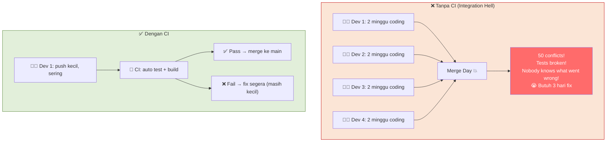
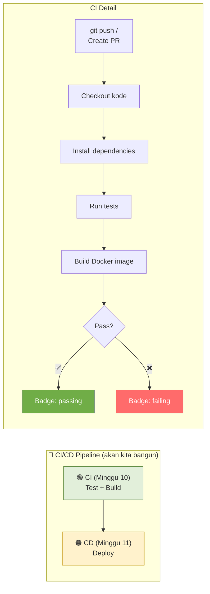
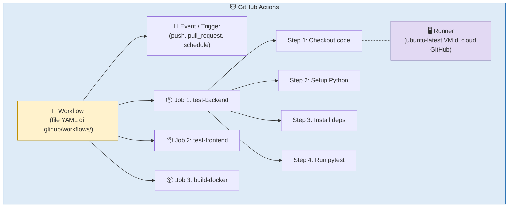
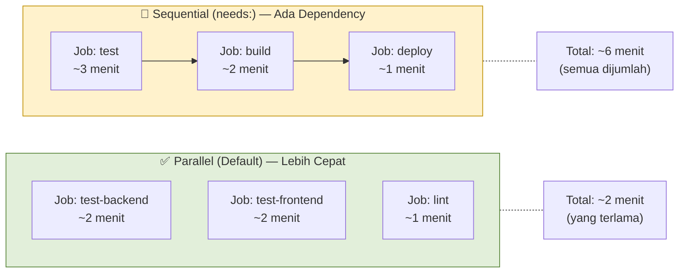
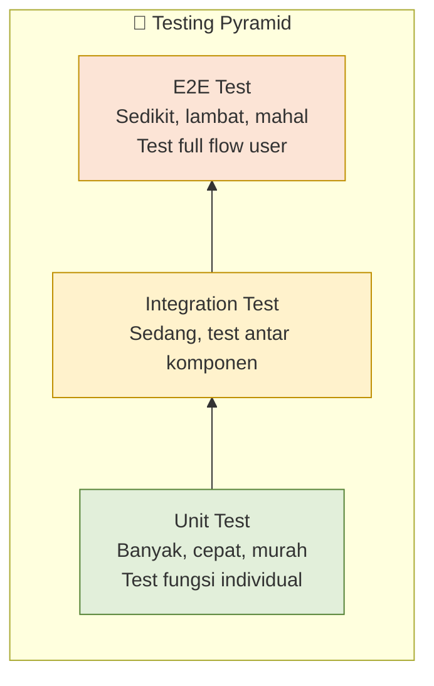
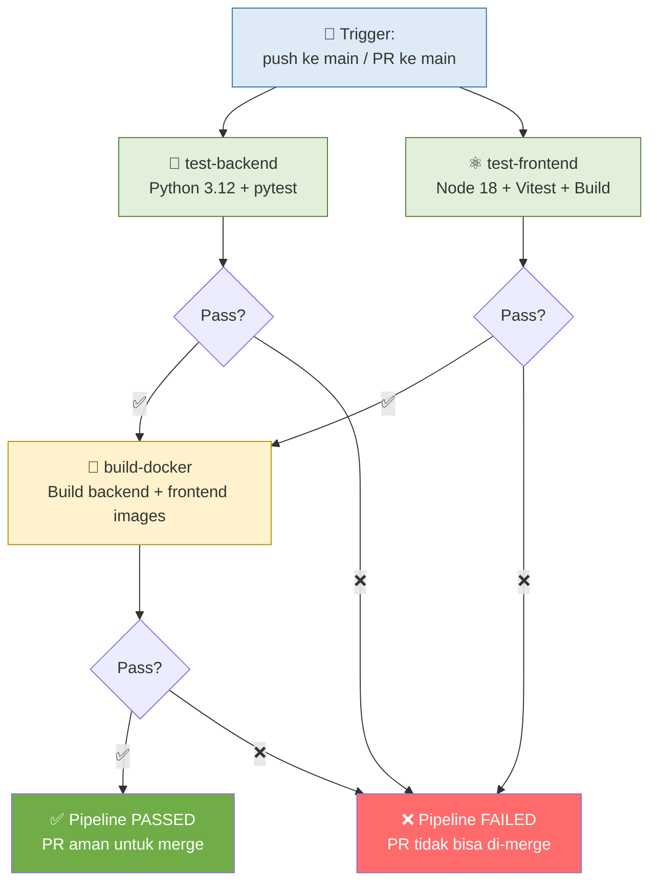
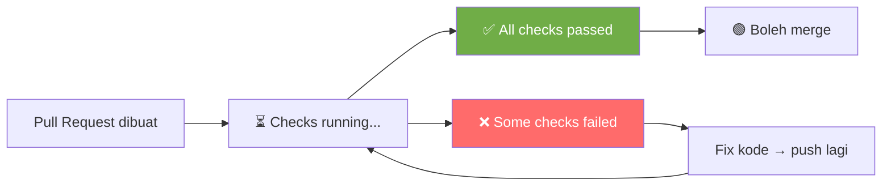
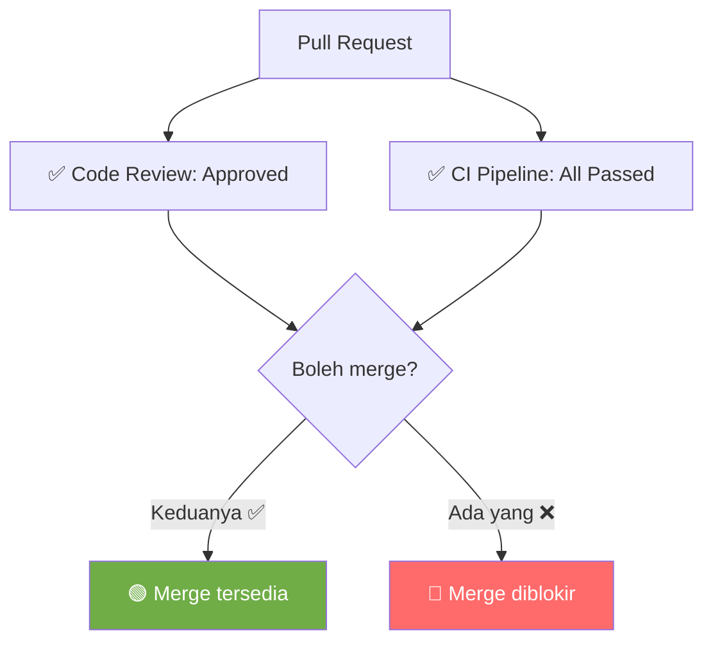

# MODUL 10: CONTINUOUS INTEGRATION — AUTOMATED TESTING & BUILD DENGAN GITHUB ACTIONS

---

**Mata Kuliah:** Komputasi Awan  
**Program Studi:** Sistem Informasi - Institut Teknologi Kalimantan  
**SKS:** 3 (1 Kuliah + 2 Project)  
**Pertemuan:** 10 dari 16  
**Fase:** 🟠 CI/CD & Deployment (Minggu 9-11)  

---

## Prasyarat

Sebelum memulai pertemuan ini, pastikan:
- [x] Modul 9 selesai: branch protection aktif, Git workflow berjalan, semua PR merged
- [x] Sudah membaca/menonton materi GitHub Actions (Modul 9 Bagian D4)
- [x] Repository tim memiliki file `docker-compose.yml`, `backend/Dockerfile`, `frontend/Dockerfile` yang berfungsi
- [x] Familiar dengan YAML syntax (digunakan di `docker-compose.yml`)

> ⚠️ **GitHub Actions berjalan di cloud GitHub!** Berbeda dengan Docker yang berjalan di laptop Anda, GitHub Actions berjalan di server GitHub (runners). Artinya: setiap push atau PR akan otomatis trigger pipeline di cloud — Anda tidak perlu menjalankan apapun secara manual.

---

## Capaian Pembelajaran

### Sub-CPMK
Setelah menyelesaikan pertemuan ini, mahasiswa mampu:
1. Menjelaskan konsep Continuous Integration (CI) dan manfaatnya dalam pengembangan software
2. Memahami arsitektur GitHub Actions: workflow, jobs, steps, runners
3. Menulis workflow YAML untuk automated testing dan build
4. Mengimplementasikan unit test untuk backend (pytest) dan frontend (Vitest)
5. Mengkonfigurasi CI pipeline yang berjalan otomatis pada setiap push dan PR

### Indikator Pencapaian
- File `.github/workflows/ci.yml` terkonfigurasi dan berjalan di GitHub
- Backend memiliki minimal 5 unit test yang passing
- Frontend memiliki minimal 3 test yang passing
- Badge CI status (✅ passing / ❌ failing) muncul di README
- Branch protection terintegrasi: PR tidak bisa merge jika CI gagal

---

## Pembagian Fokus Tim Pertemuan Ini

| Peran | Fokus Utama | Juga Membantu |
|-------|-------------|---------------|
| **Lead Backend** | Menulis unit test backend (pytest) | — |
| **Lead Frontend** | Menulis test frontend (Vitest) | — |
| **Lead DevOps** | Menulis workflow CI `.github/workflows/ci.yml` | Debug workflow |
| **Lead QA & Docs** | Menjalankan & validasi semua test, update README (badge) | Testing edge cases |
| **Lead CI/CD** *(5 orang)* | Optimasi workflow (caching, parallel jobs) | Bantu debug YAML |

---

# BAGIAN A: PEMBEKALAN TEORI (50 Menit)

## 1. Apa itu Continuous Integration? (15 menit)

### 1.1 Masalah: "Integration Hell"

Bayangkan 4 developer bekerja selama 2 minggu di branch masing-masing, lalu merge sekaligus di akhir sprint:



> 💡 **Analogi:**  
> CI seperti **pengecekan kesehatan rutin**. Tanpa CI, Anda baru tahu ada masalah saat sudah parah (integration hell). Dengan CI, setiap perubahan kecil langsung dicek — jika ada masalah, langsung terdeteksi saat masih mudah diperbaiki.

### 1.2 Definisi CI

**Continuous Integration (CI)** adalah praktik dimana developer sering meng-merge perubahan kode ke repository utama, dan setiap merge otomatis divalidasi melalui:
1. **Automated build** — kode bisa di-compile/build tanpa error
2. **Automated testing** — test suite berjalan dan passing
3. **Fast feedback** — developer tahu dalam hitungan menit jika ada masalah

### 1.3 CI dalam Konteks Cloud-Native



---

## 2. GitHub Actions — Arsitektur (20 menit)

### 2.1 Komponen GitHub Actions



| Komponen | Penjelasan | Analogi |
|----------|------------|---------|
| **Workflow** | File YAML yang mendefinisikan automation pipeline | Resep lengkap |
| **Event** | Apa yang memicu workflow (push, PR, jadwal) | Alarm / trigger |
| **Job** | Sekelompok steps yang berjalan di satu runner | Satu dapur memasak satu menu |
| **Step** | Satu aksi di dalam job (run command, use action) | Satu langkah di resep |
| **Runner** | Virtual machine di cloud GitHub yang menjalankan job | Dapur tempat memasak |
| **Action** | Reusable unit — action dari marketplace GitHub | Bahan jadi / bumbu instan |

### 2.2 Anatomy Workflow File

```yaml
# .github/workflows/ci.yml

name: CI Pipeline              # Nama workflow (muncul di GitHub UI)

on:                            # EVENT — kapan workflow jalan?
  push:
    branches: [main]           # Jalan saat push ke main
  pull_request:
    branches: [main]           # Jalan saat PR ke main

jobs:                          # JOBS — apa yang dikerjakan?
  test-backend:                # Nama job (bebas, deskriptif)
    runs-on: ubuntu-latest     # RUNNER — jalan di mana?
    
    steps:                     # STEPS — langkah-langkah
      - name: Checkout code    # Nama step (deskriptif)
        uses: actions/checkout@v4   # Pakai ACTION dari marketplace

      - name: Setup Python
        uses: actions/setup-python@v5
        with:
          python-version: "3.12"

      - name: Install dependencies
        run: |                 # Jalankan COMMAND
          cd backend
          pip install -r requirements.txt

      - name: Run tests
        run: |
          cd backend
          pytest
```

### 2.3 Event Triggers

| Event | Kapan Terjadi | Contoh Use Case |
|-------|---------------|-----------------|
| `push` | Saat kode di-push ke branch tertentu | Run CI setelah merge ke main |
| `pull_request` | Saat PR dibuat/diupdate | Validasi kode sebelum merge |
| `schedule` | Jadwal cron (misal setiap malam) | Nightly build, security scan |
| `workflow_dispatch` | Manual trigger via UI | Deploy manual ke production |

### 2.4 Jobs: Parallel vs Sequential



```yaml
# Parallel — default, semua job jalan bersamaan
jobs:
  test-backend:
    runs-on: ubuntu-latest
    # ...
  test-frontend:
    runs-on: ubuntu-latest
    # ...

# Sequential — pakai "needs:" untuk dependency
jobs:
  test:
    runs-on: ubuntu-latest
    # ...
  build:
    needs: test          # build HANYA jalan jika test berhasil
    runs-on: ubuntu-latest
    # ...
```

---

## 3. Automated Testing (15 menit)

### 3.1 Mengapa Testing Penting di CI?

CI tanpa test itu seperti **pengecekan kesehatan tanpa alat ukur** — kode di-build, tapi tidak ada yang memverifikasi apakah kode bekerja dengan benar.

### 3.2 Jenis Test



| Jenis | Apa yang Ditest | Contoh | Speed |
|-------|----------------|--------|-------|
| **Unit Test** | Satu fungsi/method secara terisolasi | Test fungsi `create_item()` | ⚡ Milidetik |
| **Integration Test** | Interaksi antar komponen | Test endpoint POST /items ke database | 🔄 Detik |
| **E2E Test** | Full flow dari perspektif user | Test register → login → CRUD via browser | 🐢 Menit |

> 📝 **Untuk mata kuliah ini:** Kita fokus pada **unit test** dan sedikit **integration test**. E2E test terlalu kompleks untuk scope kita, tapi Anda perlu tahu konsepnya.

### 3.3 Tools Testing

| Komponen | Tool | Fungsi |
|----------|------|--------|
| Backend (Python) | **pytest** | Testing framework paling populer di Python |
| Backend (Python) | **pytest-cov** | Mengukur test coverage |
| Backend (Python) | **httpx** | Test HTTP client untuk FastAPI (async-compatible) |
| Frontend (React) | **Vitest** | Test runner yang kompatibel dengan Vite |
| Frontend (React) | **@testing-library/react** | Utility untuk test React components |

---

# BAGIAN B: WORKSHOP LAB (170 Menit)

## Workshop 10.1: Setup Testing Backend — pytest (40 menit)

### Langkah 1: Install Testing Dependencies

```bash
cd backend

# Tambahkan ke requirements.txt
echo "pytest==8.3.4" >> requirements.txt
echo "pytest-cov==6.0.0" >> requirements.txt
echo "httpx==0.28.1" >> requirements.txt
```

Lalu install:
```bash
pip install pytest pytest-cov httpx
```

### Langkah 2: Buat Konfigurasi pytest

File: `backend/pytest.ini`

```ini
[pytest]
testpaths = tests
python_files = test_*.py
python_functions = test_*
addopts = -v --tb=short
```

### Langkah 3: Buat Folder Tests

```bash
mkdir -p backend/tests
touch backend/tests/__init__.py
```

### Langkah 4: Buat Test Configuration (conftest.py)

File: `backend/tests/conftest.py`

```python
"""
Konfigurasi test — setup database test terpisah dari database utama.
"""
import pytest
from fastapi.testclient import TestClient
from sqlalchemy import create_engine
from sqlalchemy.orm import sessionmaker
from sqlalchemy.pool import StaticPool

from database import Base, get_db
from main import app

# Database test — SQLite in-memory (tidak perlu PostgreSQL untuk testing!)
SQLALCHEMY_TEST_DATABASE_URL = "sqlite:///./test.db"

engine = create_engine(
    SQLALCHEMY_TEST_DATABASE_URL,
    connect_args={"check_same_thread": False},
    poolclass=StaticPool,
)
TestingSessionLocal = sessionmaker(autocommit=False, autoflush=False, bind=engine)


@pytest.fixture(scope="function")
def db_session():
    """Buat database baru untuk setiap test."""
    Base.metadata.create_all(bind=engine)
    session = TestingSessionLocal()
    try:
        yield session
    finally:
        session.close()
        Base.metadata.drop_all(bind=engine)


@pytest.fixture(scope="function")
def client(db_session):
    """Test client dengan database override."""
    def override_get_db():
        try:
            yield db_session
        finally:
            pass

    app.dependency_overrides[get_db] = override_get_db
    with TestClient(app) as c:
        yield c
    app.dependency_overrides.clear()


@pytest.fixture
def auth_headers(client):
    """Helper: register + login, return auth headers."""
    # Register
    client.post("/auth/register", json={
        "email": "test@example.com",
        "password": "TestPassword123",
        "name": "Test User"
    })
    # Login
    response = client.post("/auth/login", json={
        "email": "test@example.com",
        "password": "TestPassword123"
    })
    token = response.json()["access_token"]
    return {"Authorization": f"Bearer {token}"}
```

> 📝 **Key Insight:** Kita menggunakan **SQLite in-memory** untuk testing, bukan PostgreSQL. Ini membuat test cepat dan tidak perlu setup database terpisah. SQLAlchemy ORM memungkinkan kita ganti database tanpa ubah kode (ini keuntungan ORM!).

### Langkah 5: Tulis Unit Tests — Auth

File: `backend/tests/test_auth.py`

```python
"""Test authentication endpoints."""


def test_register_success(client):
    """Test register user baru berhasil."""
    response = client.post("/auth/register", json={
        "email": "newuser@example.com",
        "password": "SecurePass123",
        "name": "New User"
    })
    assert response.status_code == 201
    data = response.json()
    assert data["email"] == "newuser@example.com"
    assert data["name"] == "New User"
    assert "id" in data
    # Password TIDAK boleh ada di response
    assert "password" not in data
    assert "hashed_password" not in data


def test_register_duplicate_email(client):
    """Test register dengan email yang sudah ada → 400."""
    # Register pertama
    client.post("/auth/register", json={
        "email": "duplicate@example.com",
        "password": "Pass123",
        "name": "User 1"
    })
    # Register kedua dengan email sama
    response = client.post("/auth/register", json={
        "email": "duplicate@example.com",
        "password": "Pass456",
        "name": "User 2"
    })
    assert response.status_code == 400


def test_login_success(client):
    """Test login dengan kredensial benar → return token."""
    # Register dulu
    client.post("/auth/register", json={
        "email": "login@example.com",
        "password": "MyPassword123",
        "name": "Login User"
    })
    # Login
    response = client.post("/auth/login", json={
        "email": "login@example.com",
        "password": "MyPassword123"
    })
    assert response.status_code == 200
    data = response.json()
    assert "access_token" in data
    assert data["token_type"] == "bearer"


def test_login_wrong_password(client):
    """Test login dengan password salah → 401."""
    # Register
    client.post("/auth/register", json={
        "email": "wrongpass@example.com",
        "password": "CorrectPass123",
        "name": "User"
    })
    # Login dengan password salah
    response = client.post("/auth/login", json={
        "email": "wrongpass@example.com",
        "password": "WrongPassword"
    })
    assert response.status_code == 401
```

### Langkah 6: Tulis Unit Tests — CRUD

File: `backend/tests/test_items.py`

```python
"""Test CRUD item endpoints."""


def test_create_item(client, auth_headers):
    """Test membuat item baru → 201."""
    response = client.post("/items", json={
        "name": "Laptop",
        "description": "Laptop untuk cloud computing",
        "price": 15000000,
        "quantity": 5
    }, headers=auth_headers)
    assert response.status_code == 201
    data = response.json()
    assert data["name"] == "Laptop"
    assert data["price"] == 15000000
    assert "id" in data


def test_create_item_unauthorized(client):
    """Test membuat item tanpa login → 401."""
    response = client.post("/items", json={
        "name": "Laptop",
        "price": 15000000,
        "quantity": 1
    })
    assert response.status_code == 401


def test_get_items(client, auth_headers):
    """Test mengambil daftar items → 200."""
    # Buat 2 items
    client.post("/items", json={
        "name": "Laptop", "price": 15000000, "quantity": 1
    }, headers=auth_headers)
    client.post("/items", json={
        "name": "Mouse", "price": 250000, "quantity": 3
    }, headers=auth_headers)

    response = client.get("/items", headers=auth_headers)
    assert response.status_code == 200
    data = response.json()
    assert data["total"] >= 2


def test_get_item_not_found(client, auth_headers):
    """Test mengambil item yang tidak ada → 404."""
    response = client.get("/items/9999", headers=auth_headers)
    assert response.status_code == 404


def test_update_item(client, auth_headers):
    """Test update item → data berubah."""
    # Buat item
    create_resp = client.post("/items", json={
        "name": "Laptop", "price": 15000000, "quantity": 1
    }, headers=auth_headers)
    item_id = create_resp.json()["id"]

    # Update
    response = client.put(f"/items/{item_id}", json={
        "price": 14000000
    }, headers=auth_headers)
    assert response.status_code == 200
    assert response.json()["price"] == 14000000


def test_delete_item(client, auth_headers):
    """Test hapus item → 204, lalu GET → 404."""
    # Buat item
    create_resp = client.post("/items", json={
        "name": "Temporary", "price": 100, "quantity": 1
    }, headers=auth_headers)
    item_id = create_resp.json()["id"]

    # Hapus
    response = client.delete(f"/items/{item_id}", headers=auth_headers)
    assert response.status_code == 204

    # Verifikasi sudah tidak ada
    get_resp = client.get(f"/items/{item_id}", headers=auth_headers)
    assert get_resp.status_code == 404


def test_search_items(client, auth_headers):
    """Test search item berdasarkan nama."""
    client.post("/items", json={
        "name": "Laptop Gaming", "price": 20000000, "quantity": 1
    }, headers=auth_headers)
    client.post("/items", json={
        "name": "Mouse Wireless", "price": 350000, "quantity": 2
    }, headers=auth_headers)

    response = client.get("/items?search=laptop", headers=auth_headers)
    assert response.status_code == 200
    data = response.json()
    assert data["total"] >= 1
    assert any("laptop" in item["name"].lower() for item in data["items"])
```

### Langkah 7: Tulis Test untuk Health Endpoint

File: `backend/tests/test_health.py`

```python
"""Test health check endpoint."""


def test_health_check(client):
    """Test health endpoint → 200 dan status healthy."""
    response = client.get("/health")
    assert response.status_code == 200
    data = response.json()
    assert data["status"] == "healthy"
    assert data["service"] == "backend"
```

### Langkah 8: Jalankan Tests Secara Lokal

```bash
cd backend
pytest
```

Output yang diharapkan:
```
========================= test session starts ==========================
tests/test_auth.py::test_register_success PASSED
tests/test_auth.py::test_register_duplicate_email PASSED
tests/test_auth.py::test_login_success PASSED
tests/test_auth.py::test_login_wrong_password PASSED
tests/test_items.py::test_create_item PASSED
tests/test_items.py::test_create_item_unauthorized PASSED
tests/test_items.py::test_get_items PASSED
tests/test_items.py::test_get_item_not_found PASSED
tests/test_items.py::test_update_item PASSED
tests/test_items.py::test_delete_item PASSED
tests/test_items.py::test_search_items PASSED
tests/test_health.py::test_health_check PASSED
========================= 12 passed in 2.34s ==========================
```

Jalankan dengan coverage:
```bash
pytest --cov=. --cov-report=term-missing
```

> ⚠️ **Jika ada test yang gagal**, perbaiki kode test ATAU kode aplikasi. Test harus semua PASS sebelum lanjut ke langkah berikutnya. Minta bantuan asdos jika stuck.

> ✅ **Checkpoint:** `pytest` menunjukkan minimal 10 tests PASSED, 0 failed.

---

## Workshop 10.2: Setup Testing Frontend — Vitest (30 menit)

### Langkah 1: Install Testing Dependencies

```bash
cd frontend
npm install --save-dev vitest @testing-library/react @testing-library/jest-dom jsdom
```

### Langkah 2: Konfigurasi Vitest

Update file: `frontend/vite.config.js`

```javascript
import { defineConfig } from 'vite'
import react from '@vitejs/plugin-react'

export default defineConfig({
  plugins: [react()],
  test: {
    globals: true,
    environment: 'jsdom',
    setupFiles: './src/test/setup.js',
    css: true,
  },
})
```

### Langkah 3: Buat Test Setup

```bash
mkdir -p frontend/src/test
```

File: `frontend/src/test/setup.js`

```javascript
import '@testing-library/jest-dom'
```

### Langkah 4: Tambahkan Test Script

Update `frontend/package.json` — tambahkan di `"scripts"`:

```json
{
  "scripts": {
    "dev": "vite",
    "build": "vite build",
    "preview": "vite preview",
    "test": "vitest run",
    "test:watch": "vitest",
    "test:coverage": "vitest run --coverage"
  }
}
```

### Langkah 5: Tulis Frontend Tests

File: `frontend/src/components/__tests__/Header.test.jsx`

```jsx
import { render, screen } from '@testing-library/react'
import { describe, it, expect } from 'vitest'
import Header from '../Header'

describe('Header Component', () => {
  it('menampilkan judul aplikasi', () => {
    render(<Header totalItems={0} />)
    // Sesuaikan dengan teks judul di Header Anda
    expect(screen.getByText(/cloud/i)).toBeInTheDocument()
  })

  it('menampilkan jumlah total items', () => {
    render(<Header totalItems={5} />)
    expect(screen.getByText(/5/)).toBeInTheDocument()
  })
})
```

File: `frontend/src/components/__tests__/ItemCard.test.jsx`

```jsx
import { render, screen, fireEvent } from '@testing-library/react'
import { describe, it, expect, vi } from 'vitest'
import ItemCard from '../ItemCard'

const mockItem = {
  id: 1,
  name: 'Laptop',
  description: 'Laptop untuk cloud computing',
  price: 15000000,
  quantity: 5,
}

describe('ItemCard Component', () => {
  it('menampilkan nama dan harga item', () => {
    render(
      <ItemCard
        item={mockItem}
        onEdit={() => {}}
        onDelete={() => {}}
      />
    )
    expect(screen.getByText('Laptop')).toBeInTheDocument()
    expect(screen.getByText(/15/)).toBeInTheDocument()
  })

  it('memanggil onEdit saat tombol edit diklik', () => {
    const handleEdit = vi.fn()
    render(
      <ItemCard
        item={mockItem}
        onEdit={handleEdit}
        onDelete={() => {}}
      />
    )
    // Sesuaikan selector dengan teks tombol edit di komponen Anda
    const editButton = screen.getByText(/edit/i)
    fireEvent.click(editButton)
    expect(handleEdit).toHaveBeenCalledWith(mockItem)
  })

  it('memanggil onDelete saat tombol hapus diklik', () => {
    const handleDelete = vi.fn()
    render(
      <ItemCard
        item={mockItem}
        onEdit={() => {}}
        onDelete={handleDelete}
      />
    )
    const deleteButton = screen.getByText(/hapus|delete/i)
    fireEvent.click(deleteButton)
    expect(handleDelete).toHaveBeenCalledWith(mockItem.id)
  })
})
```

File: `frontend/src/test/api.test.js`

```javascript
import { describe, it, expect, vi, beforeEach } from 'vitest'

// Mock fetch global
global.fetch = vi.fn()

describe('API Service', () => {
  beforeEach(() => {
    fetch.mockClear()
  })

  it('fetchItems memanggil endpoint yang benar', async () => {
    fetch.mockResolvedValueOnce({
      ok: true,
      json: async () => ({ total: 0, items: [] }),
    })

    const response = await fetch('http://localhost:8000/items')
    const data = await response.json()

    expect(fetch).toHaveBeenCalledWith('http://localhost:8000/items')
    expect(data.items).toEqual([])
  })

  it('handle error saat API gagal', async () => {
    fetch.mockRejectedValueOnce(new Error('Network error'))

    await expect(
      fetch('http://localhost:8000/items')
    ).rejects.toThrow('Network error')
  })
})
```

### Langkah 6: Jalankan Frontend Tests

```bash
cd frontend
npm test
```

Output yang diharapkan:
```
 ✓ src/components/__tests__/Header.test.jsx (2 tests)
 ✓ src/components/__tests__/ItemCard.test.jsx (3 tests)
 ✓ src/test/api.test.js (2 tests)

 Test Files  3 passed (3)
      Tests  7 passed (7)
```

> ⚠️ **Nama komponen, props, dan teks di test harus sesuai dengan kode Anda.** Jika test gagal karena selector tidak cocok, sesuaikan test dengan komponen Anda yang sebenarnya. Tanya asdos jika bingung.

> ✅ **Checkpoint:** `npm test` menunjukkan minimal 5 tests PASSED di frontend.

---

## Workshop 10.3: Menulis GitHub Actions Workflow (40 menit)

### Langkah 1: Buat Workflow File

```bash
mkdir -p .github/workflows
```

File: `.github/workflows/ci.yml`

```yaml
# ==============================================
# CI Pipeline — Cloud Team XX
# ==============================================
# Pipeline ini berjalan otomatis saat:
# - Push ke branch main
# - Pull Request ke branch main
# 
# Jobs:
# 1. test-backend: Install deps + run pytest
# 2. test-frontend: Install deps + run vitest
# 3. build-docker: Build Docker images (pastikan Dockerfile valid)

name: CI Pipeline

on:
  push:
    branches: [main]
  pull_request:
    branches: [main]

jobs:
  # ================================
  # JOB 1: Test Backend (Python/FastAPI)
  # ================================
  test-backend:
    name: 🐍 Test Backend
    runs-on: ubuntu-latest

    defaults:
      run:
        working-directory: ./backend

    steps:
      - name: 📥 Checkout code
        uses: actions/checkout@v4

      - name: 🐍 Setup Python
        uses: actions/setup-python@v5
        with:
          python-version: "3.12"

      - name: 📦 Cache pip packages
        uses: actions/cache@v4
        with:
          path: ~/.cache/pip
          key: ${{ runner.os }}-pip-${{ hashFiles('backend/requirements.txt') }}
          restore-keys: |
            ${{ runner.os }}-pip-

      - name: 📥 Install dependencies
        run: |
          python -m pip install --upgrade pip
          pip install -r requirements.txt

      - name: 🧪 Run tests with coverage
        run: |
          pytest --cov=. --cov-report=term-missing --cov-fail-under=50

  # ================================
  # JOB 2: Test Frontend (React/Vitest)
  # ================================
  test-frontend:
    name: ⚛️ Test Frontend
    runs-on: ubuntu-latest

    defaults:
      run:
        working-directory: ./frontend

    steps:
      - name: 📥 Checkout code
        uses: actions/checkout@v4

      - name: 📦 Setup Node.js
        uses: actions/setup-node@v4
        with:
          node-version: "18"
          cache: "npm"
          cache-dependency-path: frontend/package-lock.json

      - name: 📥 Install dependencies
        run: npm ci

      - name: 🧪 Run tests
        run: npm test

      - name: 🏗️ Build frontend
        run: npm run build

  # ================================
  # JOB 3: Build Docker Images
  # ================================
  build-docker:
    name: 🐳 Build Docker
    runs-on: ubuntu-latest
    needs: [test-backend, test-frontend]    # Hanya jalan jika kedua test PASS

    steps:
      - name: 📥 Checkout code
        uses: actions/checkout@v4

      - name: 🐳 Build backend image
        run: docker build -t cloudapp-backend:ci ./backend

      - name: 🐳 Build frontend image
        run: docker build -t cloudapp-frontend:ci ./frontend

      - name: ✅ Build success
        run: |
          echo "✅ All Docker images built successfully!"
          docker images | grep cloudapp
```

### Langkah 2: Pahami Alur Pipeline



### Langkah 3: Push via PR & Lihat CI Berjalan

```bash
git checkout main
git pull origin main
git checkout -b feature/add-ci-pipeline

# Add semua file testing + workflow
git add .github/workflows/ci.yml
git add backend/pytest.ini backend/tests/
git add frontend/src/test/ frontend/src/components/__tests__/
git add frontend/vite.config.js

git commit -m "feat: add CI pipeline with automated testing

- Add GitHub Actions workflow: test-backend, test-frontend, build-docker
- Add pytest tests: auth (4), items (7), health (1) = 12 tests
- Add Vitest tests: Header (2), ItemCard (3), API (2) = 7 tests
- Configure pytest with coverage threshold 50%
- Jobs run in parallel, Docker build requires tests to pass"

git push origin feature/add-ci-pipeline
```

Buat PR di GitHub, lalu **perhatikan**:

1. Di PR, akan muncul section **"Checks"** dengan status pipeline
2. Klik **"Details"** untuk melihat log setiap job
3. Tunggu hingga semua jobs selesai (~2-5 menit)



> ✅ **Checkpoint:** PR menunjukkan status checks — minimal 2 dari 3 jobs berwarna hijau (pass).

---

## Workshop 10.4: Tambahkan CI Badge ke README (10 menit)

### Langkah 1: Ambil Badge URL

Format badge GitHub Actions:
```

```

Ganti `OWNER/REPO` dengan path repository Anda.

### Langkah 2: Update README.md

Tambahkan di bagian paling atas README.md, setelah judul:

```markdown
# ☁️ Cloud App - [Nama Proyek]


Deskripsi singkat aplikasi...
```

Badge akan otomatis menampilkan:
- 🟢 `passing` — jika CI terakhir di main berhasil
- 🔴 `failing` — jika CI terakhir di main gagal

### Langkah 3: Commit Badge Update

Tambahkan perubahan README ke PR yang sama:

```bash
git add README.md
git commit -m "docs: add CI badge to README"
git push origin feature/add-ci-pipeline
```

> ✅ **Checkpoint:** README di PR menampilkan badge CI.

---

## Workshop 10.5: Integrasi CI dengan Branch Protection (15 menit)

### Langkah 1: Update Branch Protection Rules

Sekarang CI sudah berjalan, kita bisa mengaktifkan **required status checks**:

1. Buka GitHub → repository → **Settings** → **Branches**
2. Edit ruleset yang sudah ada (dari Modul 9)
3. Aktifkan **Require status checks to pass before merging**
4. Cari dan tambahkan status checks:
   - `🐍 Test Backend`
   - `⚛️ Test Frontend`
   - `🐳 Build Docker`
5. Save changes

### Langkah 2: Verifikasi

Sekarang, PR tidak bisa di-merge kecuali semua CI checks pass:



### Langkah 3: Merge PR CI Pipeline

Setelah semua checks pass dan review approved:
1. Klik **Squash and merge**
2. Confirm merge
3. Delete branch

> ✅ **Checkpoint:** Branch protection membutuhkan CI pass + code review sebelum merge.

---

## Workshop 10.6: Debug CI Failures (20 menit)

### Cara Membaca Log CI

Saat CI gagal, berikut cara debug:

1. Buka PR → klik tab **Checks** (atau klik ❌ di samping commit)
2. Klik job yang gagal (misal: `🐍 Test Backend`)
3. Expand step yang gagal (ditandai ❌ merah)
4. Baca error message

### Common CI Failures & Solutions

| Error | Penyebab | Solusi |
|-------|----------|--------|
| `ModuleNotFoundError: No module named 'xxx'` | Dependency belum ada di requirements.txt | Tambahkan module ke requirements.txt |
| `FAILED test_xxx - AssertionError` | Test gagal karena kode berubah | Fix kode atau update test |
| `npm ERR! Missing: xxx@x.x.x` | package-lock.json tidak up-to-date | Jalankan `npm install` lalu commit package-lock.json |
| `docker build: COPY failed` | File yang di-COPY tidak ada | Periksa path di Dockerfile |
| `Error: Process completed with exit code 1` | Command gagal | Baca log di atas baris error |

### Latihan: Sengaja Buat CI Gagal & Fix

```bash
git checkout main && git pull origin main
git checkout -b fix/practice-ci-debug
```

1. **Buat test yang sengaja gagal:**
   
   Tambahkan di `backend/tests/test_health.py`:
   ```python
   def test_intentional_failure(client):
       """Test ini sengaja gagal — untuk latihan debug CI."""
       response = client.get("/health")
       assert response.status_code == 999  # Sengaja salah!
   ```

2. **Push & buat PR** — lihat CI gagal
3. **Baca log error** di GitHub Actions
4. **Fix test** (ubah 999 ke 200)
5. **Push fix** — lihat CI berubah jadi hijau

```bash
git add backend/tests/test_health.py
git commit -m "test: add intentional failure for CI debug practice"
git push origin fix/practice-ci-debug
# Buat PR → lihat CI gagal

# Fix
# ... edit test ...
git add backend/tests/test_health.py
git commit -m "fix: correct assertion in health test"
git push origin fix/practice-ci-debug
# PR otomatis re-run CI → seharusnya pass sekarang
```

> ✅ **Checkpoint:** Tim berhasil mensimulasikan CI failure, membaca log, dan memperbaikinya.

---

## Workshop 10.7: Commit & Verify (15 menit)

### Verifikasi Akhir

```bash
git checkout main
git pull origin main
```

Buka GitHub Actions → tab **Actions** di repository. Anda akan melihat:
- History semua workflow runs
- Status: ✅ Success / ❌ Failure
- Durasi setiap run

### Struktur Repository Akhir

```
cloud-team-XX/
├── .github/
│   ├── CODEOWNERS
│   ├── pull_request_template.md
│   └── workflows/
│       └── ci.yml                     ← Baru
├── backend/
│   ├── main.py
│   ├── auth.py
│   ├── database.py
│   ├── models.py
│   ├── schemas.py
│   ├── crud.py
│   ├── requirements.txt               ← Updated (pytest, httpx)
│   ├── pytest.ini                     ← Baru
│   ├── tests/                         ← Baru
│   │   ├── __init__.py
│   │   ├── conftest.py
│   │   ├── test_auth.py
│   │   ├── test_items.py
│   │   └── test_health.py
│   ├── Dockerfile
│   └── .dockerignore
├── frontend/
│   ├── src/
│   │   ├── components/
│   │   │   ├── __tests__/             ← Baru
│   │   │   │   ├── Header.test.jsx
│   │   │   │   └── ItemCard.test.jsx
│   │   │   └── ...
│   │   └── test/                      ← Baru
│   │       ├── setup.js
│   │       └── api.test.js
│   ├── vite.config.js                 ← Updated (test config)
│   ├── package.json                   ← Updated (test scripts)
│   ├── Dockerfile
│   └── .dockerignore
├── docker-compose.yml
├── Makefile
└── README.md                          ← Updated (CI badge)
```

> ✅ **Checkpoint Akhir Workshop:** CI pipeline berjalan di GitHub. Badge di README hijau. Branch protection membutuhkan CI pass.

---

# BAGIAN C: TUGAS TERSTRUKTUR (60 Menit)

> 📝 **Kumpulkan sebelum pertemuan 11** via Pull Request.
>
> ⚠️ PR harus lulus CI pipeline sebelum bisa di-merge!

---

## Tugas 10: Tingkatkan Test Coverage & CI

### Pembagian Tugas

| Anggota | Branch Name | Tugas | Detail |
|---------|-------------|-------|--------|
| **Lead Backend** | `feature/more-backend-tests` | Tambah test coverage backend ≥ 60% | Tambah test: edge cases (input invalid, empty fields), test endpoint `/items/stats`, test pagination (`?skip=0&limit=2`). Target: minimal 15 test backend total. |
| **Lead Frontend** | `feature/more-frontend-tests` | Tambah test coverage frontend | Tambah test: SearchBar (input, clear), ItemForm (submit, validation), ItemList (empty state, render items). Target: minimal 10 test frontend total. |
| **Lead DevOps** | `feature/ci-optimization` | Optimasi CI pipeline | Tambahkan: timeout per job (10 menit), concurrency group (cancel run lama jika ada push baru), notifikasi di PR comment saat CI gagal. |
| **Lead QA & Docs** | `docs/testing-guide` | Tulis panduan testing | Buat `docs/testing-guide.md`: cara run test lokal (backend + frontend), cara baca CI log, cara debug test failure, cara tambah test baru. |
| **Lead CI/CD** *(5 orang)* | `feature/lint-ci` | Tambah linting ke CI | Tambah job `lint` di ci.yml: install `ruff` (Python linter), jalankan `ruff check backend/`. Buat file `backend/ruff.toml` dengan konfigurasi dasar. |

### Contoh: CI Optimization

```yaml
# Tambahkan di level atas workflow (sebelum jobs:)
concurrency:
  group: ci-${{ github.ref }}
  cancel-in-progress: true    # Cancel run lama jika ada push baru

jobs:
  test-backend:
    timeout-minutes: 10       # Gagal otomatis jika lebih dari 10 menit
    # ...
```

### Contoh: Linting dengan Ruff

```yaml
  lint:
    name: 🔍 Lint
    runs-on: ubuntu-latest
    steps:
      - uses: actions/checkout@v4
      - uses: actions/setup-python@v5
        with:
          python-version: "3.12"
      - name: Install ruff
        run: pip install ruff
      - name: Run linter
        run: ruff check backend/
```

File: `backend/ruff.toml`
```toml
line-length = 100
target-version = "py312"

[lint]
select = ["E", "F", "W"]    # Error, pyflakes, warning
ignore = ["E501"]            # Skip line length (untuk sekarang)
```

### Informasi Pengumpulan

| Item | Keterangan |
|------|------------|
| **Deadline** | Sebelum pertemuan 11 dimulai |
| **Format** | Pull Request ke repository tim — HARUS lulus CI |
| **Yang dinilai** | Test coverage meningkat, CI pipeline robust, docs lengkap, semua anggota ≥1 PR |
| **Bonus** | Tim yang backend coverage ≥ 70% dan frontend ≥ 50% |

---

# BAGIAN D: BELAJAR MANDIRI (230 Menit)

> 📚 **Tidak dikumpulkan**, tetapi sangat penting untuk pemahaman.

---

## D1. Membaca Referensi (60 menit)

### Bacaan Wajib
1. **GitHub Actions Documentation — Understanding Workflows**  
   https://docs.github.com/en/actions/about-github-actions/understanding-github-actions  
   (Arsitektur lengkap: workflow, jobs, steps, runners)

2. **pytest Documentation — Getting Started**  
   https://docs.pytest.org/en/stable/getting-started.html  
   (Tutorial pytest dari dasar)

3. **GitHub Actions — Deploy to Cloud** (persiapan minggu depan)  
   https://docs.github.com/en/actions/use-cases-and-examples/deploying  
   (Overview deployment via GitHub Actions)

### Bacaan Tambahan
- Vitest Documentation — https://vitest.dev/guide/
- Testing Library (React) — https://testing-library.com/docs/react-testing-library/intro/
- pytest-cov Documentation — https://pytest-cov.readthedocs.io/

---

## D2. Video Tutorial (60 menit)

1. **"GitHub Actions Tutorial"** — TechWorld with Nana (YouTube, ~30 min)
   - Penjelasan lengkap workflow, jobs, steps

2. **"pytest Tutorial"** — cari di YouTube (~15 min)
   - Cara menulis test di Python dengan pytest

3. **"Testing React Apps"** — cari di YouTube (~15 min)
   - Cara menulis test React dengan Testing Library


---

## D3. Latihan Mandiri (60 menit)

### Soal Pilihan Ganda

**1.** Continuous Integration (CI) berarti:
- [ ] a. Deploy otomatis ke production setiap hari
- [ ] b. Menggunakan Git untuk version control
- [ ] c. Menulis kode secara terus-menerus tanpa henti
- [ ] d. Sering merge kode ke repository utama dengan validasi otomatis (build + test)

**2.** Di GitHub Actions, "runner" adalah:
- [ ] a. Nama workflow file
- [ ] b. Virtual machine di cloud GitHub yang menjalankan jobs
- [ ] c. Script yang dijalankan di repository
- [ ] d. Branch khusus untuk CI

**3.** `needs: [test-backend, test-frontend]` pada job build-docker artinya:
- [ ] a. Job build-docker hanya berjalan jika kedua test job berhasil
- [ ] b. Job build-docker berjalan bersamaan dengan test
- [ ] c. Job test harus menunggu build-docker selesai
- [ ] d. Job build-docker tidak memerlukan test

**4.** Mengapa kita menggunakan SQLite (bukan PostgreSQL) untuk testing?
- [ ] a. SQLite lebih cepat dari PostgreSQL
- [ ] b. PostgreSQL tidak bisa digunakan di CI
- [ ] c. SQLite tidak memerlukan instalasi server — test lebih cepat dan portable
- [ ] d. pytest hanya mendukung SQLite

**5.** CI badge di README berfungsi untuk:
- [ ] a. Menghias repository agar terlihat profesional
- [ ] b. Menjalankan CI pipeline
- [ ] c. Menggantikan GitHub Actions
- [ ] d. Menunjukkan status pipeline terakhir (passing/failing) secara visual

---

## D4. Persiapan Pertemuan Berikutnya (50 menit)

Pertemuan 11 akan membangun **CD Pipeline — Automated Deploy ke Cloud**. Persiapkan:

- Apa itu **Continuous Deployment (CD)** dan bedanya dengan CI?
- Apa itu **Railway/Render** dan bagaimana cara deploy aplikasi Docker?
- Bagaimana mengelola **secrets** (API keys, database URL) di GitHub Actions?
- Buat akun di **Railway** (https://railway.app/) atau **Render** (https://render.com/) — free tier, tanpa kartu kredit
- Baca: https://docs.railway.app/getting-started/introduction
- Baca: https://docs.render.com/docker

> 💡 **Tip:** Buat akun Railway/Render SEKARANG dan eksplorasi dashboard-nya. Minggu depan kita akan langsung setup deployment.
>

---

---

*Modul ini disusun oleh Aidil Saputra Kirsan, Institut Teknologi Kalimantan.*
