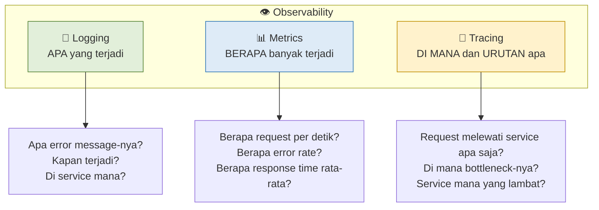
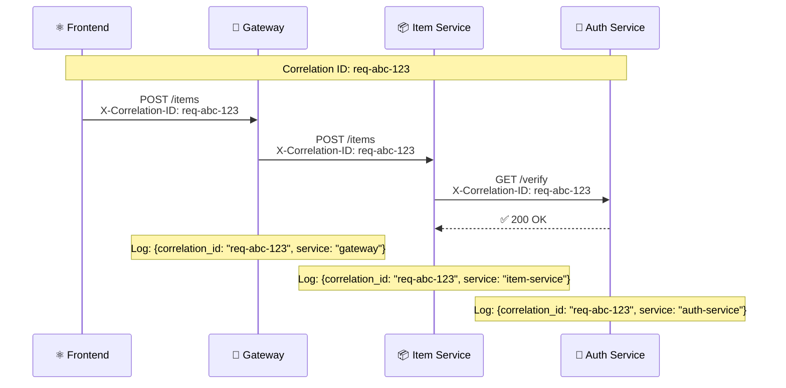
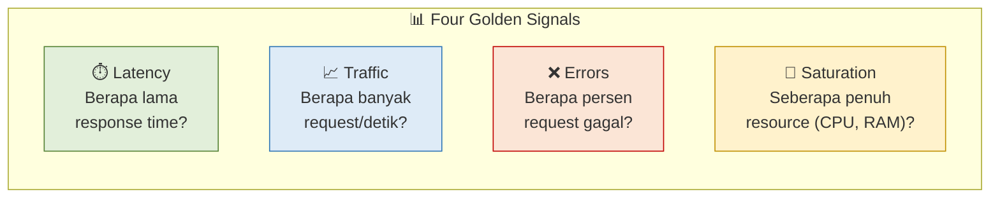
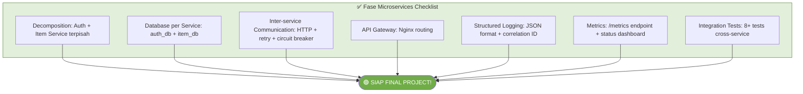

# MODUL 14: MONITORING, LOGGING & OBSERVABILITY

---

**Mata Kuliah:** Komputasi Awan  
**Program Studi:** Sistem Informasi - Institut Teknologi Kalimantan  
**SKS:** 3 (1 Kuliah + 2 Project)  
**Pertemuan:** 14 dari 16  
**Fase:** 🔵 Microservices & Production (Minggu 12-14) — **Pertemuan Terakhir Fase Microservices**  

---

## Prasyarat

Sebelum memulai pertemuan ini, pastikan:
- [x] Modul 13 selesai: microservices berjalan dengan retry + circuit breaker
- [x] Docker Compose menjalankan semua services (auth, item, gateway, 2 DB, frontend)
- [x] Integration tests passing
- [x] Sudah membaca tentang monitoring dan structured logging (Modul 13 Bagian D4)

> ⚠️ **Ini adalah pertemuan terakhir fase Microservices.** Setelah ini, masuk ke Final Polish (minggu 15) dan UAS (minggu 16). Pastikan semua fitur dari minggu 12-13 stabil sebelum menambah monitoring.

---

## Capaian Pembelajaran

### Sub-CPMK
Setelah menyelesaikan pertemuan ini, mahasiswa mampu:
1. Menjelaskan perbedaan monitoring, logging, dan observability
2. Mengimplementasikan structured logging (JSON format) di semua services
3. Menerapkan request tracing dengan correlation ID lintas service
4. Membuat metrics endpoint untuk monitoring performa aplikasi
5. Membangun health dashboard sederhana untuk memantau status semua services

### Indikator Pencapaian
- Semua services menghasilkan structured log (JSON) dengan timestamp, level, service name
- Correlation ID diteruskan dari gateway ke semua services dalam satu request chain
- Endpoint `/metrics` tersedia di setiap service (request count, error rate, latency)
- Health dashboard (React) menampilkan status real-time semua services
- Centralized logging berjalan dengan Docker Compose logging driver

---

## Pembagian Fokus Tim Pertemuan Ini

| Peran | Fokus Utama | Juga Membantu |
|-------|-------------|---------------|
| **Lead Backend** | Structured logging, middleware logging | Metrics endpoint |
| **Lead Frontend** | Health dashboard UI, status monitoring page | Error tracking UI |
| **Lead DevOps** | Centralized logging, Docker logging config | Log aggregation |
| **Lead QA & Docs** | Testing log output, dokumentasi monitoring | Verify correlation ID |
| **Lead CI/CD** *(5 orang)* | Log rotation, CI log artifacts | Bantu dashboard |

---

# BAGIAN A: PEMBEKALAN TEORI (50 Menit)

## 1. Monitoring vs Logging vs Observability (15 menit)

### 1.1 Tiga Pilar Observability

Di monolith, debugging cukup baca satu log file. Di microservices, satu request bisa melewati 3+ services — bagaimana men-debug jika ada masalah?



| Pilar | Menjawab Pertanyaan | Contoh Tools | Yang Kita Bangun |
|-------|---------------------|--------------|------------------|
| **Logging** | "Apa yang terjadi?" | ELK Stack, Grafana Loki, CloudWatch | Structured JSON logs |
| **Metrics** | "Berapa banyak?" | Prometheus, Grafana, Datadog | Endpoint `/metrics` |
| **Tracing** | "Di mana dan urutannya?" | Jaeger, Zipkin, OpenTelemetry | Correlation ID |

> 💡 **Analogi:**  
> Bayangkan Anda mengelola rumah sakit. **Logging** seperti rekam medis pasien — apa diagnosis-nya, obat apa yang diberikan. **Metrics** seperti statistik rumah sakit — berapa pasien hari ini, rata-rata waktu tunggu. **Tracing** seperti melacak perjalanan satu pasien — dari UGD → lab → ruang rawat → apotek. Ketiganya dibutuhkan untuk memahami kondisi rumah sakit secara menyeluruh.

### 1.2 Monitoring vs Observability

| Aspek | Monitoring | Observability |
|-------|------------|---------------|
| **Pendekatan** | "Apakah sistem OK?" (yes/no) | "Mengapa sistem tidak OK?" |
| **Pertanyaan** | Predefined — sudah tahu apa yang dicari | Open-ended — bisa investigasi masalah baru |
| **Contoh** | Alert jika CPU > 90% | Trace request yang lambat, temukan root cause |
| **Analogi** | Dashboard mobil (bensin, suhu) | Mekanik yang bisa buka mesin dan cari masalah |

> 📝 **Untuk mata kuliah ini:** Kita fokus pada **monitoring dasar** — logging, metrics, dan health checks. Observability penuh (distributed tracing dengan Jaeger/OpenTelemetry) adalah topik lanjutan.

---

## 2. Structured Logging (15 menit)

### 2.1 Masalah: Unstructured Logs

Log seperti ini sulit di-parse dan di-search:

```
INFO:     127.0.0.1 - "GET /items HTTP/1.1" 200
WARNING:  Cannot connect to Auth Service
ERROR:    Database connection failed
```

Tidak ada konteks: service mana? request ID? user siapa? kapan tepatnya?

### 2.2 Solusi: Structured Logs (JSON)

```json
{
  "timestamp": "2026-02-15T10:30:45.123Z",
  "level": "INFO",
  "service": "item-service",
  "correlation_id": "abc-123-def",
  "method": "GET",
  "path": "/items",
  "status_code": 200,
  "duration_ms": 45,
  "user_id": 1,
  "message": "Request completed"
}
```

**Keuntungan structured logging:**
- Bisa di-filter: "tampilkan semua ERROR dari item-service"
- Bisa di-search: "cari semua request dengan correlation_id = abc-123-def"
- Bisa di-aggregate: "rata-rata duration_ms per endpoint per jam"
- Bisa di-parse oleh tools (ELK, Loki, CloudWatch) secara otomatis

### 2.3 Log Levels

| Level | Kapan Digunakan | Contoh |
|-------|-----------------|--------|
| **DEBUG** | Detail teknis untuk development | "Database query: SELECT * FROM items WHERE..." |
| **INFO** | Event normal yang penting | "Request GET /items completed in 45ms" |
| **WARNING** | Sesuatu yang tidak ideal tapi tidak error | "Auth Service retry attempt 2/3" |
| **ERROR** | Kesalahan yang perlu perhatian | "Database connection failed" |
| **CRITICAL** | Sistem tidak bisa berfungsi | "Cannot start — port already in use" |

> 📝 **Production rule:** Set log level ke **INFO**. DEBUG terlalu verbose untuk production (menghabiskan disk space dan memperlambat app). Gunakan DEBUG hanya saat troubleshooting.

---

## 3. Correlation ID — Request Tracing (10 menit)

### 3.1 Masalah: Request Melewati Banyak Services

Saat user create item, request melewati: Gateway → Item Service → Auth Service. Jika ada error, log dari masing-masing service terpisah — bagaimana menghubungkannya?

### 3.2 Solusi: Correlation ID

**Correlation ID** adalah identifier unik yang digenerate di awal request dan diteruskan ke semua services dalam chain.



Dengan correlation ID yang sama, kita bisa **grep satu ID** dan melihat seluruh perjalanan request di semua services:

```bash
# Cari semua log terkait satu request
grep "req-abc-123" /var/log/all-services.log
```

---

## 4. Metrics — Mengukur Performa (10 menit)

### 4.1 Empat Golden Signals (Google SRE)



| Signal | Metric | Target | Alert Jika |
|--------|--------|--------|------------|
| **Latency** | p50, p95, p99 response time | p95 < 500ms | p95 > 1000ms |
| **Traffic** | Requests per second | — | Spike > 2x normal |
| **Errors** | Error rate (% of 5xx) | < 1% | > 5% |
| **Saturation** | CPU%, Memory% | < 70% | > 90% |

> 📝 **Untuk mata kuliah ini:** Kita mengimplementasikan latency, traffic, dan errors sebagai in-memory metrics. Saturation biasanya dipantau oleh infrastructure tools (Prometheus, CloudWatch).

---

# BAGIAN B: WORKSHOP LAB (170 Menit)

## Workshop 14.1: Structured Logging (35 menit)

### Langkah 1: Buat Logging Module

Buat module logging yang bisa dipakai oleh semua services.

File: `services/shared/logging_config.py`

```python
"""
Structured Logging Configuration.
Menghasilkan JSON logs yang mudah di-parse oleh log aggregator.
"""
import json
import logging
import sys
import os
from datetime import datetime, timezone


SERVICE_NAME = os.getenv("SERVICE_NAME", "unknown")
LOG_LEVEL = os.getenv("LOG_LEVEL", "INFO")


class JSONFormatter(logging.Formatter):
    """Format log sebagai JSON untuk structured logging."""

    def format(self, record):
        log_entry = {
            "timestamp": datetime.now(timezone.utc).isoformat(),
            "level": record.levelname,
            "service": SERVICE_NAME,
            "logger": record.name,
            "message": record.getMessage(),
        }

        # Tambah extra fields jika ada
        if hasattr(record, "correlation_id"):
            log_entry["correlation_id"] = record.correlation_id
        if hasattr(record, "method"):
            log_entry["method"] = record.method
        if hasattr(record, "path"):
            log_entry["path"] = record.path
        if hasattr(record, "status_code"):
            log_entry["status_code"] = record.status_code
        if hasattr(record, "duration_ms"):
            log_entry["duration_ms"] = record.duration_ms
        if hasattr(record, "user_id"):
            log_entry["user_id"] = record.user_id

        # Tambah exception info jika ada
        if record.exc_info and record.exc_info[0] is not None:
            log_entry["exception"] = self.formatException(record.exc_info)

        return json.dumps(log_entry)


def setup_logging():
    """Setup structured logging untuk service."""
    root_logger = logging.getLogger()
    root_logger.setLevel(getattr(logging, LOG_LEVEL))

    # Hapus existing handlers
    root_logger.handlers.clear()

    # JSON handler ke stdout
    handler = logging.StreamHandler(sys.stdout)
    handler.setFormatter(JSONFormatter())
    root_logger.addHandler(handler)

    # Kurangi noise dari library
    logging.getLogger("uvicorn.access").setLevel(logging.WARNING)
    logging.getLogger("httpx").setLevel(logging.WARNING)

    return root_logger
```

### Langkah 2: Copy ke Setiap Service

```bash
# Copy logging config ke auth-service dan item-service
cp services/shared/logging_config.py services/auth-service/logging_config.py
cp services/shared/logging_config.py services/item-service/logging_config.py
```

> 📝 Di production, `shared/` bisa menjadi package Python yang di-install via pip. Untuk kesederhanaan, kita copy file langsung.

### Langkah 3: Buat Logging Middleware

Middleware ini otomatis log setiap request yang masuk dan keluar.

File: `services/shared/logging_middleware.py`

```python
"""
Request Logging Middleware.
Log setiap HTTP request dengan timing, status, dan correlation ID.
"""
import time
import uuid
import logging
from starlette.middleware.base import BaseHTTPMiddleware
from starlette.requests import Request

logger = logging.getLogger(__name__)


class RequestLoggingMiddleware(BaseHTTPMiddleware):
    """Middleware yang log setiap request/response."""

    async def dispatch(self, request: Request, call_next):
        # Generate atau ambil correlation ID
        correlation_id = request.headers.get(
            "X-Correlation-ID",
            str(uuid.uuid4())[:12]
        )

        # Simpan di request state (bisa diakses di endpoint)
        request.state.correlation_id = correlation_id

        # Catat waktu mulai
        start_time = time.time()

        # Proses request
        try:
            response = await call_next(request)
        except Exception as e:
            duration_ms = round((time.time() - start_time) * 1000, 2)
            logger.error(
                f"Request failed: {request.method} {request.url.path}",
                extra={
                    "correlation_id": correlation_id,
                    "method": request.method,
                    "path": request.url.path,
                    "duration_ms": duration_ms,
                    "status_code": 500,
                },
            )
            raise

        # Hitung durasi
        duration_ms = round((time.time() - start_time) * 1000, 2)

        # Log request (skip health checks agar log tidak terlalu noisy)
        if request.url.path != "/health":
            log_level = logging.WARNING if response.status_code >= 400 else logging.INFO
            logger.log(
                log_level,
                f"{request.method} {request.url.path} → {response.status_code} ({duration_ms}ms)",
                extra={
                    "correlation_id": correlation_id,
                    "method": request.method,
                    "path": request.url.path,
                    "status_code": response.status_code,
                    "duration_ms": duration_ms,
                },
            )

        # Teruskan correlation ID di response header
        response.headers["X-Correlation-ID"] = correlation_id
        return response
```

```bash
# Copy middleware ke setiap service
cp services/shared/logging_middleware.py services/auth-service/logging_middleware.py
cp services/shared/logging_middleware.py services/item-service/logging_middleware.py
```

### Langkah 4: Integrasikan ke Auth Service

Update `services/auth-service/main.py` — tambahkan di bagian atas (setelah import):

```python
from logging_config import setup_logging
from logging_middleware import RequestLoggingMiddleware

# Setup structured logging
setup_logging()
logger = logging.getLogger(__name__)
```

Lalu tambahkan middleware setelah CORS middleware:

```python
# Logging middleware (setelah CORS)
app.add_middleware(RequestLoggingMiddleware)
```

Tambahkan environment variable di `docker-compose.yml` untuk auth-service:

```yaml
  auth-service:
    build: ./services/auth-service
    environment:
      # ... existing vars ...
      SERVICE_NAME: auth-service
      LOG_LEVEL: INFO
```

### Langkah 5: Integrasikan ke Item Service

Lakukan hal yang sama di `services/item-service/main.py`:

```python
from logging_config import setup_logging
from logging_middleware import RequestLoggingMiddleware

setup_logging()
logger = logging.getLogger(__name__)

# ... (setelah CORS middleware)
app.add_middleware(RequestLoggingMiddleware)
```

Tambahkan environment di `docker-compose.yml`:

```yaml
  item-service:
    build: ./services/item-service
    environment:
      # ... existing vars ...
      SERVICE_NAME: item-service
      LOG_LEVEL: INFO
```

### Langkah 6: Test Structured Logging

```bash
# Rebuild services
docker compose up -d --build auth-service item-service

# Lihat log Auth Service (JSON format)
docker compose logs auth-service --tail=5

# Trigger beberapa request
curl -X POST http://localhost/auth/register \
  -H "Content-Type: application/json" \
  -d '{"email":"logtest@example.com","password":"Log123","name":"Log Tester"}'

# Lihat log terbaru
docker compose logs auth-service --tail=3
```

Output log yang diharapkan (JSON structured):

```json
{"timestamp":"2026-02-15T10:30:45.123Z","level":"INFO","service":"auth-service","logger":"logging_middleware","message":"POST /register → 201 (89.5ms)","correlation_id":"a1b2c3d4e5f6","method":"POST","path":"/register","status_code":201,"duration_ms":89.5}
```

> ✅ **Checkpoint:** Log kedua services dalam format JSON. Setiap log entry memiliki timestamp, level, service name, dan correlation ID.

---

## Workshop 14.2: Correlation ID Lintas Service (25 menit)

### Langkah 1: Teruskan Correlation ID di Auth Client

Saat Item Service memanggil Auth Service, correlation ID harus diteruskan agar log bisa dihubungkan.

Update `services/item-service/auth_client.py` — modifikasi fungsi `_call_auth_service` untuk menerima dan meneruskan correlation ID:

```python
async def _call_auth_service(
    authorization: str,
    correlation_id: str = None,
) -> dict:
    """Panggil Auth Service dengan Circuit Breaker + Retry + Correlation ID."""
    if not auth_circuit.can_execute():
        raise HTTPException(
            status_code=503,
            detail="Auth Service circuit breaker OPEN. Try again later."
        )

    headers = {"Authorization": authorization}
    if correlation_id:
        headers["X-Correlation-ID"] = correlation_id

    last_exception = None

    for attempt in range(1, MAX_RETRIES + 1):
        try:
            async with httpx.AsyncClient() as client:
                response = await client.get(
                    f"{AUTH_SERVICE_URL}/verify",
                    headers=headers,
                    timeout=TIMEOUT_SECONDS,
                )

            if response.status_code == 200:
                auth_circuit.record_success()
                logger.info(
                    f"Auth verified (attempt {attempt})",
                    extra={"correlation_id": correlation_id},
                )
                return response.json()

            if response.status_code == 401:
                auth_circuit.record_success()
                raise HTTPException(status_code=401, detail="Invalid or expired token")
            if response.status_code == 400:
                auth_circuit.record_success()
                raise HTTPException(status_code=400, detail="Bad auth request")

            if response.status_code in RETRYABLE_STATUS_CODES:
                logger.warning(
                    f"Auth service returned {response.status_code} "
                    f"(attempt {attempt}/{MAX_RETRIES})",
                    extra={"correlation_id": correlation_id},
                )
                last_exception = HTTPException(
                    status_code=response.status_code,
                    detail=f"Auth service error: {response.status_code}"
                )
            else:
                raise HTTPException(
                    status_code=response.status_code,
                    detail=f"Unexpected auth response: {response.status_code}"
                )

        except httpx.ConnectError:
            logger.warning(
                f"Cannot connect to Auth Service (attempt {attempt}/{MAX_RETRIES})",
                extra={"correlation_id": correlation_id},
            )
            last_exception = HTTPException(status_code=503, detail="Auth unavailable")

        except httpx.TimeoutException:
            logger.warning(
                f"Auth Service timeout (attempt {attempt}/{MAX_RETRIES})",
                extra={"correlation_id": correlation_id},
            )
            last_exception = HTTPException(status_code=504, detail="Auth timeout")

        if attempt < MAX_RETRIES:
            delay = BASE_DELAY * (2 ** (attempt - 1))
            await asyncio.sleep(delay)

    auth_circuit.record_failure()
    raise HTTPException(
        status_code=503,
        detail="Auth Service unavailable. Please try again later."
    )
```

Update juga fungsi `verify_token_with_auth_service` agar menerima request:

```python
async def verify_token_with_auth_service(
    request: Request,
    authorization: str = Header(...),
) -> dict:
    """FastAPI Dependency: Verifikasi token dengan correlation ID."""
    if not authorization.startswith("Bearer "):
        raise HTTPException(status_code=401, detail="Invalid authorization header")

    correlation_id = getattr(request.state, "correlation_id", None)
    return await _call_auth_service(authorization, correlation_id)
```

Tambahkan import `Request`:
```python
from fastapi import HTTPException, Header, Request
```

### Langkah 2: Test Correlation ID Chain

```bash
# Rebuild
docker compose up -d --build item-service auth-service

# Login
TOKEN=$(curl -s -X POST http://localhost/auth/login \
  -H "Content-Type: application/json" \
  -d '{"email":"logtest@example.com","password":"Log123"}' | \
  python3 -c "import sys,json; print(json.load(sys.stdin)['access_token'])")

# Create item (ini memicu: gateway → item-service → auth-service)
curl -X POST http://localhost/items \
  -H "Content-Type: application/json" \
  -H "Authorization: Bearer $TOKEN" \
  -d '{"name":"Traced Item","price":50000,"quantity":1}'

# Ambil correlation ID dari response header
curl -v -X GET http://localhost/items \
  -H "Authorization: Bearer $TOKEN" 2>&1 | grep -i correlation

# Lihat log kedua services — cari correlation ID yang sama
docker compose logs auth-service item-service --tail=10 | grep "correlation_id"
```

Log yang diharapkan (correlation ID yang sama muncul di kedua services):

```
item-service | {..., "correlation_id": "a1b2c3d4", "service": "item-service", "message": "POST /items → 201"}
auth-service | {..., "correlation_id": "a1b2c3d4", "service": "auth-service", "message": "GET /verify → 200"}
```

> ✅ **Checkpoint:** Correlation ID yang sama muncul di log Item Service dan Auth Service untuk satu request chain.

---

## Workshop 14.3: Metrics Endpoint (30 menit)

### Langkah 1: Buat In-Memory Metrics Collector

File: `services/shared/metrics.py`

```python
"""
Simple In-Memory Metrics Collector.
Mengumpulkan metrics dasar: request count, error count, latency.
"""
import time
import threading
from collections import defaultdict


class MetricsCollector:
    """Thread-safe metrics collector."""

    def __init__(self):
        self._lock = threading.Lock()
        self.start_time = time.time()

        # Counters
        self.request_count = 0
        self.error_count = 0          # 4xx + 5xx
        self.status_counts = defaultdict(int)  # per status code

        # Latency tracking (last 1000 requests)
        self.latencies = []
        self.max_latency_samples = 1000

        # Per-endpoint stats
        self.endpoint_stats = defaultdict(lambda: {
            "count": 0,
            "errors": 0,
            "total_latency_ms": 0,
        })

    def record_request(self, method: str, path: str, status_code: int, duration_ms: float):
        """Catat satu request."""
        with self._lock:
            self.request_count += 1
            self.status_counts[status_code] += 1

            if status_code >= 400:
                self.error_count += 1

            # Latency
            self.latencies.append(duration_ms)
            if len(self.latencies) > self.max_latency_samples:
                self.latencies.pop(0)

            # Per-endpoint
            key = f"{method} {path}"
            self.endpoint_stats[key]["count"] += 1
            self.endpoint_stats[key]["total_latency_ms"] += duration_ms
            if status_code >= 400:
                self.endpoint_stats[key]["errors"] += 1

    def get_metrics(self) -> dict:
        """Return snapshot metrics."""
        with self._lock:
            uptime = round(time.time() - self.start_time, 1)
            error_rate = (
                round(self.error_count / self.request_count * 100, 2)
                if self.request_count > 0 else 0
            )

            # Latency percentiles
            latency_stats = {}
            if self.latencies:
                sorted_lat = sorted(self.latencies)
                n = len(sorted_lat)
                latency_stats = {
                    "p50_ms": round(sorted_lat[int(n * 0.5)], 2),
                    "p95_ms": round(sorted_lat[int(n * 0.95)], 2),
                    "p99_ms": round(sorted_lat[min(int(n * 0.99), n - 1)], 2),
                    "avg_ms": round(sum(sorted_lat) / n, 2),
                }

            # Top endpoints
            endpoints = {}
            for key, stats in self.endpoint_stats.items():
                avg_lat = (
                    round(stats["total_latency_ms"] / stats["count"], 2)
                    if stats["count"] > 0 else 0
                )
                endpoints[key] = {
                    "count": stats["count"],
                    "errors": stats["errors"],
                    "avg_latency_ms": avg_lat,
                }

            return {
                "uptime_seconds": uptime,
                "total_requests": self.request_count,
                "total_errors": self.error_count,
                "error_rate_percent": error_rate,
                "status_codes": dict(self.status_counts),
                "latency": latency_stats,
                "endpoints": endpoints,
            }

    def reset(self):
        """Reset semua metrics."""
        with self._lock:
            self.request_count = 0
            self.error_count = 0
            self.status_counts.clear()
            self.latencies.clear()
            self.endpoint_stats.clear()


# Singleton instance
metrics = MetricsCollector()
```

```bash
# Copy ke setiap service
cp services/shared/metrics.py services/auth-service/metrics.py
cp services/shared/metrics.py services/item-service/metrics.py
```

### Langkah 2: Integrasikan Metrics ke Logging Middleware

Update `services/shared/logging_middleware.py` — tambahkan metrics recording:

```python
from metrics import metrics

class RequestLoggingMiddleware(BaseHTTPMiddleware):

    async def dispatch(self, request: Request, call_next):
        correlation_id = request.headers.get(
            "X-Correlation-ID", str(uuid.uuid4())[:12]
        )
        request.state.correlation_id = correlation_id
        start_time = time.time()

        try:
            response = await call_next(request)
        except Exception as e:
            duration_ms = round((time.time() - start_time) * 1000, 2)
            # Record failed request
            metrics.record_request(request.method, request.url.path, 500, duration_ms)
            logger.error(
                f"Request failed: {request.method} {request.url.path}",
                extra={
                    "correlation_id": correlation_id,
                    "method": request.method,
                    "path": request.url.path,
                    "duration_ms": duration_ms,
                    "status_code": 500,
                },
            )
            raise

        duration_ms = round((time.time() - start_time) * 1000, 2)

        # Record metrics (semua request, termasuk health)
        metrics.record_request(
            request.method, request.url.path,
            response.status_code, duration_ms
        )

        if request.url.path not in ["/health", "/metrics"]:
            log_level = logging.WARNING if response.status_code >= 400 else logging.INFO
            logger.log(
                log_level,
                f"{request.method} {request.url.path} → {response.status_code} ({duration_ms}ms)",
                extra={
                    "correlation_id": correlation_id,
                    "method": request.method,
                    "path": request.url.path,
                    "status_code": response.status_code,
                    "duration_ms": duration_ms,
                },
            )

        response.headers["X-Correlation-ID"] = correlation_id
        return response
```

Copy updated middleware:
```bash
cp services/shared/logging_middleware.py services/auth-service/logging_middleware.py
cp services/shared/logging_middleware.py services/item-service/logging_middleware.py
```

### Langkah 3: Tambah /metrics Endpoint

Di setiap service, tambahkan endpoint metrics.

Untuk **Auth Service** (`services/auth-service/main.py`):

```python
from metrics import metrics

@app.get("/metrics")
def get_metrics():
    """Return application metrics."""
    return {
        "service": "auth-service",
        **metrics.get_metrics(),
    }
```

Untuk **Item Service** (`services/item-service/main.py`):

```python
from metrics import metrics

@app.get("/metrics")
def get_metrics():
    """Return application metrics."""
    return {
        "service": "item-service",
        **metrics.get_metrics(),
    }
```

### Langkah 4: Test Metrics

```bash
# Rebuild
docker compose up -d --build

# Generate beberapa request
for i in $(seq 1 10); do
  curl -s http://localhost/auth/health > /dev/null
done

# Lihat metrics Auth Service
curl -s http://localhost/auth/metrics | python3 -m json.tool
```

Output yang diharapkan:

```json
{
    "service": "auth-service",
    "uptime_seconds": 125.3,
    "total_requests": 10,
    "total_errors": 0,
    "error_rate_percent": 0.0,
    "status_codes": {"200": 10},
    "latency": {
        "p50_ms": 2.15,
        "p95_ms": 5.83,
        "p99_ms": 6.21,
        "avg_ms": 3.02
    },
    "endpoints": {
        "GET /health": {"count": 10, "errors": 0, "avg_latency_ms": 3.02}
    }
}
```

> ✅ **Checkpoint:** `/metrics` menampilkan request count, error rate, latency percentiles, dan per-endpoint stats.

---

## Workshop 14.4: Health Dashboard (40 menit)

### Langkah 1: Buat Status Page di Frontend

Buat komponen React yang menampilkan status semua services secara real-time.

File: `frontend/src/pages/StatusPage.jsx`

```jsx
import { useState, useEffect, useCallback } from 'react';

const API_URL = import.meta.env.VITE_API_URL || 'http://localhost';

function ServiceCard({ name, icon, healthUrl, metricsUrl }) {
  const [health, setHealth] = useState(null);
  const [metrics, setMetrics] = useState(null);
  const [loading, setLoading] = useState(true);

  const fetchStatus = useCallback(async () => {
    try {
      const healthRes = await fetch(healthUrl);
      const healthData = await healthRes.json();
      setHealth(healthData);
    } catch {
      setHealth({ status: 'unreachable' });
    }

    try {
      const metricsRes = await fetch(metricsUrl);
      const metricsData = await metricsRes.json();
      setMetrics(metricsData);
    } catch {
      setMetrics(null);
    }

    setLoading(false);
  }, [healthUrl, metricsUrl]);

  useEffect(() => {
    fetchStatus();
    const interval = setInterval(fetchStatus, 10000); // Refresh setiap 10 detik
    return () => clearInterval(interval);
  }, [fetchStatus]);

  const statusColor = {
    healthy: '#22c55e',
    degraded: '#f59e0b',
    unhealthy: '#ef4444',
    unreachable: '#6b7280',
  };

  const status = health?.status || 'unreachable';

  return (
    <div style={{
      border: '1px solid #e2e8f0',
      borderRadius: '12px',
      padding: '20px',
      borderLeft: `4px solid ${statusColor[status] || '#6b7280'}`,
      background: '#fff',
    }}>
      <div style={{ display: 'flex', justifyContent: 'space-between', alignItems: 'center' }}>
        <h3 style={{ margin: 0 }}>{icon} {name}</h3>
        <span style={{
          background: statusColor[status],
          color: '#fff',
          padding: '4px 12px',
          borderRadius: '20px',
          fontSize: '13px',
          fontWeight: '600',
          textTransform: 'uppercase',
        }}>
          {loading ? '...' : status}
        </span>
      </div>

      {metrics && (
        <div style={{ marginTop: '16px', fontSize: '14px', color: '#64748b' }}>
          <div style={{ display: 'grid', gridTemplateColumns: '1fr 1fr', gap: '8px' }}>
            <div>Requests: <strong>{metrics.total_requests}</strong></div>
            <div>Errors: <strong style={{ color: metrics.total_errors > 0 ? '#ef4444' : 'inherit' }}>
              {metrics.total_errors}
            </strong></div>
            <div>Error Rate: <strong>{metrics.error_rate_percent}%</strong></div>
            <div>Avg Latency: <strong>{metrics.latency?.avg_ms || 0}ms</strong></div>
            <div>p95 Latency: <strong>{metrics.latency?.p95_ms || 0}ms</strong></div>
            <div>Uptime: <strong>{Math.round((metrics.uptime_seconds || 0) / 60)}min</strong></div>
          </div>
        </div>
      )}
    </div>
  );
}

export default function StatusPage() {
  return (
    <div style={{ maxWidth: '800px', margin: '40px auto', padding: '0 20px' }}>
      <h1>📊 System Status</h1>
      <p style={{ color: '#64748b' }}>
        Real-time health monitoring — auto-refresh setiap 10 detik
      </p>

      <div style={{ display: 'grid', gap: '16px', marginTop: '24px' }}>
        <ServiceCard
          name="Auth Service"
          icon="🔐"
          healthUrl={`${API_URL}/auth/health`}
          metricsUrl={`${API_URL}/auth/metrics`}
        />
        <ServiceCard
          name="Item Service"
          icon="📦"
          healthUrl={`${API_URL}/items/health`}
          metricsUrl={`${API_URL}/items/metrics`}
        />
        <ServiceCard
          name="API Gateway"
          icon="🚪"
          healthUrl={`${API_URL}/health`}
          metricsUrl={null}
        />
      </div>

      <p style={{ marginTop: '24px', fontSize: '13px', color: '#94a3b8' }}>
        Last checked: {new Date().toLocaleTimeString()}
      </p>
    </div>
  );
}
```

### Langkah 2: Tambah Route

Update router frontend — tambahkan route `/status`:

```jsx
// Di App.jsx atau router config
import StatusPage from './pages/StatusPage';

// Tambah route
<Route path="/status" element={<StatusPage />} />
```

### Langkah 3: Update Nginx Gateway

Tambahkan routing untuk metrics di `services/gateway/nginx.conf`:

```nginx
    # Auth Service metrics
    location /auth/metrics {
        proxy_pass http://auth_service/metrics;
        proxy_set_header Host $host;
    }

    # Item Service metrics (route via /items prefix)
    location /items/metrics {
        proxy_pass http://item_service/metrics;
        proxy_set_header Host $host;
    }

    # Item Service health
    location /items/health {
        proxy_pass http://item_service/health;
        proxy_set_header Host $host;
    }
```

### Langkah 4: Test Dashboard

```bash
# Rebuild
docker compose up -d --build

# Generate traffic
for i in $(seq 1 20); do
  curl -s http://localhost/auth/health > /dev/null
  curl -s http://localhost/items/health > /dev/null
done

# Buka browser: http://localhost/status
```

> ✅ **Checkpoint:** Status page menampilkan health dan metrics dari Auth Service, Item Service, dan Gateway. Auto-refresh setiap 10 detik.

---

## Workshop 14.5: Docker Centralized Logging (20 menit)

### Langkah 1: Konfigurasi Docker Logging

Dengan JSON structured logs, Docker secara default menyimpan log di `/var/lib/docker/containers/`. Kita bisa menggunakan Docker Compose logging configuration untuk mengelola log.

Tambahkan logging config di `docker-compose.yml` untuk setiap service:

```yaml
  auth-service:
    build: ./services/auth-service
    environment:
      # ... existing ...
      SERVICE_NAME: auth-service
      LOG_LEVEL: INFO
    logging:
      driver: "json-file"
      options:
        max-size: "10m"     # Rotate setiap 10MB
        max-file: "3"       # Simpan 3 file lama
        tag: "auth-service"

  item-service:
    build: ./services/item-service
    environment:
      # ... existing ...
      SERVICE_NAME: item-service
      LOG_LEVEL: INFO
    logging:
      driver: "json-file"
      options:
        max-size: "10m"
        max-file: "3"
        tag: "item-service"
```

### Langkah 2: Aggregated Log Viewing

```bash
# Lihat log semua services bersamaan
docker compose logs -f auth-service item-service

# Filter log berdasarkan level
docker compose logs auth-service 2>&1 | grep '"level":"ERROR"'

# Filter berdasarkan correlation ID
docker compose logs auth-service item-service 2>&1 | grep "a1b2c3d4"

# Export log ke file
docker compose logs --no-color > logs/all-services-$(date +%Y%m%d).log
```

### Langkah 3: Buat Log Helper Script

File: `scripts/logs.sh`

```bash
#!/bin/bash
# Log helper script untuk debugging microservices
# Usage: ./scripts/logs.sh [command] [args]

case "$1" in
  all)
    echo "📋 Showing all service logs..."
    docker compose logs -f auth-service item-service
    ;;
  errors)
    echo "❌ Showing ERROR logs only..."
    docker compose logs auth-service item-service 2>&1 | grep '"level":"ERROR"'
    ;;
  trace)
    if [ -z "$2" ]; then
      echo "Usage: ./scripts/logs.sh trace <correlation-id>"
      exit 1
    fi
    echo "🔗 Tracing correlation ID: $2"
    docker compose logs auth-service item-service 2>&1 | grep "$2"
    ;;
  metrics)
    echo "📊 Fetching metrics..."
    echo "--- Auth Service ---"
    curl -s http://localhost/auth/metrics | python3 -m json.tool
    echo ""
    echo "--- Item Service ---"
    curl -s http://localhost/items/metrics | python3 -m json.tool
    ;;
  *)
    echo "Usage: ./scripts/logs.sh {all|errors|trace <id>|metrics}"
    ;;
esac
```

```bash
chmod +x scripts/logs.sh
```

> ✅ **Checkpoint:** Log rotation dikonfigurasi. Helper script tersedia untuk debugging.

---

## Workshop 14.6: Commit & Verify (20 menit)

### Struktur Repository Akhir

```
cloud-team-XX/
├── services/
│   ├── shared/                       ← Baru
│   │   ├── logging_config.py
│   │   ├── logging_middleware.py
│   │   └── metrics.py
│   ├── auth-service/
│   │   ├── main.py                   ← Updated (logging + metrics)
│   │   ├── logging_config.py         ← Baru (copy dari shared)
│   │   ├── logging_middleware.py     ← Baru
│   │   ├── metrics.py               ← Baru
│   │   └── ...
│   ├── item-service/
│   │   ├── main.py                   ← Updated
│   │   ├── auth_client.py            ← Updated (correlation ID)
│   │   ├── logging_config.py         ← Baru
│   │   ├── logging_middleware.py     ← Baru
│   │   ├── metrics.py               ← Baru
│   │   └── ...
│   └── gateway/
│       └── nginx.conf                ← Updated (metrics routes)
├── frontend/
│   └── src/
│       └── pages/
│           └── StatusPage.jsx        ← Baru
├── scripts/
│   ├── logs.sh                       ← Baru
│   └── migrate_data.py
├── docker-compose.yml                ← Updated (logging config)
└── README.md
```

### Commit

```bash
git checkout -b feature/monitoring-logging

git add services/shared/
git add services/auth-service/logging_config.py services/auth-service/logging_middleware.py services/auth-service/metrics.py
git add services/item-service/logging_config.py services/item-service/logging_middleware.py services/item-service/metrics.py
git add services/auth-service/main.py services/item-service/main.py
git add services/item-service/auth_client.py
git add services/gateway/nginx.conf
git add frontend/src/pages/StatusPage.jsx
git add scripts/logs.sh
git add docker-compose.yml

git commit -m "feat: add monitoring, structured logging & observability

- Implement structured JSON logging (timestamp, level, service, correlation_id)
- Add request logging middleware with timing and correlation ID
- Forward correlation ID across services for request tracing
- Add in-memory metrics collector (latency, error rate, per-endpoint)
- Add /metrics endpoint for both services
- Add StatusPage dashboard (auto-refresh, health + metrics display)
- Add Docker log rotation (10MB, 3 files)
- Add logs.sh helper script for debugging"

git push origin feature/monitoring-logging
```

> ✅ **Checkpoint Akhir Workshop:** Structured logging, correlation ID tracing, metrics endpoint, dan health dashboard semua berfungsi.

---

# BAGIAN C: TUGAS TERSTRUKTUR (60 Menit)

> 📝 **Kumpulkan sebelum pertemuan 15** via Pull Request.
>
> ⚠️ **Ini tugas terakhir sebelum Final Polish!** Pastikan semua fitur dari minggu 12-14 stabil.

---

## Tugas 14: Production Readiness Checklist

### Pembagian Tugas

| Anggota | Branch Name | Tugas | Detail |
|---------|-------------|-------|--------|
| **Lead Backend** | `feature/error-alerting` | Tambah error alerting logic | Jika error rate > 10% dalam 1 menit terakhir, log level CRITICAL dan tambahkan field `alert: true` di log. Ini bisa di-pick up oleh log aggregator untuk trigger notifikasi. |
| **Lead Frontend** | `feature/status-page-polish` | Polish status page dashboard | Tambah auto-refresh indicator, timestamp last checked, visual chart sederhana (bar chart error rate), responsive design. Tambah link ke status page di navbar. |
| **Lead DevOps** | `feature/docker-production` | Buat `docker-compose.prod.yml` | Production overrides: no port exposure kecuali gateway, resource limits, restart policies, production env vars. Buat `Makefile` targets: `dev`, `prod`, `logs`, `status`. |
| **Lead QA & Docs** | `docs/operations-guide` | Buat Operations Guide | Buat `docs/operations-guide.md`: cara check health, cara baca log, cara trace request (correlation ID), cara check metrics, common troubleshooting, escalation path. |
| **Lead CI/CD** *(5 orang)* | `feature/ci-log-artifacts` | Simpan log sebagai CI artifacts | Update workflow: setelah integration test, export Docker logs dan simpan sebagai GitHub Actions artifacts. Jika test gagal, log otomatis tersedia untuk debugging. |

### Deliverable Akhir Fase Microservices



### Informasi Pengumpulan

| Item | Keterangan |
|------|------------|
| **Deadline** | Sebelum pertemuan 15 dimulai |
| **Format** | Pull Request ke repository tim — HARUS lulus CI |
| **Yang dinilai** | Error alerting, status page polish, production compose, ops guide, semua anggota ≥1 PR |
| **Bonus** | Tim yang menambahkan Grafana dashboard (via Docker Compose) |

---

# BAGIAN D: BELAJAR MANDIRI (230 Menit)

> 📚 **Tidak dikumpulkan**, tetapi sangat penting untuk persiapan UAS.

---

## D1. Membaca Referensi (60 menit)

### Bacaan Wajib
1. **12-Factor App — Semua 12 Faktor (Review)**  
   https://12factor.net/  
   (Review semua faktor — ini bisa muncul di UAS)

2. **Google SRE Book — Chapter 6: Monitoring Distributed Systems**  
   https://sre.google/sre-book/monitoring-distributed-systems/  
   (Four golden signals, alerting philosophy)

3. **OWASP Top 10 Security Risks**  
   https://owasp.org/www-project-top-ten/  
   (Persiapan security review minggu depan)

### Bacaan Tambahan
- OpenTelemetry Documentation — https://opentelemetry.io/docs/
- Structured Logging Best Practices — https://www.structlog.org/en/stable/why.html
- Prometheus Metrics Types — https://prometheus.io/docs/concepts/metric_types/

---

## D2. Video Tutorial (60 menit)

1. **"Observability vs Monitoring"** — IBM Technology (YouTube, ~10 min)
   - Perbedaan monitoring dan observability

2. **"Prometheus and Grafana Tutorial"** — TechWorld with Nana (YouTube, ~20 min)
   - Setup monitoring stack (untuk pemahaman, tidak wajib implement)

3. **"Structured Logging"** — cari di YouTube (~10 min)
   - Best practices structured logging

4. **"How to Prepare for Technical Presentations"** — cari di YouTube (~15 min)
   - Persiapan presentasi UAS

---

## D3. Latihan Mandiri (60 menit)

### Soal Pilihan Ganda

**1.** Tiga pilar observability adalah:
- [ ] a. CPU, Memory, Disk
- [ ] b. Logging, Metrics, Tracing
- [ ] c. Frontend, Backend, Database
- [ ] d. Docker, Kubernetes, Terraform

**2.** Structured logging menggunakan format JSON karena:
- [ ] a. JSON lebih kecil ukurannya dari plain text
- [ ] b. Semua programmer sudah menguasai JSON
- [ ] c. JSON mudah di-parse oleh tools dan bisa di-filter, search, aggregate secara otomatis
- [ ] d. JSON adalah standar wajib dari Google

**3.** Correlation ID berguna untuk:
- [ ] a. Mengenkripsi data antar service
- [ ] b. Menggantikan JWT token
- [ ] c. Mempercepat response time
- [ ] d. Menghubungkan log dari berbagai service yang menangani satu request yang sama

**4.** Berdasarkan Four Golden Signals (Google SRE), yang BUKAN golden signal adalah:
- [ ] a. Latency
- [ ] b. Traffic
- [ ] c. Code coverage
- [ ] d. Saturation

**5.** Log level yang tepat untuk production environment adalah:
- [ ] a. DEBUG — agar semua detail tercatat
- [ ] b. INFO — mencatat event penting tanpa terlalu verbose
- [ ] c. ERROR — hanya mencatat error saja
- [ ] d. CRITICAL — hanya mencatat hal paling kritis

---

## D4. Persiapan Pertemuan Berikutnya (50 menit)

Pertemuan 15 adalah **Final Polish, Security & Dokumentasi**. Ini adalah kesempatan terakhir menyempurnakan proyek sebelum UAS. Persiapkan:

- Review semua fitur: apakah semua berjalan dengan baik?
- Apakah README sudah up-to-date dengan arsitektur terbaru?
- Apakah semua environment variables terdokumentasi?
- Apakah ada security vulnerability? (CORS, SQL injection, token exposure)
- Siapkan **slide presentasi** untuk demo UAS (5-7 slide):
  - Arsitektur aplikasi (monolith → microservices journey)
  - Tech stack dan tools yang digunakan
  - Demo live (register → login → CRUD → status page)
  - Tantangan dan lessons learned
  - Kontribusi setiap anggota

> 💡 **Preview:** Minggu 15 fokus pada security hardening (CORS, rate limiting, input validation), code cleanup, dan persiapan presentasi UAS. Minggu 16 adalah **UAS — Final Demo** di depan dosen.

---

---

*Modul ini disusun oleh Aidil Saputra Kirsan, Institut Teknologi Kalimantan.*
